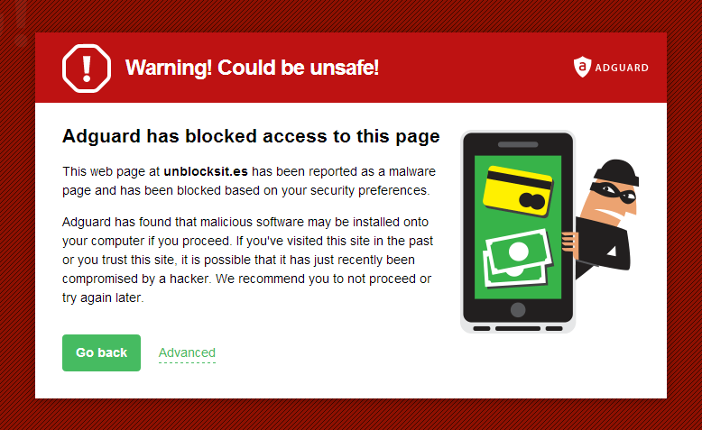

AdGuard 常与熟知的浏览器扩展器对比 - 即 Adblock 和 Adblock Plus。我们利用本文描述 AdGuard 具备但其对手所不具备的主要优势。

Adguard 的最大优势在于其不受限于浏览器的能力限制。Adblock 和 Adblock Plus 从技术上讲是无法移除网页上的所有广告的。AdGuard 是在广告元素加载到浏览器之前就先拦截了它们。而扩展的工作是基于浏览器的广告拦截能力之上。这就是为什么在隐藏拦截的元素之后需要进行 [后处理](http://adguard.com/en/how-ads-blocked.html#cosmetic) 。如您曾经使用过 Adblock，则您肯定知道隐藏后的横幅广告是如何 “闪的”。

AdGuard 第二个优势在于其是单独的程序，而非浏览器扩展。AdGuard 可拦截任何浏览器内的广告。无论您在使用什么浏览器，这包括 Google Chrome，Mozilla Firefox，Opera，Internet Explorer 或 Yandex 等 - AdGuard 都会让您忘记令人反感的在线广告。

如您在使用罕见的浏览器 - 则对于 Adblock 和 Adblock Plus 是个问题，因为两者仅适用于最流行的浏览器。但 AdGuard 不会有这些问题，将您在使用的浏览器添加至受保护列表即可。

以上并非全部。AdGuard 还可拦截包括 Skype，uTorrent 在内的众多常用程序内的广告。只需将它们添加至浏览器列表并重启相应的程序即可。

除拦截广告外，AdGuard 也提供有其它附加工具。或许最重要的就是钓鱼过滤器。此模块的运作是基于持续更新的恶意与钓鱼网站黑名单之上。AdGuard 使用两个主要源。第一个是 Google Safe Browsing 列表。第二个是 AdGuard 自己的黑名单。我们是持续监视网站安全性数据并依此快速改进我们的过滤器。

有用户只使用 AdGuard，还有用户使用 AdGuard + 反病毒软件。无论何种情况，AdGuard 都会显著提升您计算机的在线安全性。

当前用户对 Adblock 和 Adblock Plus 有个普遍误解，就是认为它们几乎不消耗资源。但确实如此？

让我们通过任务管理器（Task Manager）检查下它们在 Google Chrome 浏览器内的使用情况。

请注意：即使在开启最简单的设置+单个过滤器的情况下，扩展也消耗了 100 MB 的物理内存。而 AdGuard 在消耗几乎相同资源的情况下提供了更多的功能。

概括之：

**1. AdGuard 会在广告加载到浏览器之前先拦截它们**

**2. AdGuard 确实为您节省流量**

**3. AdGuard 可工作于任何浏览器**

**4. AdGuard 可移除 Skype，uTorrent 及其它程序的内置广告**

**5. AdGuard 保护您远离病毒和诈骗。**
