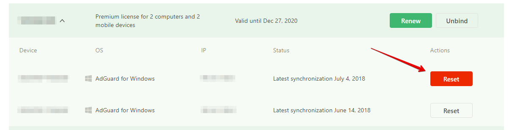

* [What is AdGuard license key?](#key)
* [How to activate AdGuard with a license key?](#activation)
* [How to recover my license key?](#recovery)
* [How to register the AdGuard Account?](#account)
* [What functions are available in AdGuard Account?](#account-functions)
* [What to do after the key was renewed?](#account-renewal)

#### What is AdGuard license key?

License key is a unique symbol sequence that activates AdGuard. License key is required for AdGuard’s work after trial period's expiration. There are two types of licenses available:

1. **Personal** - This license key allows you to activate AdGuard on **any three** devices.

2. **Family** - This license key allows you to activate AdGuard on **any nine** devices.

>**Please notice**: all types of licenses are universal. You can use any license to activate AdGuard on any of the operating systems — **Windows**, **Mac**, **Android**, or **iOS**.

You can manage your license keys in your [AdGuard Account](http://adguard.com/login.html).

To purchase AdGuard license key click [here](https://adguard.com/license.html).

## How to activate AdGuard with a license key?

[How to activate AdGuard for Windows](#activation_windows)

[How to activate AdGuard for Mac](#activation_mac)

[How to activate AdGuard for Android](#activation_android)

[How to activate AdGuard for iOS](#activation_iOS) 

[Transfering license to another device](#activation_info)

#### Activating AdGuard for Windows

1. Open the program.
   
To do it, doubleclick on AdGuard icon on the desktop:   

or double click on AdGuard icon in the system tray:   

2. Go to **License** in the main menu, then click **Activate license**. 

3. You will be presented with two options for activation:
- Activation by entering **Login** and **Password** from **AdGuard  account**.

- Activation with the **license key**.

#### Activating AdGuard for Mac

1. Open AdGuard menu. 

To do it, click on the AdGuard icon in the menu bar: 

2. Open options menu by clicking on gear icon and choose **License...** 

3. In the opened window enter your license key and press **Activate**.   

4. You will be presented with two options for activation:
- Activation by entering **Login** and **Password** from **AdGuard  account**.

- Activation with the **license key**.

#### Activating AdGuard for Android

1. Open the application and go to the license menu. 
To do so, tap the **Get Premium** button at the top of the screen. 
You can also go to the license menu by tap to **License Status**:

2. Click the three dots in the **top right corner** of the screen
In the small window you will see 3 functions:

- Get a free trial (14 days trial period).
- **Activate Premium**.
- Restore purchases (Restores the license if you've reinstalled the app).

3) After you press **Activate Premium**, you will be presented with several activation options:
- Activation by entering **Login** and **Password** from **AdGuard account**.
- Sign in with one of the social networks (**Twitter, Google Account, Facebook, Yandex, VK**).

- Activation with the license key.

#### Activating AdGuard for iOS

1. Open the application menu and tap on the **gear icon** in the right top corner of the screen.

2. Then go to **About** > **License**. You will see that window:

3. You can purchase the license directly from the **AppStore**, or activate **Premium** using **authorization** in **AdGuard account**.

#### Note: For successful activation you need to have at least one "free" license on your account.

#### Transfering license to another device

Once the program is activated with a license key, the license key is “bound” to the device on which activation was held. License key may be activated on a limited number of devices. If the license key is already used on the maximum possible number of devices, you need to reset it before using this key again. You can do it in your [AdGuard Account](#account-functions).

## How to recover my license key?

You can easily find out which license keys belong to you in your [AdGuard Account](#account).

The binding of your license key with your account is held with your email address, which was used for purchasing of AdGuard.

**Please note** that it is often not enough to just find out what your license key is. If it was already used on another computer, it’s necessary to unbind it from that computer through the [AdGuard Account](#account) before using it again.

## How to register the AdGuard Account?

If you purchased the AdGuard License key – your Account is already registered with your email which was used by the purchase. You were to receive an email on the automatic registration of your Personal account and the link for its activation. If you haven’t received this email or forgot your password you can [recover your password](http://adguard.com/recovery_password.html).

If you don’t have AdGuard Account, we suggest you register it by clicking [this link](http://adguard.com/register.html).

AdGuard Account gives you an opportunity to manage your license keys and their binding with your computers.

Find more on functions of the Account [below](#account-functions).

## What functions are available in AdGuard Account?

When you enter the AdGuard [personal account](https://adguard.com/en/login.html) you will see the list of your license keys and their current status.

If the license key is activated on one or more computers you will see the list of these computers under the license key. License key can be activated on a limited number of computers, before using it again you will have to unbind it from one of the computers.

To unbind the license key from computer just click the “Reset” button as it’s showed on this picture:

## What to do after the key was renewed?

Once you have renewed AdGuard for another year - you will need to restart the program/app or go to the 'License' section and refresh the license status for changes to take effect. 

_E.g: AdGuard for Windows_

#### Payment options

You can purchase an AdGuard license on our website. To do so:

1\. Go to the [payment page](http://adguard.com/license.html).

2\. Depending on whether you want to prolong an existing license key or to purchase a new one, choose the appropriate option.

3\. Choose the license type. Currently, we have **two** different license types - **Personal** and **Family**. 

4\. Choose the preferred currency, license period and the number of devices you want to use AdGuard on.

5\. Enter and confirm your email address.

_**Attention!** Please, pay close attention to the email address you enter. The license key will be sent to this address, and it will be used to automatically create your AdGuard personal account. Make sure you don't make any typos._

6\. Choose the payment method.

We offer the possibility to pay with a credit card or PayPal. 

#### License key activation

The purchased license key will be sent to the indicated email address. You need to activate your AdGuard with this license key. The detailed instruction on how to do it is available [here](#activation).

#### Refund policy

To get a refund, contact our [support team](mailto:support@adguard.com) and indicate what payment option did you use. Note that refunds may be rejected if you've purchased the license key more than 60 days ago.
