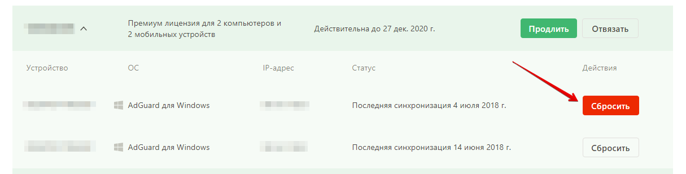

* [Что такое лицензионный ключ AdGuard?](#key)
* [Как активировать AdGuard лицензионным ключом?](#activation)
* [Как можно восстановить лицензионный ключ?](#recovery)
* [Как зарегистрировать личный кабинет AdGuard?](#account)
* [Какие функции доступны из личного кабинета AdGuard?](#account-functions)
* [Способы оплаты лицензии AdGuard](#payment)
* [Правила возврата](#refund)

#### Что такое лицензионный ключ AdGuard?

Лицензионный ключ - это уникальный набор символов, с помощью которого может быть активирован AdGuard. Лицензионный ключ необходим для полноценной работы AdGuard после истечения пробного периода использования программы. Существует несколько типов лицензий:

1. **Стандартная** — позволяет активировать AdGuard на компьютере с Windows или на macOS.
2. **Мобильная** - позволяет активировать AdGuard на мобильном устройстве.
3. **Премиум** - мобильная и стандартная лицензии в одной. Позволяет активировать AdGuard на компьютере и мобильном устройстве с помощью одного ключа.
4. **Бонусная** — лицензия, которая выдается по результатам розыгрышей и акций. Соответствует стандартной. 
5. **Бета-тест** — специальный тип лицензии для бета-тестировщиков AdGuard. Программа, активированная таким типом лицензии, автоматически обновляется до последней доступной бета-версии. 

Вы можете управлять своими лицензионными ключами в [личном кабинете AdGuard](https://adguard.com/ru/login.html).

Приобрести лицензионный ключ AdGuard можно по [этой ссылке](https://adguard.com/ru/license.html).

## Как активировать AdGuard лицензионным ключом

[Как активировать AdGuard для Windows?](#activation_windows)

[Как активировать AdGuard для macOS?](#activation_mac)

[Как активировать AdGuard для Android?](#activation_android) 

[Привязка ключа](#activation_info)

#### Активация AdGuard для Windows

1. Откройте окно программы.

Для этого дважды щелкните на иконке AdGuard на рабочем столе:   

Либо дважды щелкните на иконке AdGuard в области уведомлений на панели задач:   

2. Перейдите в раздел "О программе" в главном меню.

3. Введите лицензионный ключ и нажмите кнопку "Активировать".  

#### Активация AdGuard для macOS

1. Откройте меню программы
Для этого щелкните на иконке AdGuard в строке меню. 

2. Откройте опции, щелкнув мышью на пиктограмме шестерёнки, и в выпадающем меню выберите "Лицензия".   

3. В открывшемся окне введите лицензионный ключ и нажмите кнопку "Активация лицензионным ключом".

#### Активация AdGuard для Android

1. Откройте приложение и перейдите в меню лицензии. 
Для этого нажмите на кнопку **Получить Премиум** в верхней части экрана.  

2. Обратите внимание на три точки в **правом верхнем углу** экрана.
Нажав на них, вам будет предложено:
1) Получить бесплатную версию(14 дней пробного периода).
2) **Ввести ключ**.
3) Восстановить покупки (Восстанавливает лицензию, если вы удалили приложение и установили его повторно).

3. Введите лицензионный ключ и нажмите кнопку "Активировать".

#### Привязка ключа

После того как программа активирована лицензионным ключом, происходит **привязка** лицензионного ключа к устройству, на котором произведена активация. Лицензионный ключ может быть активирован на ограниченном количестве устройств. Если лицензионный ключ уже используется на максимально возможном количестве устройств, перед тем как снова использовать его, вы должны отвязать ключ от одного из них. Для этого вы можете воспользоваться [личным кабинетом AdGuard](#account-functions).

## Как можно восстановить лицензионный ключ?

Самый простой способ узнать, какие лицензионные ключи принадлежат вам - это воспользоваться [личным кабинетом AdGuard](#account). Привязка лицензионного ключа к личному кабинету происходит по адресу электронной почты, который использовался при приобретении AdGuard.

**Обратите внимание** — часто недостаточно просто узнать свой лицензионный ключ. Если он уже был использован на другом компьютере, перед повторным использованием необходимо отвязать его от этого компьютера с помощью [личного кабинета AdGuard](#account).

## Как зарегистрировать личный кабинет AdGuard?

Если вы приобретали лицензионный ключ AdGuard — личный кабинет AdGuard уже зарегистрирован на email, указанный вами при покупке. Вы должны были получить письмо об автоматической регистрации личного кабинета и ссылкой на его активацию. Если вы не получили такое письмо или забыли Ваш пароль, воспользуйтесь процедурой [восстановления пароля](http://adguard.com/recovery_password.html).

Если у вас нет личного кабинета AdGuard, советуем зарегистрировать его, перейдя по [этой ссылке](http://adguard.com/register.html).

Личный кабинет AdGuard даст Вам возможность управлять вашими лицензионными ключами и их привязкой к вашим компьютерам. Подробнее о функциях личного кабинета вы можете узнать из [соответствующей статьи](#account-functions).

## Какие функции доступны из личного кабинета AdGuard?

Зайдя в [личный кабинет](https://adguard.com/ru/login.html) AdGuard, вы сразу увидите список ваших лицензионных ключей и их текущий статус.

Если лицензионный ключ активирован на одном или более компьютерах, вы увидите список этих компьютеров под лицензионным ключом. Лицензионный ключ может быть активирован на ограниченном количестве компьютеров. Если лицензионный ключ уже используется на максимально возможном количестве компьютеров, перед тем как снова использовать его, вы должны отвязать его от одного из компьютеров.  

Если вы переустановили операционную систему или поменяли свой компьютер, то необходимо сбросить ключ перед его повторной активацией.

Для того чтобы отвязать лицензионный ключ от компьютера, просто нажмите на кнопку "Сбросить" как показано на картинке. 

## Способы оплаты лицензии AdGuard

Мы предоставляем множество способов приобретения лицензии AdGuard.

#### Оплата на сайте

В первую очередь, это оплата на сайте. Для того чтобы приобрести лицензию на AdGuard, вам нужно сделать следующее.

1\. Перейдите на [страницу оплаты](http://adguard.com/license.html).

2\. В зависимости от того, хотите ли вы продлить лицензионный ключ, или приобрести новый, выберите соответствующий вариант.

3\. Выберите тип лицензии. На данный момент доступно три типа лицензии - **Премиум**, **Стандартная** и **Мобильная**. 

*Обратите внимание, что **Мобильная** лицензия распространяется только на устройства Android - AdGuard для iOS не активируется лицензией, а приобретается в iTunes AppStore*

4\. Выберите валюту оплаты, срок действия лицензионного ключа и количество компьютеров, на которых вы хотите использовать AdGuard.

5\. Введите дважды адрес вашей электронной почты.

_**Важно!** Пожалуйста, внимательно и без ошибок вводите адрес электронной почты. Именно на него будет выслан лицензионный ключ. Также после приобретения лицензионного ключа для вас будет автоматически создан личный кабинет AdGuard._

6\. Выберите подходящий способ оплаты.

Мы предлагаем варианты оплаты картой, электронными деньгами, через счет мобильного телефона и т.д. 

#### Оплата в интернет-магазине Allsoft

Если по какой-либо причине вы не можете оплатить AdGuard на нашем сайте, то существует возможность приобрести лицензию AdGuard в интернет-магазине нашего партнера allsoft.ru. Интернет-магазин предоставляет широкий выбор способов оплаты, в том числе, с помощью квитанции сбербанка.

_Также предоставляется возможность оплаты со счета юридического лица._

Ниже представлены ссылки на витрины магазина Allsoft для разных стран.

Россия: [http://allsoft.ru/software/vendors/insoft/adguard/](http://allsoft.ru/software/vendors/insoft/adguard/)

Украина: [http://allsoft.ua/program_page.php?grp=118826](http://allsoft.ua/program_page.php?grp=118826)

Белоруссия: [http://allsoft.by/program_page.php?grp=118826](http://allsoft.by/program_page.php?grp=118826)

Казахстан: [http://allsoft.kz/program_page.php?grp=118826](http://allsoft.kz/program_page.php?grp=118826)

#### Активация лицензионного ключа

Приобретенный лицензионный ключ будет выслан на указанный вами адрес электронной почты. Программу нужно активировать этим лицензионным ключом. Подробное описание процесса активации программы предоставлено в [соответствующей статье](#activation).

## Правила возврата

Для осуществления возврата денежных средств обратитесь в [службу подедржки](mailto:support@adguard.com) и укажите, какой способ оплаты вы использовали. Примите во внимание, что в возврате может быть отказано, если вы приобретали ключ более, чем 60 дней назад.
