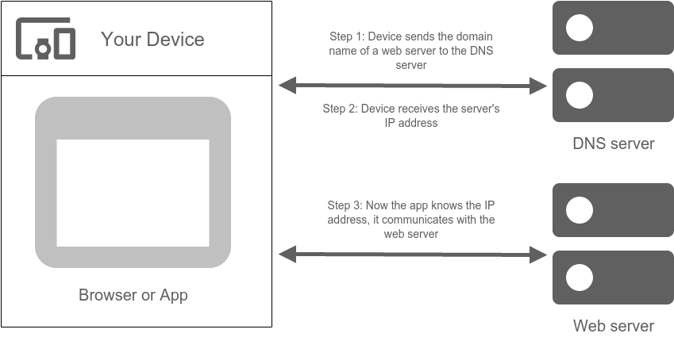
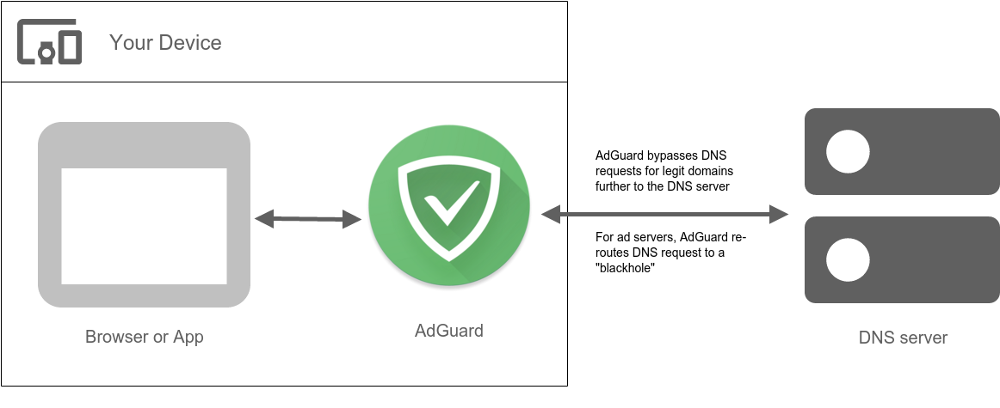
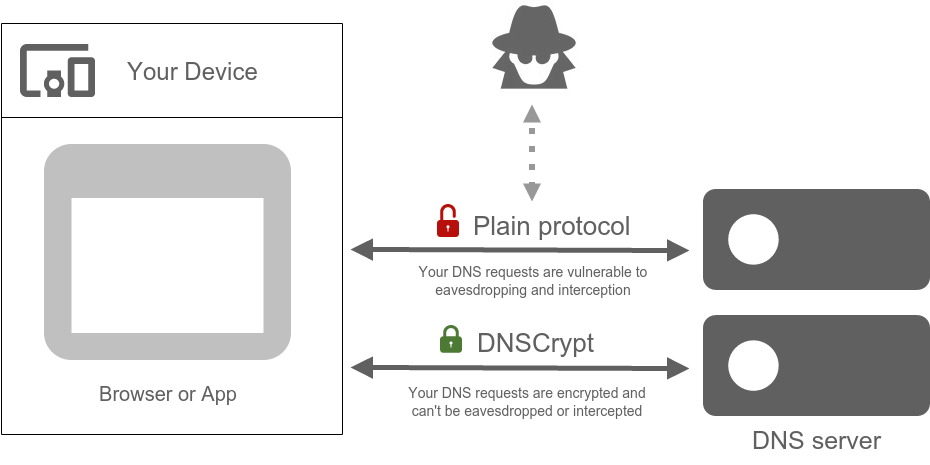

### What is DNS?

DNS stands for 'Domain name system', and its purpose is to translate websites 'names' into something browser can understand, i.e. IP addresses. Thus, each time you go to a website, your browser sends a request to a special server. That server either redirects the request to another server or replies with an IP address. Very schematically it can be represented like this:

The same applies, of course, to all apps and programs that send any web requests.

### How does DNS filtering work?

Usually, your ISP provides a DNS server that does all the job of returning the IP addresses in response to web requests by your apps and browsers. In reality, you are free to use any DNS server for this purpose, and there are plenty of them to choose from (in fact, AdGuard has its own DNS servers - you can read about AdGuard DNS in [another article](https://kb.adguard.com/en/dns/overview)). Some of these DNS servers are designed to do more than just return IP addresses, for example ad blocking. 

The best part is, you don't even need to choose a special DNS server to block ads if you are using DNS filtering. How is it possible? Let's have a look at this diagram:

For example, let's imagine you have AdGuard for Android app installed on your device. If you have DNS filtering enabled, all DNS requests will pass through AdGuard before reaching the DNS server. AdGuard has a special 'Simplified domain names filter' containing a large amount of ad and tracker domains, which it uses in conjunction with User filter to recognize 'bad' requests. Every request is checked against this filter, and if there's a hit, instead of forwarding it to the DNS server, it is being rerouted to a 'blackhole'. Mind you, all this happens locally on your device!

The main advantage of this approach is it is extremely economical and saving. Once a domain is blocked, it won't be requested again within an hour. The disadvantage being the roughness of this method: specific URLs can't be blocked, only whole domains. It can sometimes lead to 'breaking' of a websites functionality.

### What is DNSCrypt and why is it important?

If you use regular client-server protocol, you are at risk of your DNS requests being intercepted and, subsequently, eavesdropped and/or altered. The experiments [show that](https://blog.adguard.com/dns-track-you/) the DNS tracking can even be used to collect a 'profile of interests' for any user. Luckily, AdGuard offers [DNSCrypt](https://dnscrypt.info/) - a special protocol that encrypts communication with the DNS server, thus preventing tampering and tracking by any third party including your ISP.

If you care about your online privacy, we strongly recommend using DNSCrypt as an important part of your defence suit.

