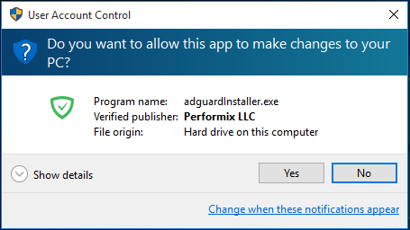
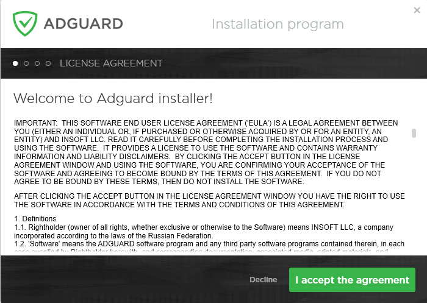
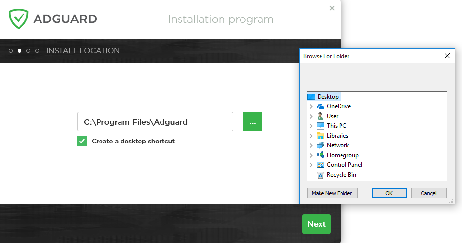
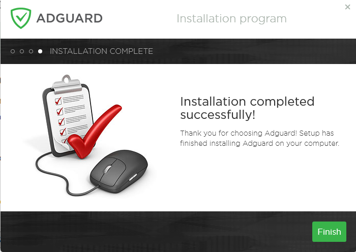
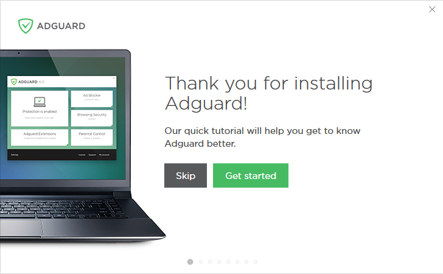
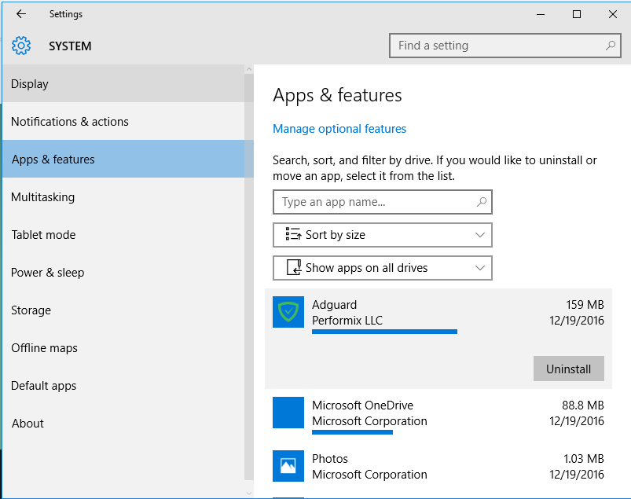
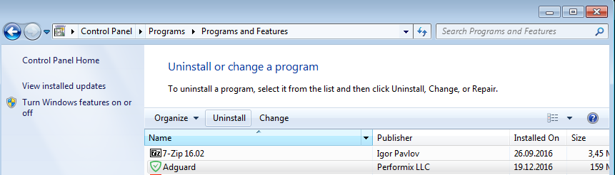

## System  requirements
**Operating system:** Microsoft Windows 10, 8.1, 8, 7, Vista, XP SP3.

**RAM:** at least 512 MB.

**Free disk space:** 60 Mbytes.

**Browsers:** Microsoft Edge, Microsoft Internet Explorer (all versions), Opera, Google Chrome, Yandex.Browser, Mozilla Firefox, and other browsers.

## AdGuard Installation

To use AdGuard on a PC or tablet under Microsoft Windows, you should download the installation package and launch the installation program. Perform the following actions:

1) Open your browser and proceed to the[ AdGuard website](http://adguard.com) by typing AdGuard.com in the address bar, and then click **DOWNLOAD**.

2) When the download is finished, press the **Run** button shown in the Downloads bar or click the file name *adguardInstaller.exe*.

3) You’ll see the User Account Control dialogue box requesting to allow the app to make changes to your PC. Click **Yes**.

4) The installation program will prompt you to read the License Agreement. Accept the terms and conditions by clicking **I accept the agreement** at the bottom of the window.

5) Next, choose the folder on your PC for the app to be installed to. If you do not agree with the default installation path, press the **[…]** button on the right, select the folder for AdGuard installation in the **Browse For Folder** window, and confirm your choice by clicking** OK**. You can also install AdGuard to a new folder by clicking **Make New Folder** and entering its name. To create a desktop shortcut for AdGuard, check the **Create a desktop shortcut** box. Press **Next** to proceed with installation.

6) Wait for the installation to complete and click **Finish**.

7) When the installation is complete, you can learn about the main functions of AdGuard. To begin your tour of the app and step-by-step adjustment of its principal parameters, click **Get started**. If you want to skip this step, press **Skip**.

Congratulations! You have successfully installed AdGuard on your computer. On the screen you will see the main window where you can change the app’s settings.

## Uninstalling and Reinstalling AdGuard

### Regular 

If you need to uninstall or reinstall AdGuard, do the following:

* For Microsoft Windows 10: Open **Start Menu** by clicking **Start**, and select **Settings**. Click the **System** icon in the window that opens. Select **Apps and Features** from the list on the left in the **Settings** window. Select **Adguard** from the list of your installed apps and click **Uninstall**. Click **Uninstall** in the dialogue box that opens to confirm.

* For Microsoft Windows 8.1, 8 and 7: Open **Control Panel**. Click **Uninstall a program** in the **Programs** section, then select **Adguard** from the list of installed apps and press the **Uninstall** button located right above the list. Confirm the action by clicking **Uninstall AdGuard** in the window that opens.

In case regular uninstall doesn't work for any reason, you can try to use Advanced method.

To reinstall AdGuard on your PC, launch the installation program again and repeat the steps in the AdGuard Installation section.

### Advanced
First of&nbsp;all, you need to&nbsp;download the uninstaller tool created by&nbsp;our developers. You can do&nbsp;it&nbsp;by&nbsp;using
[this link](https://cdn.adguard.com/public/Adguard/tools/Uninstall_Utility.zip"). Extract the archive to any folder on your PC and run the **Adguard_Uninstall_Utility.exe** file. Then follow the instruction below:

* Choose <em>&rsquo;Standard uninstall&rsquo;</em> and click <em>&rsquo;Uninstall&rsquo;</em>.

                                 
* Wait until uninstall is&nbsp;finished. there will be&nbsp;a&nbsp;string in&nbsp;the window:
                            <pre>"[OK] Uninstall finished"</pre>
                            

<b>Attention!</b> Follow steps 3-4 only if after performing first two steps wasn’t enough for some reason. Usually it can be determined by seeing incorrect reinstall of AdGuard, but we strongly suggest contacting our support before using steps 3-4 of advanced uninstall instruction.

* Choose <em>&rsquo;Advanced uninstall&rsquo;</em> and click <em>&rsquo;Uninstall&rsquo;</em>.

                                 
* Wait until uninstall is&nbsp;finished. there will be&nbsp;a&nbsp;string in&nbsp;the window:
                            <pre>"[OK] Uninstall finished"</pre>

                                 
AdGuard is successfully uninstalled!                              
