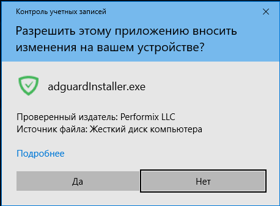
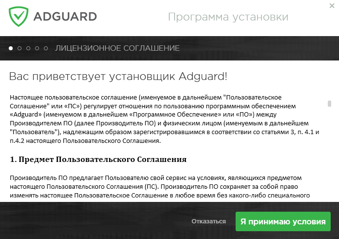
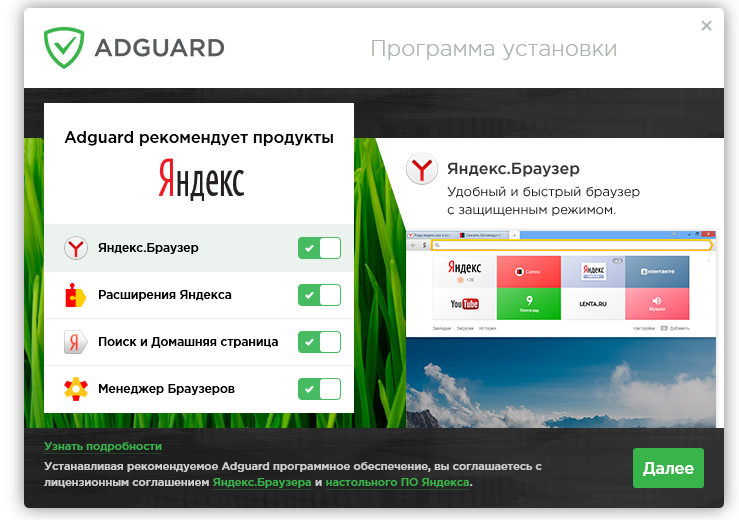
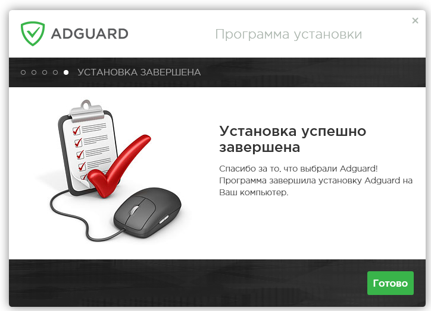
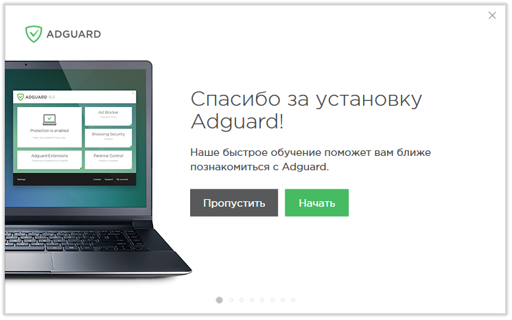
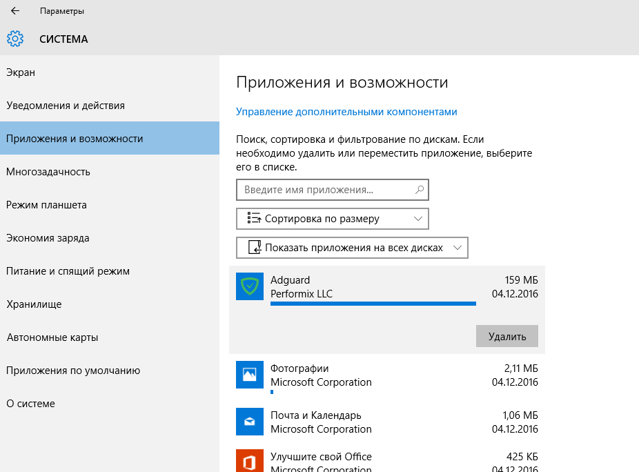
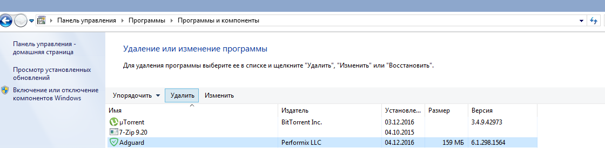

## Системные требования ##

**Поддерживаемые операционные системы:**	Microsoft Windows 10, 8.1, 8, 7, Vista, XP SP3.

**Объем оперативной памяти:**	от 512 Мбайт.

**Необходимый объем доступного дискового пространства:**	60 Мбайт.

**Поддерживаемые браузеры:**	Microsoft Edge, Microsoft Internet Explorer (все версии), Opera, Google Chrome, Yandex.Browser, Mozilla Firefox, другие браузеры.

## Установка AdGuard ##
Чтобы использовать программу AdGuard на компьютере или планшетном устройстве под управлением операционной системы Microsoft Windows, необходимо загрузить дистрибутив этого приложения и запустить программу установки. Для этого выполните перечисленные ниже действия.

1) Откройте окно используемого вами браузера и перейдите на [сайт AdGuard](https://adguard.com/ru/welcome.html), набрав в адресной строке `adguard.com`, а затем щелкните мышью на кнопке ***СКАЧАТЬ***.

2) После завершения загрузки нажмите на кнопку ***Выполнить***, которая отобразится в панели загрузки браузера, либо щелкните мышью на скачанный файл *adguardinstaller.exe*.

3) На экране появится диалоговое окно службы Контроля учетных записей пользователей, содержащее запрос на внесение изменений в настройки вашего компьютера. Нажмите на кнопку ***Да***.

4) Программа установки предложит вам ознакомиться с текстом Пользовательского Соглашения. Следует принять условия этого Соглашения нажатием на кнопку ***Я принимаю условия***, расположенную в нижней части окна. 

 

5) На следующем этапе необходимо выбрать папку на вашем компьютере, в которую будет установлена программа. Если вас по каким-либо причинам не устраивает предложенная по умолчанию папка установки, нажмите на расположенную правее кнопку **[…]**. В открывшемся окне ***Обзор папок*** укажите папку, в которую вы желаете установить программу AdGuard, и подтвердите свой выбор нажатием на кнопку ***ОК***. Вы также можете установить AdGuard в новую папку: для этого щелкните мышью на кнопке ***Создать папку*** и введите ее имя. Чтобы разместить ярлык AdGuard на Рабочем столе Windows, установите флажок ***Создать ярлык на рабочем столе***. Для продолжения установки нажмите на кнопку ***Далее***.
 
 

6) В следующем окне вам будет предложено установить дополнительные продукты. Вы можете отказаться от использования этих приложений, переместив влево соответствующие переключатели в списке предлагаемых программ. Чтобы получить более подробные сведения об этих продуктах, воспользуйтесь ссылкой ***Узнать подробности*** в нижней части окна. Для продолжения установки нажмите на кнопку ***Далее***.

 
 
7) Дождитесь окончания процедуры установки и щелкните мышью на кнопке ***Готово***.

 
 
8) После завершения установки вы сможете изучить основные возможности программы AdGuard. Чтобы приступить к знакомству с приложением, а также настроить в пошаговом режиме основные параметры его работы, нажмите кнопку ***Начать***. Если вы хотите пропустить этот шаг, воспользуйтесь кнопкой ***Пропустить***.

 

Поздравляем, вы успешно установили программу AdGuard на свой компьютер. На экране отобразится основное окно приложения, в котором вы сможете изменить его настройки.

## Удаление и переустановка AdGuard ##

Если у вас возникла необходимость удалить AdGuard или переустановить эту программу, выполните следующие действия:

- В Microsoft Windows 10 откройте ***Главное меню*** нажатием кнопки ***Пуск*** и выберите в нем пункт ***Параметры***. В отобразившемся окне нажмите на значок ***Система***. В списке, расположенном в левой части окна ***Параметры***, выберите пункт ***Приложения и возможности***. В перечне установленных на вашем компьютере приложений выберите пункт ***Adguard*** и нажмите кнопку ***Удалить***. В открывшемся диалоговом окне подтвердите выбранное действие нажатием кнопки ***Удалить AdGuard***.

  

- В Microsoft Windows 8.1, 8 или 7 откройте окно ***Панели управления***. Нажмите на надпись ***Удаление программы*** в разделе ***Программы***, затем выберите в списке установленных приложений AdGuard и нажмите кнопку ***Удалить***, расположенную непосредственно над этим списком. В открывшемся окне подтвердите выбранное действие нажатием кнопки ***Удалить AdGuard***.

   

В случае, если обычное удаление по какой-либо причине не помогает, следуйте инструкциям по продвинутому удалению AdGuard.

### Продвинутое удаление
*Используйте эту инструкцию, только если инструкция по стандартному удалению не помогла.*

Для начала необходимо установить специальную утилиту для удаления AdGuard, созданную нашими разработчиками. Её можно скачать по [этой ссылке](https://cdn.adguard.com/public/Adguard/tools/Uninstall_Utility.zip). Распакуйте скачанный архив в любую папку на вашем компьютере и запустите файл AdGuard_Uninstall_Utility.exe

1. Выберите пункт ’Standard uninstall’ и нажмите кнопку ’Uninstall’ в правом нижнем углу.

2. Дождитесь окончания удаления, в окне появится строка:
*"[OK] Uninstall finished"*

*Внимание!* Пункты 3-4 выполняйте только в том случае, если после выполнения пунктов 1-2 AdGuard не был корректно удален по той или иной причине! Обычно это можно определить по тому, что AdGuard не переустанавливается после обычного удаления, но мы настоятельно рекомендуем предварительно связаться со службой поддержки перед тем, как выполнять следующие пункты продвинутой инструкции.

3. Выберите в главном меню утилиты пункт *’Advanced uninstall’* и нажмите кнопку *’Uninstall’* в правом нижнем углу.

4. Дождитесь окончания удаления, в окне появится строка:
*[OK] Uninstall finished*

5. AdGuard успешно удален!

### Переустановка AdGuard
Для того чтобы переустановить AdGuard на вашем компьютере, запустите заново программу установки и последовательно повторите шаги, изложенные в разделе «*Установка AdGuard*».
