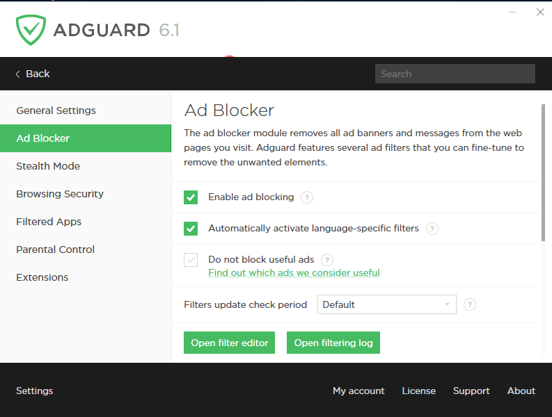

This is the main module of AdGuard for Windows that filters off ads on websites viewed by the user and in the user’s installed apps. Ad Blocker clears web pages of advertising images and messages using specific rules. The undesirable content is filtered even before the page is loaded in the browser, which helps save a lot of traffic.

Ad Blocker is flexibly adjusted to your needs, so you can add any object on pages you are viewing to the blocking rules, or turn off filtering on select websites. There is an option of completely halting the module and resuming its work when needed. Ad Blocker filters are updated automatically; however, you can change the User Filter parameters by editing the list of website URLs in its settings.

AdGuard works well with all Microsoft Windows compatible browsers, therefore Ad Blocker will successfully filter the ads in any website-viewing application you may use. 

AdGuard provides users with numerous filters that let you fine-tune blocking properties.

Filters receive automatic updates from AdGuard servers. Our specialists create them all manually based on user data received. You can always help other AdGuard users by sending us website URLs that you have still seen ads at.