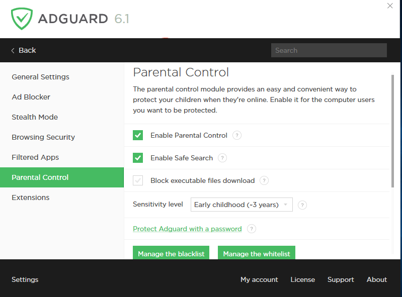
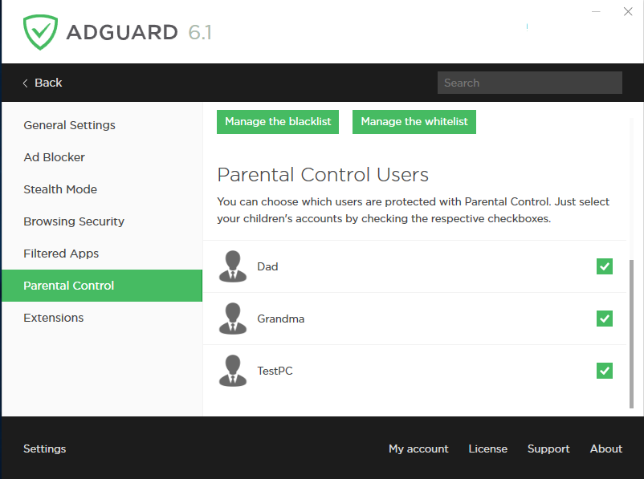

There are numerous websites access to which should be restricted if the PC is used by children. This task is accomplished by Parental Control.

The module checks the contents of web pages opened in the browser and filters those with content undesirable for children: images and texts for adults, crude language, violence, drug propaganda, etc. Parental Control settings are password protected so that the child is not able to go round the restrictions. This module not only blocks directions to undesirable sites but can also delete the links that are inappropriate for children from the search results. Filter sensitivity is flexibly adjusted. 

**Enable Parental Control**

Turn Parental Control on or off.

**Enable Safe Search**

Safe Search excludes adult and other content that is inappropriate for children from search results in popular search engines (Yandex, Rambler, Google, Yahoo).

**Block executable files download**

Enabling this function will make Parental Control block downloading any executable files. This option will forbid your child from downloading and installing software on the protected device.

**Sensitivity level
**
Sets the level of sensitivity for Parental Control depending on the age of your child.

**Protect AdGuard with a password
**
A password protects AdGuard from change of settings or disabling. You can also use the password to access websites Parental Control has blocked.

**Manage the blacklist**

Here you can manually add websites you thinks are inappropriate for your children.

**Manage the whitelist**

You can manually disable Parental Control for certain sites.

**Protected users**

Choose which users are protected by Parental Control. Just check the boxes near your children’s names.
