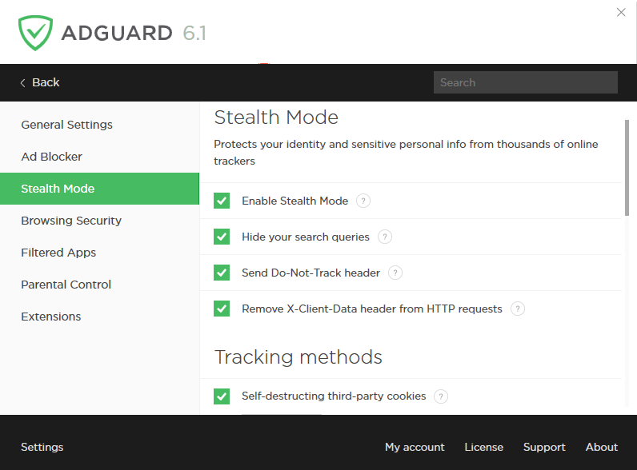
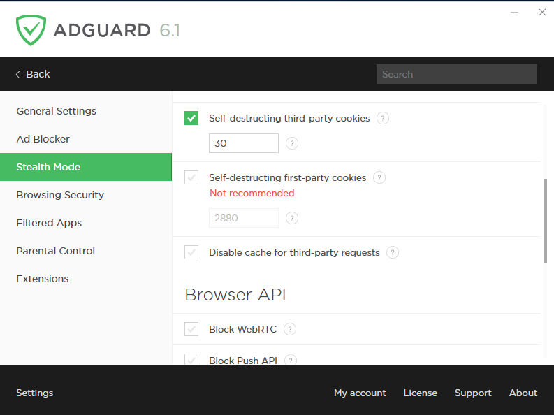
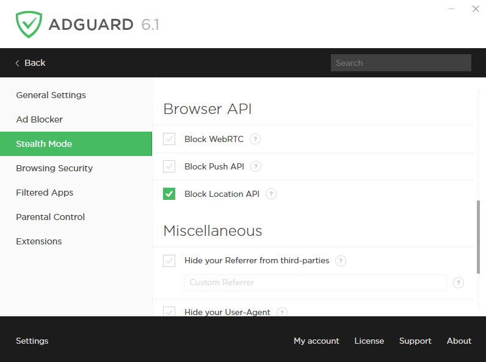
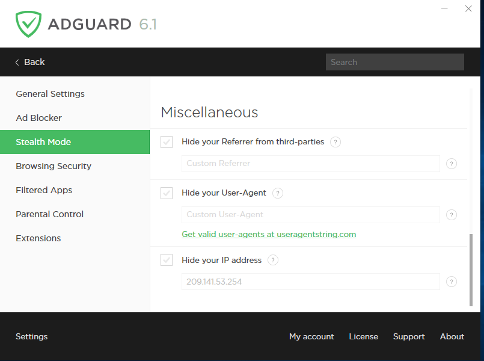

Many websites gather information about their visitors, such as their IP addresses, information about the browser and operating system installed, screen resolution, and even what page the user was redirected from. Some web pages use cookies to mark the browser and save your personal settings, user preferences, or “recognize” you upon your next visit. Stealth Mode safeguards your personal information from such data and statistics gathering systems.

You can flexibly adjust the work of Stealth Mode: for instance, you can prohibit the website to receive the search request you used to find it on the Internet, automatically delete both third-party and website’s own cookies, turn off browser geolocation sharing that can be used to track your whereabouts, hide your real IP-address or even indicate one of your choice.

**Enable Stealth Mode**

Turn the Stealth Mode module on or off.

**Hide your search queries**

When you proceed to the website from Google, Yahoo or any other search engine, this option hides the search query you used to find it.

**Send Do-Not-Track header**

Sends a Do-Not-Track (DNT) HTTP header to queried websites that requires web apps to disable tracking of your activity.

**Remove X-Client-Data header from HTTP requests**

Forbids Google Chrome to send its version and modifications information with requests to Google domains (including Double Click and Google Analytics).

**Strip tracking parameters from URLs**

If you enable this option, AdGuard will strip tracking parameters like utm_* and fb_ref from pages’ URLs.

**Self-destructing third-party cookies**

Websites store your information and preferences with cookies – e.g., they remember the language you chose, the location or even the list of goods in your cart. When you get back to the site, your browser sends back the cookies belonging to that website, which allows it to “recall” your data.

Third-party cookies are those implemented by a website that is different from the one you are browsing at the moment. E.g., cnn.com may have a Facebook “Like” widget on it page. This widget will implement a cookie that may be read by Facebook later on. Some advertisers use such cookies to track what other sites you visit where their ads are posted.

Put a time period (in minutes) by the end of which all third-party cookies will be destroyed. Set the timer to 0 in order to block them completely.

**Self-destructing first-party cookies**

We do not recommend enabling this option as it may severely interfere with the work of certain sites.
Put a time period (in minutes) by the end of which all cookies will be destroyed. Set the timer to 0 in order to block them completely.

**Disable cache for third-party requests**

When the browser addresses a page, the server assigns it an ETag, which the browser then uses to cache the contents. Upon subsequent requests it sends the ETag to the corresponding server, thus letting it learn the visitor’s identity. While the site files are cached, the ETag is sent every time your browser addresses this site. If the site has content embedded from another server (e.g., an image or iframe), that server will also be able to track your activities without your knowing it.

**Block third-party Authorization header**

Authorization header's value is simply a base64 encoded version of the credentials (<username>:<password>), which are sent to the server for authentication purposes. In this case, data would be readily available to anyone, who could intercept the HTTP request. Enabling this option will remove Authorization headers for all third-party requests. Note that this can result in the need to re-enter your credentials on the web-forms.

**Block WebRTC**

WebRTC (Real Time Communications) is a technology that allows streaming of data directly between browsers and apps. It can let others know your real IP address even if you use a proxy or VPN.
Enabling this option can disrupt the work of certain browser applications, such as messengers, chats, cinemas, or games.

**Block Push API**

Push API enables servers to send messages to web applications regardless of browser status. This means you may see notifications from varous websites even if your browser is hidden to tray or not launched. Enable this option to block browser Push API completely.

**Block Location API**

Enabling this option will prohibit the browser from sending GPS data that could be used to find your location and modify your search results or otherwise influence your web experience.

**Block Flash**

The Flash Player plugin has become increasingly vulnerable to online threats like viruses and hackers and can also have a significant negative impact on loading time for websites. When this setting is on, AdGuard blocks browsers' ability to detect components (like plugins and ActiveXObject objects) that allow Flash to display content. This effectively means that browsers are unable to support Flash.

**Block Java**

Some websites and web services still use old technology of supporting Java plugins. The API, which is the basis of Java plugins, has serious security issues. You can disable such plugins for security purposes. Nevertheless, even if you decide to use "Block Java" option, Javascript will still be enabled.

**Hide Referer from third-parties**

Referer is one of HTTP headers for browser-to-server request. It contains the URL of request source. If you advance from one page to another, Referer will save the URL of the initial page. The server is often equipped with software that analyzes Referer and extracts various information from it. Enabling this option hides the current website from third-party sites by changing the HTTP header.
You can also set Referer of your choice by typing it into the Custom Referer field. Leave the field empty to use the default Referer.

**Hide your User-Agent **

When you visit a website, your browser send the server its information. It looks like a text line that is a part of HTTP request beginning with “User-Agent:”. It usually includes the name and version of the browser, operating system, and language settings. We always replace your operating system with Linux as we consider \*nix system users as less interesting for advertisers.

You can also set User-Agent of your choice by typing it into the Custom User-Agent field. Leave the field empty to use the default User-Agent.

**Hide your IP address**

Stealth Mode cannot hide your IP address. However, we can conceal it so that websites you visit will take you for a proxy server. Sometimes, it helps, and websites ignore your real IP.
You can set a random IP that you would like to be perceived as yours by simply typing it into the corresponding field. Leave the field empty to use the default IP address.

