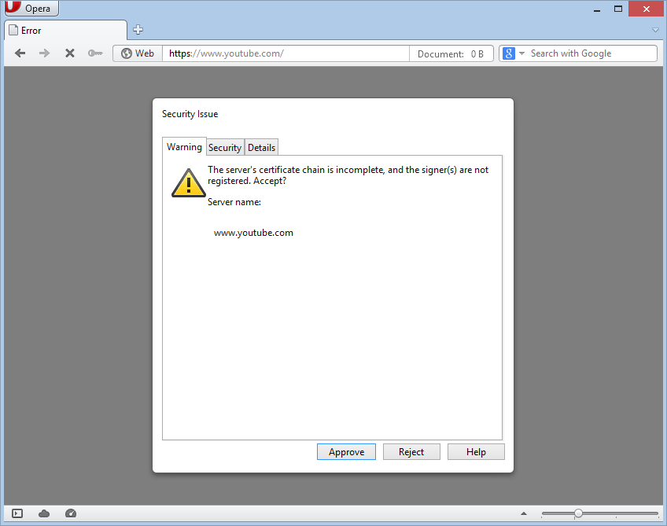

This problem is more common for the Firefox-based browsers and Opera 12.

The easiest way to solve it is to:

1. Go to Network Settings.

2. Scroll to the middle to find 'Reinstall Certificate' button.

3. Click on it and wait until the certificate is automatically reinstalled. Note that browsers all will be closed.

4. Open your browser. The problem should be solved.

If the problem persists, you should use one of specified manuals depending on your browser:
 

* [Firefox](#firefox)
* [Opera](#opera)

<!---
* [Comodo IceDragon](#comodo)
* [K-Meleon](#k-meleon)
--->

#### Firefox

If [basic manual](#basic) didn't help you, there are two ways to solve the problem.

**First way**

Manual certificate import.

In case you want to keep filtering HTTPS protocol, we suggest you this instruction on manual AdGuard certificate importing.

To do so:
1. Open Firefox browser and proceed to Options menu

2. Open 'Advanced -> Certificates' tab, and find 'View Certificates' in the window. Click on it.

3. Choose 'Authorities' tab and click on "Import...".

4. In the opened window type in ** %ProgramData%\Adguard\NetworkTemp\SSL\ ** and choose AdGuard Personal CA in the shown folder, then press 'Open'.

5. Check the checkboxes as it is shown on the screenshot and click 'OK'.

6. In 'Authorities' window choose 'AdGuard personal CA' and click on 'View...'.

7. Make sure that the certificate is valid for the current date.

**Second way**

Disabling HTTPS filtering

To do so:

Go to the Network settings.

Disable the HTTPS filtering as it’s done in this picture:

We do not recommend this way, as it will leave all your HTTPS traffic unfiltered. Only use it as a temporary measure and contact our [support team](/technical-support).

#### Opera

If [basic manual](#basic) didn't help you, there are two ways to solve the problem.

**First way**

Manual certificate import.

In case you want to keep filtering HTTPS protocol, we suggest you this instruction on manual AdGuard certificate importing.

To do so:
1. Open Opera browser and proceed to Settings -> Preferences menu

2. Open 'Advanced -> Security' tab, and find 'Manage Certificates' in the window. Click on it.

3. Choose 'Authorities' tab and click on "Import".

4. In the opened window type in **%ProgramData%\Adguard\NetworkTemp\SSL\ ** and choose AdGuard **Personal CA** in the shown folder, then press 'Open'.

5. In the opened window click on 'View...'.

6. Check the checkboxes as it is shown on the screenshot and click 'OK'.

7. In the opened window confirm that you trust the issuer.

8. In 'Authorities' window choose 'AdGuard personal CA' and click on 'View...'.

9. Make sure that the certificate is valid for the current date.

**Second way**

Disabling HTTPS filtering.

To do so:

Go to the Network settings.

Disable the HTTPS filtering as it’s done in this picture:

We do not recommend this way, as it will leave all your HTTPS traffic unfiltered. Only use it as a temporary measure and contact our [support team](/technical-support).

<!---

#### Comodo IceDragon

**Adding a security certificate Comodo IceDragon browser.**

If you are using Comodo Icedargon browser, then after installation of AdGuard you are going to have a problem with visiting websites, protected by a security certificate (https).

To solve this problem you need to install the AdGuard root certificate or disable https filtering.

**Instructions for a Comodo IceDragon browser.**

If when using a Comodo IceDragon browser with enabled https filtering you see the message that shown below, you need to install the AdGuard root certificate or disable https filtering in the AdGuard network settings.

Go to Browser Settings, in the "Advanced" tab click on the "Certificates" and then on "View certificates".

In the opened window select “Authorities” tab and click on “Import…”.

In the appeared window, type in the address bar: ** %ProgramData%\Adguard\NetworkTemp\SSL** and press Enter.

Choose “AdGuard CA.rar” from the list anf click “Open”.

In the appeared window, you need to select the purposes for which you are importing the certificate. Select all of the proposed options by putting a “tick” next to them and then press the "OK" button.

Click “Ok” once again.

After adding the certificate, restart the browser.

#### K-Meleon

##### Adding a security certificate to K-Meleon browser

If you are using K-Meleon browser, then after installation of AdGuard you are going to have a problem with visiting websites, protected by a security certificate (https).

To solve this problem you need to install the AdGuard root certificate or disable https filtering.

##### Instructions for a K-Meleon browser

If a browser shows you the following message, when you visit the website protected by a certificate, then you need to install the root certificate.

To install the root certificate, follow the instructions below. Go to the “Tools” tab, then "View details", then click on "View certificates".

In the opened window, select the tab "Authorities" and click "Import".

In the appeared window, type in the address bar: % ProgramData% \ AdGuard \ NetworkTemp \ SSL and press Enter.

Choose “AdGuard CA.rar” from the list and click “Open”.

In the opened window, tick all the boxes and press "OK".

Click “OK” once again.

After adding the certificate, restart the browser.

--->
