Чаще всего подобная проблема встречается в браузерах на основе Firefox и Opera 12. 

Самым простым решением будет следующее: 

1. Откройте раздел "Сеть". 

2. Прокрутите вниз до середины экрана и найдите кнопку "Переустановить сертификат". 

3. Нажмите эту кнопку. Учтите, что все браузеры при этом закроются автоматически.

4. Запустите браузер. Проблема должна быть решена.

Если проблема осталась, вам необходимо воспользоваться одной из инструкций, в зависимости от версии бразуера:

* [Firefox](#firefox)
* [Opera](#opera)

<!---
* [Comodo IceDragon](#comodo)
* [K-Meleon](#k-meleon)
--->

## Firefox

Если [обычная](#basic) инструкция не помогла, воспользуйтесь одним из этих способов.

##### Первый способ

Добавление сертификата вручную.
В случае если вы хотите сохранить фильтрацию HTTPS-протокола, предлагаем вам следующую инструкцию для установки сертификата AdGuard вручную.

Для этого:
1. Откройте браузер Firefox и перейдите в меню настроек.

2. Откройте вкладку "Дополнительные - Сертификаты", затем нажмите "Просмотр сертификатов".

3. Перейдите во вкладку "Центры сертификации" и нажмите "Импортировать..."

4. В открывшемся окне введите в поиск **%ProgramData%\Adguard\SSL**, выберите в открывшейся папке **AdGuard Personal CA** и нажмите **"Открыть"**.

5. Выставьте флажки, как показано на иллюстрации, и нажмите кнопку «Ок».

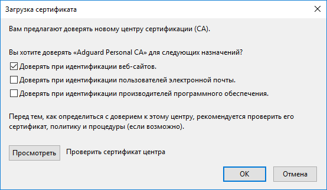

6. Выберите в окне «Центры сертификации» только что установленный сертификат и нажмите кнопку «Просмотреть…».

7. Убедитесь, что сертификат действителен для текущей даты.

##### Второй способ

Отключение HTTPS фильтрации

Для этого: 

1. Перейдите в Общие настройки AdGuard 

2. Выключите фильтрацию HTTPS как это сделано на картинке:

Мы не рекомендуем использовать этот способ, так как при этом весь HTTPS трафик не будет фильтроваться. Этот вариант можно использовать в качестве временной меры, написав при этом в [службу поддержки](/technical-support).

## Opera

Если [обычная](#basic) инструкция не помогла, воспользуйтесь одним из этих способов.

##### Первый способ

Добавление сертификата вручную.
В случае если вы хотите сохранить фильтрацию HTTPS-протокола, предлагаем вам следующую инструкцию для установки сертификата AdGuard вручную.

Для этого:
1. Откройте браузер Opera и перейдите в меню настроек.

2. Откройте вкладку "Расширенные - Безопасность", затем нажмите "Управление сертификатами".

3. Перейдите во вкладку "Издатели" и нажмите "Импорт".

4. В открывшемся окне введите в поиск **%ProgramData%\Adguard\SSL**, выберите в открывшейся папке **AdGuard Personal CA** и нажмите "**Открыть**".

5. В открывшемся окне нажмите кнопку «Просмотреть».

6. Установите флажки, как показано на иллюстрации, и нажмите кнопку «Ок».

7. В появившемся окне подтвердите, что доверяете издателю.

8. Выберите в окне «Управление сертификатами» только что установленный сертификат и нажмите кнопку «Просмотреть…».

9. Убедитесь, что сертификат действителен для текущей даты.

##### Второй способ

Отключение HTTPS фильтрации

Для этого: 

1. Перейдите в Общие настройки AdGuard 

2. Выключите фильтрацию HTTPS как это сделано на картинке:

Мы не рекомендуем использовать этот способ, так как при этом весь HTTPS трафик не будет фильтроваться. Этот способ можно использовать в качестве временной меры, написав при этом в [службу поддержки](/technical-support).

<!---

#### Comodo IceDragon

Если при использовании браузера Comodo IceDragon и включенной https фильтрации вы наблюдаете показанное на иллюстрации сообщение, то вам необходимо установить корневой сертификат AdGuard или отключить фильтрацию https в сетевых настройках AdGuard.

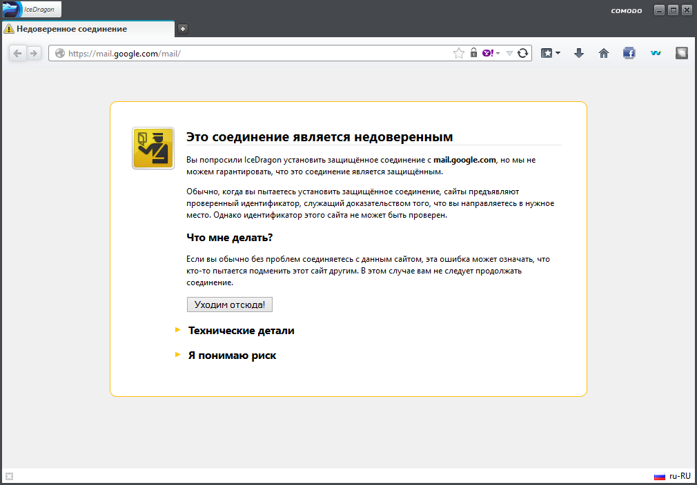

Перейдите Настройки браузера, выберите в разделе «Дополнительные» вкладку «Сертификаты» и нажмите кнопку «Просмотр сертификатов».

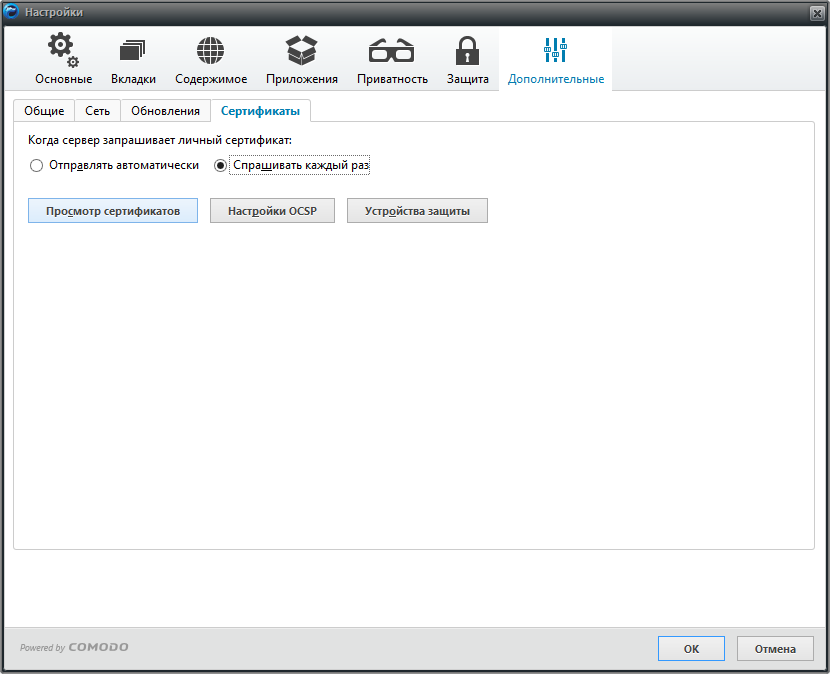

В открывшемся окне выберите вкладку Центры сертификации и нажмите кнопку «Импортировать…».

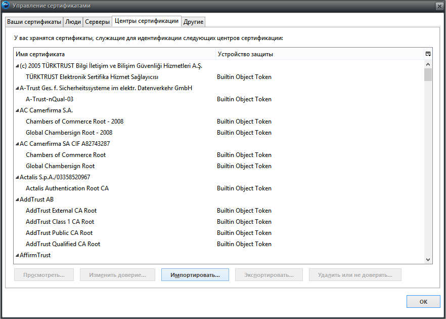

В открывшемся окне в адресную строку введите **%ProgramData%\Adguard\NetworkTemp\SSL** и нажмите Enter.

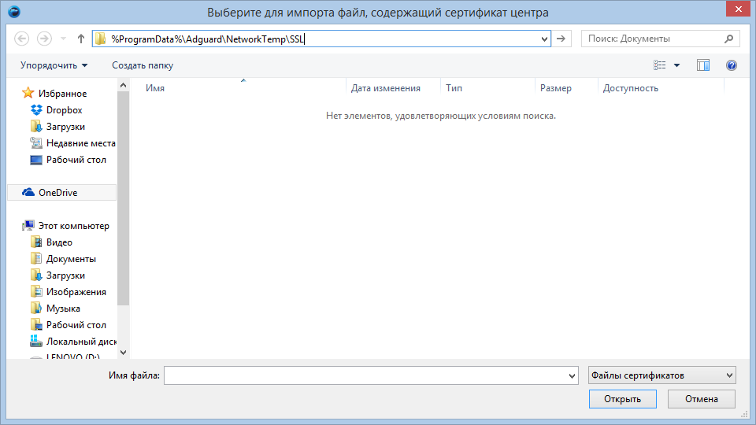

Выберите из списка «AdGuard CA.cer» и нажмите «Открыть».

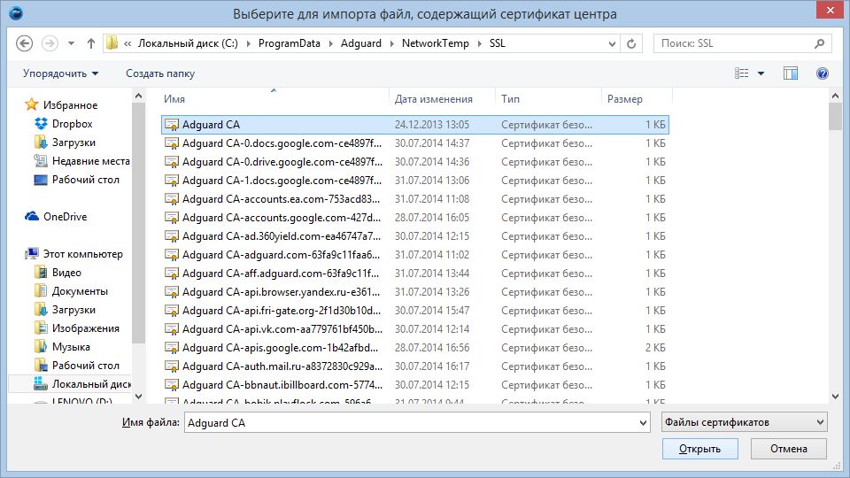

В появившемся окне необходимо выбрать цели, для которых вы импортируете сертификат. Выбирайте все предложенные варианты, отметив их флажками, после чего жмите кнопку «ОК».

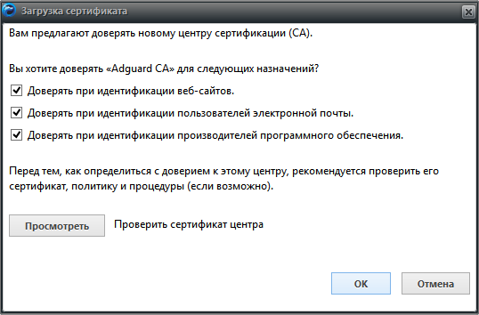

Еще раз нажмите «ОК».

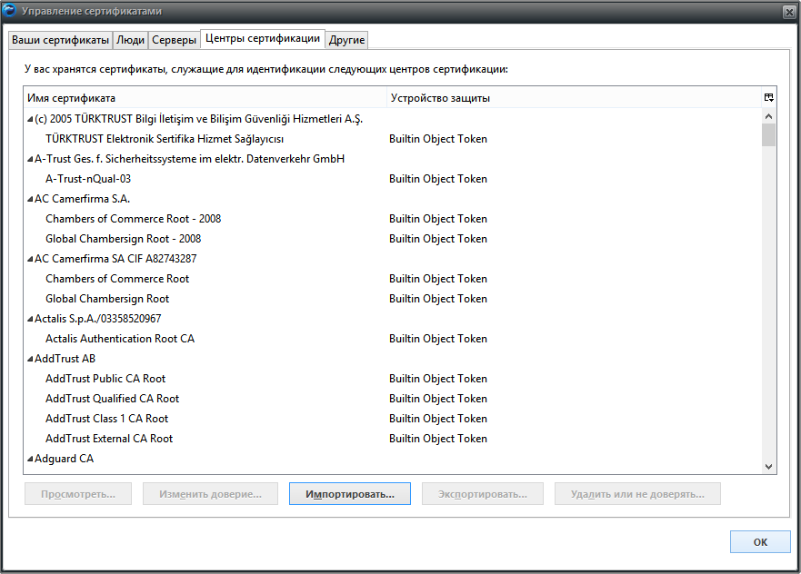

После добавления сертификата перезагрузите браузер.

Готово! Теперь вы можете посещать защищенные сертификатом сайты.

#### K-Meleon

Если при посещении сайта, защищенного сертификатом, браузер выдает вам следующее сообщение, необходимо установить корневой сертификат.

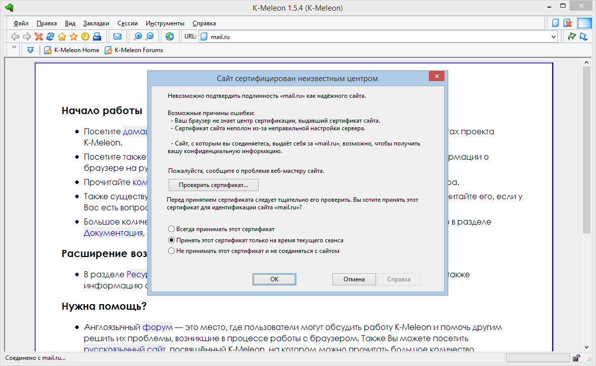

Для установки корневого сертификата следуйте предложенной ниже инструкции.

Откройте меню "Инструменты", затем - "Просмотреть данные", затем - "Просмотреть сертификаты".

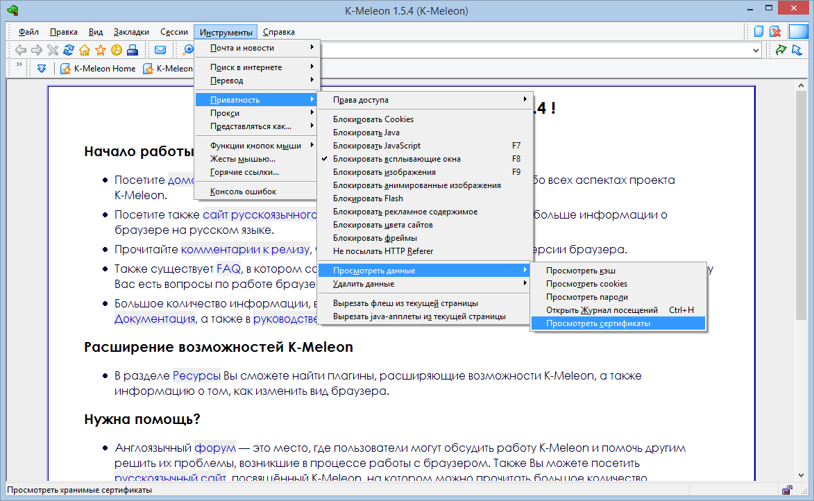

В открывшемся окне перейдите во вкладку "Центры сертификации" и нажмите "Импорт".

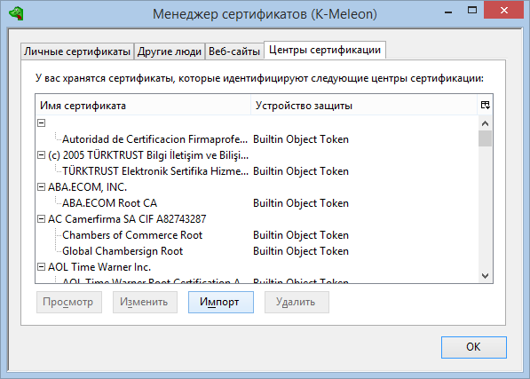

В открывшемся окне введите в адресную строку **%ProgramData%\Adguard\NetworkTemp\SS**L и нажмите Enter.

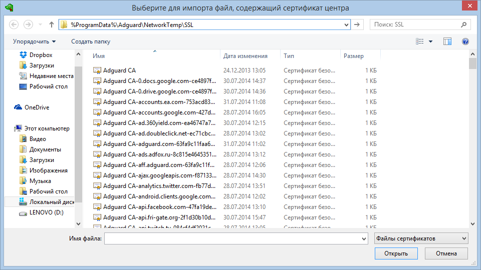

Выберите из списка "AdGuard CA.cer" и нажмите "Открыть".

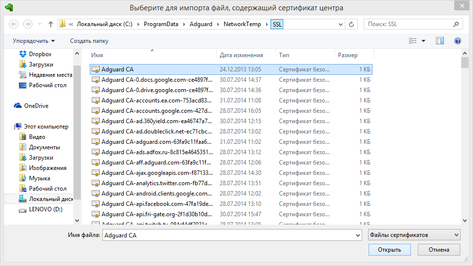

В открывшемся окне отметьте флажками все пункты и жмете "ОК".

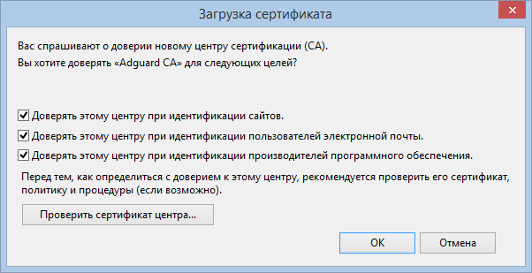

Нажмите еще раз "Ок".

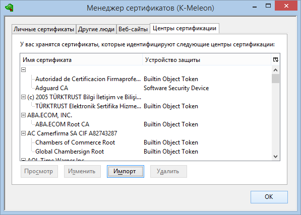

После добавления сертификата перезагрузите браузер.

Готово! Теперь вы можете посещать защищенные сертификатом сайты.

--->
