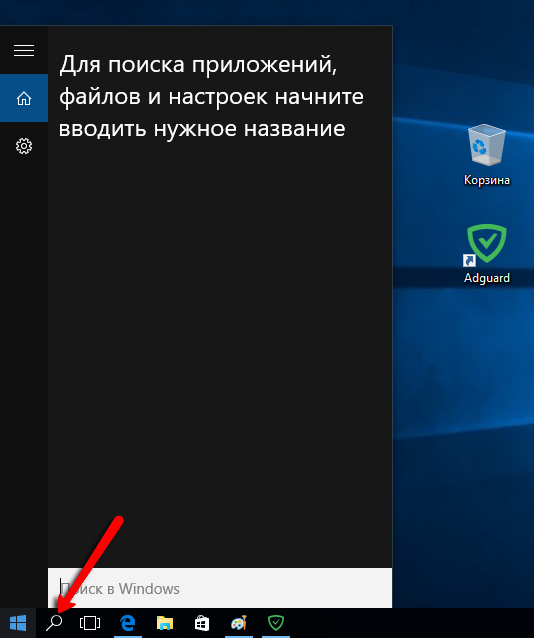

Для анализа и диагностики различных проблем службе поддержки могут понадобиться файлы журнала AdGuard. Эти файлы содержат записи обо всех ошибках, которые произошли с программой за последнее время. Ниже представлена краткая инструкция, описывающая как получить и отправить в службу поддержки файлы журнала.

1. Перейдите в директорию с рабочими файлами AdGuard.

В Windows 10 нажмите на значок "Поиск" в панели задач:

Введите %programdata%\AdGuard и нажмите Enter.

Если вы используете Windows 8 или 8.1, то перейдите в раздел Поиск:

Введите %programdata%\AdGuard и нажмите Enter:

Если вы используете Windows 7 или Vista, то, нажмите на кнопку Пуск, введите в строке поиска %programdata%\AdGuard и нажмите Enter.

2. Создайте архив с файлами журнала AdGuard

Для этого щелкните правой кнопкой мыши на директории **Logs** в открытой вами папке в пункте 1.
Выберите **Отправить - Сжатая (zip) папка**, как это показано на картинке:

**Внимание!** Заархивировать, используя WinRar, не получится. Рекомендуем следовать согласно инструкции.

3. Отправьте полученный файл Logs.zip в [службу поддержки](mailto:support@adguard.com) AdGuard.