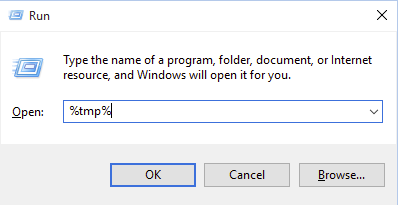
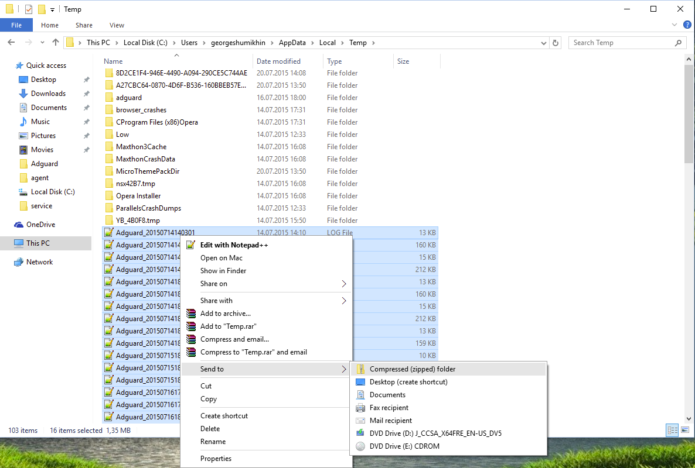

To collect and send AdGuard installation log you have to:

1. Select '**Run**' command in Start menu or press (Win+R), then type in **%tmp%** and click on '**OK**':

2. In the opened folder select all files starting with 'Adguard' and add them to archive (using WinRAR, for example):

3. Send this archive to AdGuard [tech support](mailto:support@adguard.com).