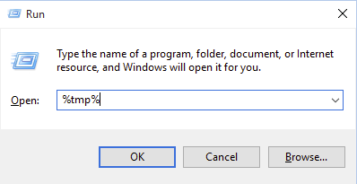

Для получения и отправки лога установки AdGuard, необходимо:

1. Запустить команду "Выполнить" (Win+R), ввести в строке **%tmp%**, нажать "OK":

2. В открывшейся папке выбрать все файлы, начинающиеся с "Adguard" и запаковать в архив:

3. Полученный архив отправить в [службу поддержки](mailto:support@adguard.com) AdGuard.