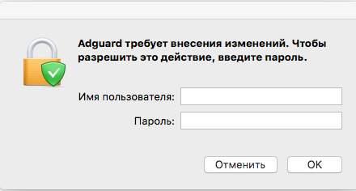

## Системные требования

**Версия операционной системы:** OS X 10.10 (64 bit) или более поздняя

**Объем оперативной памяти:**	от 2 Гб

**Браузеры:**	Safari, Google Chrome, Opera, Yandex.Browser, Mozilla Firefox, любой другой браузер, совместимый с macOS

**Свободное пространство на диске:** 120 Мбайт

## Установка программы

Для того чтобы установить Adguad для macOS на вашем компьютере, запустите браузер, наберите в адресной строке _adguard.com_ и на открывшейся веб-странице нажмите кнопку **_Скачать_**.

Дождитесь окончания загрузки файла _Adguard.release.dmg_ и щелкните мышью на его значке в списке загруженных объектов, который демонстрируется в панели dock. На Рабочем столе вашего компьютера отобразится значок AdGuard. Щелкните на нем мышью, чтобы открыть окно программы установки.

В окне программы установки сделайте двойной клик мышью на значек AdGuard.
При первом запуске AdGuard операционная система продемонстрирует на экране предупреждение о том, что данное приложение загружено из Интернета. Нажмите кнопку **_Открыть_**.

Далее вам следует подтвердить процедуру установки нажав **_Установить_**.

Для использования программы вам потребуется ввести пароль администратора вашей учетной записи macOS. Введите его в открывшемся диалоговом окне и нажмите кнопку **_ОК_**.

## Удаление программы

#### Стандартное удаление 

Первым делом, откройте приложение «Finder», кликнув по соответствующей иконке:

Перейдите в раздел *«Программы»*. Выберите в списке AdGuard, кликните по нему правой кнопкой мыши и выберите пункт *«Переместить в корзину»*.

#### Продвинутое удаление

Используйте эту инструкцию только после выполнения всех шагов из инструкции по «стандартному удалению». После её выполнения:

1. Удалите следующие файлы Адгарда:
 * целиком папку /Library/Application Support/com.adguard.Adguard
 * целиком папку ~/Library/Application Support/com.adguard.Adguard
 * файл ~/Library/Preferences/com.adguard.Adguard.plist
2. Запустите приложение «Мониторинг системы».
3. Через поиск найдите процесс *’cfprefsd’*.

4. Остановите процесс, запущенный от имени пользователя.

AdGuard полностью удален с вашего компьютера.
