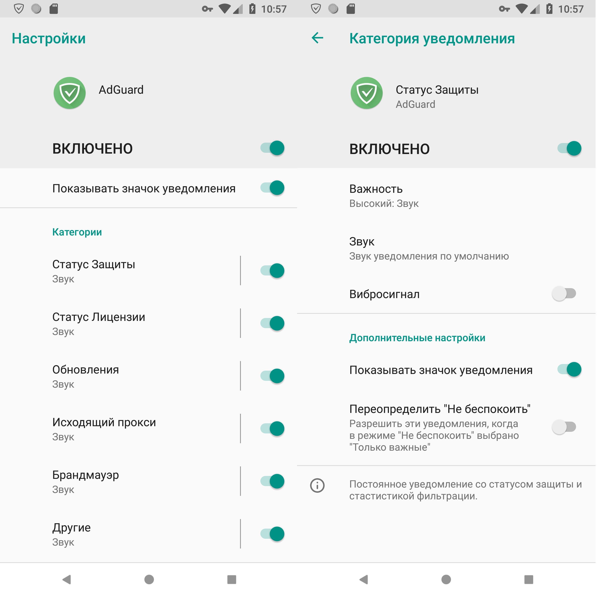
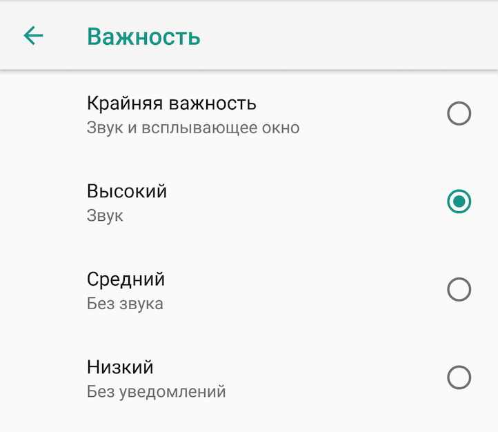

* [Что такое AdGuard?](#wtf)
* [Как работает защита AdGuard?](#howitworks)
* [Нужно ли получение ROOT доступа?](#root)
* [Как вручную настроить локальный HTTP прокси?](#http)
* [Как использовать другой VPN вместе с AdGuard?](#vpn)
* [Какие ограничения имеет режим VPN?](#restrictions)
* [Почему не получается установить флажок "Я доверяю", когда Android спрашивает разрешения на включение VPN?](#checkbox)
* [Почему я вижу сообщение "Нет поддержки VPN"?](#novpn)
* [Почему статистика Android показывает, что AdGuard использовал больше трафика, чем сэкономил?](#traf)
* [Почему режим модема не работает вместе с AdGuard?](#modem)
* [Какие браузеры не поддерживаются AdGuard?](#browsers)
* [Почему может не запускаться VPN на Android 5.0?](#andr5)
* [Как устранить известные конфликты с другими приложениями?](#conflicts)
* [Почему в режиме прокси функционал брандмауэра ограничен и статистика не очень точна?](#firewall)
* [Значит, режим прокси - это плохо?](#badproxy)
* [Почему некоторые приложения находятся в списке исключений?](#iskl)
* [Как работает DNS-фильтрация?](#nsfilter)
* [Как работает фильтрация HTTPS?](#https)
* [Чем отличаются алгоритмы фильтрации AdGuard?](#methods)
* [Как управлять уведомлениями AdGuard?](#notifications)

## Что такое AdGuard?

AdGuard – это единственный в своём роде интернет-фильтр, который защищает вас от вездесущей рекламы, вредоносных и фишинговых сайтов, онлайн-трекинга и многого другого.

AdGuard действительно справится с блокировкой абсолютно всех видов интернет-рекламы, ускорит загрузку страниц, сэкономит трафик, и повысит защиту вашего устройства от возможных угроз.

AdGuard использует уникальную технологию, позволяющую фильтровать трафик вашего устройства, для которой не требуются ROOT-права. Скорость работы фильтрации не будет зависеть от работы VPN-сервера, так как он размещается прямо на вашем устройстве.

## Как работает защита AdGuard?

AdGuard фильтрует ваш трафик, блокируя запросы к фишинговым и вредоносным сайтам и удаляя навязчивую браузерную рекламу. AdGuard может использовать два режима фильтрации трафика.

1. Режим локального VPN.

2. Режим локального HTTP прокси сервера.

**_Режим локального VPN_**

В случае, если вы используете этот режим, AdGuard не требуются ROOT-права для осуществления фильтрации. При этом VPN-сервер находится на вашем же устройстве, так что для фильтрации не приходится пропускать ваш трафик через удаленный сервер.

**_Режим локального HTTP прокси сервера_**

В этом режиме AdGuard запускает на вашем устройстве локальный HTTP прокси сервер. Этот режим рекомендуется применять, если вы используете рутованное устройство. В обратном случае для применения этого режима понадобится ручная настройка HTTP прокси, а также будет невозможна фильтрация в мобильных сетях (Edge/3G/4G).

## Нужно ли получение ROOT доступа?

В отличие от большинства приложений, занимающихся фильтрацией трафика, AdGuard не требует ROOT доступа к Вашему устройству. В режиме локального VPN сервера AdGuard будет фильтровать весь ваш трафик, и ROOT доступ ему не понадобится.

## Как вручную настроить локальный HTTP прокси?

Если ваше устройство не поддерживает автоматическую настройку прокси, то вы можете настроить прокси-сервер вручную, используя предложенную ниже инструкцию.

* В расширенных настройках AdGuard выберите режим работы _Локальный HTTP прокси_ и способ установки _Ручной_.

* Перейдите в настройки телефона, выберите Wi-Fi. Откроется список беспроводных сетей.

* Если устройство еще не подключено, подключитесь к необходимой Wi-Fi сети. Откройте настройки сети путем зажатия строки этой сети. Появится меню действий с выбранной Wi-Fi сетью.

* Выберите пункт _Изменить сеть_. В новом окне выберите пункт _Дополнительно_.

* В пункте _Прокси-сервер_ выберите _Вручную_.

* Введите _127.0.0.1_ в поле хоста прокси-сервера и тот же порт, что указан в настройках прокси в самом приложении AdGuard (по умолчанию в настройках AdGuard задан порт _8080_).

Прокси сервер установлен. Теперь весь интернет-трафик будет фильтроваться AdGuard.

## Как использовать другой VPN вместе с AdGuard?

Если вы уже используете VPN для каких-либо целей, для обеспечения работы AdGuard необходимо переключить приложение в режим HTTP прокси. Этот режим можно изменить в разделе _Дополнительные настройки_.

В данном режиме работы существует два способа установки прокси: _автоматический_ и _ручной_.

**_Автоматический режим_**

В автоматическом режиме включение фильтрации не требует от вас совершения каких-либо действий. Фильтрация будет работать как в мобильных, так и в Wi-Fi сетях. Проблема в том, что автоматический режим может быть задействован только при наличии ROOT доступа.

**_Ручной режим_**

Этот подход может не сработать в некоторых случаях. Это зависит от прошивки и самого VPN приложения. В ряде ситуация трафик направляется в обход прокси, установленного вручную. В ручном режиме фильтрация будет работать только для Wi-Fi соединений. Также вам придётся вручную настраивать прокси для каждого нового Wi-Fi соединения.

## Какие ограничения имеет режим VPN?

По умолчанию AdGuard фильтрует трафик, используя локальный VPN-сервер. В этом режиме существуют незначительные ограничения, описанные ниже.

* В режиме локального VPN защита AdGuard не будет запускаться автоматически вместе в включением телефона, так как эта возможность блокируется самой операционной системой Android.

* Фильтрация не может работать совместно с другими VPN приложениями. В этом случае рекомендуем использовать режим локального HTTP прокси.

## Почему не получается установить флажок "Я доверяю", когда Android спрашивает разрешения на включение VPN?

Если вы используете приложения, которые изменяют отображение (например, Night Mode или Twilight), вам нужно временно отключить это приложение. Иначе Android запрещает установку флажка в целях улучшения безопасности.

## Почему я вижу сообщение "Нет поддержки VPN"?

Это сообщение появляется, когда AdGuard не удается создать VPN-соединение на вашем устройстве. На данный момент мы знаем о нескольких ситуациях, когда это может происходить.

**1. Нестандартная прошивка**

Вы используете нестандартную прошивку, в которой вырезан модуль ядра tun.ko, необходимый для работы VPN на Android.

**2. Неправильная настройка прошивки**

Прошивка на вашем устройстве была неправильно настроена. Если производитель знает о проблеме, то он может исправить ее в будущих обновлениях прошивки.

**_Восстановить поддержку VPN_**

Если у вас есть ROOT доступ, вы можете попробовать восстановить модуль VPN (tun.ko), используя для этого специальную программу - **tun.ko installer**.

**_Переключить режим фильтрации_**

Вы можете переключиться на режим фильтрации _Локальный HTTP Прокси_ в расширенных настройках AdGuard.

## Почему статистика Android показывает, что AdGuard использовал больше трафика, чем сэкономил?

На экране Android _Использование данных_ или в каком-либо приложении для подсчета использования данных вы можете увидеть, что AdGuard использовал весь или почти весь ваш трафик. На самом деле весь этот трафик был использован вашими приложениями, а не AdGuard. Дело в том, что существует известная проблема с подсчетом статистики Android в случае, когда включена VPN- или прокси- фильтрация. Android в этой ситуации считает, что весь трафик потребляет AdGuard.

Надеемся, что этот ответ прояснил, что происходит.

## Почему режим модема не работает вместе с AdGuard?

Android не позволяет соединениям в режиме модема использовать VPN. Это правило распространяется на любое VPN приложение, запущенное на устройстве без ROOT прав. Да и с ROOT правами обойти это ограничение очень сложно. Ограничение введено из соображений безопасности на случай, чтобы посторонний человек, получив доступ к вашей сети в режиме модема, не мог одновременно получить доступ к VPN.

**_Решения_**

1. Отключите AdGuard на время, пока вы хотите использовать режим модема.

2. Если у вас есть ROOT доступ, можете переключить режим фильтрации на "Локальный HTTP прокси" вместо использования VPN. Это можно сделать в расширенных настройках AdGuard.

## Какие браузеры не поддерживаются AdGuard?

В целом, AdGuard не может фильтровать трафик браузеров с функцией сжатия трафика. Единственный браузер с такой функцией, который мы можем фильтровать, это Google Chrome.

**_Opera_**

AdGuard может фильтровать трафик браузера Opera если вы не используете **режим сжатия**. Иначе трафик сжимается так, что его фильтрация становится невозможной.

**_Opera Mini_**

Браузер Opera Mini всегда сжимает трафик, поэтому AdGuard не может фильтровать его.

**_UC Browser_**

AdGuard может фильтровать UC Browser в случае, если вы не используете **Скоростной режим** или **Быстрый режим**. Иначе трафик частично сжимается и шифруется, так что AdGuard не может его фильтровать.

**_Puffin Browser_**

Браузер Puffin всегда сжимает трафик, поэтому AdGuard не может фильтровать его.

## Почему может не запускаться VPN на Android 5.0?

Существует два известных открытых дефекта Android 5.0, которые могут помешать создать VPN-соединение.
Единственное решение - перезагрузить устройство.

## Как устранить известные конфликты с другими приложениями?

Эта секция содержит список приложений, при использовании которых вы можете столкнуться с проблемами совместимости. В некоторых случаях проблема может быть решена настройкой самого приложения или AdGuard.

**_Orbot Прокси в комплекте с Tor_**

**Проблема:** _Orbot Прокси_ в комплекте с Tor является VPN приложением, а вы не можете использовать два VPN одновременно.

**Решение:** настройте AdGuard на использование Orbot как вышестоящего прокси-сервера.

1. Запустите Orbot.

2. Откройте AdGuard, откройте Настройки - Расширенные.

3. Откройте Настройки прокси.

4. Используйте следующие настройки:
Тип прокси SOCKS4, сервер 127.0.0.1, порт 9050.

5. Запустите защиту AdGuard.

**_VPN by Private Internet Access_**

**Проблема:** _VPN by Private Internet Access_ является VPN приложением, а вы не можете использовать два VPN одновременно.

**Решение:** вы можете настроить AdGuard на использование SOCKS5 прокси, предоставляемого PIA. Дополнительную информацию можно получить на сайте PIA. Другое возможное решение - переключить режим фильтрации на _Локальный HTTP прокси_ в расширенных настройках (требуются ROOT права).

**_Opera Max_**

**Проблема:** _Opera Max_ является VPN приложением, а вы не можете использовать два VPN одновременно.

**Решение:** (требуется ROOT) переключите режим фильтрации на _Локальный HTTP прокси_ в расширенных настройках.

**Решение:** переключите режим фильтрации на _Локальный HTTP прокси_ в расширенных настройках AdGuard.

## Почему в режиме прокси функционал брандмауэра ограничен и статистика не очень точна?

В Сети Интернет используется множество разных вариантов подключений и передачи данных. Обычные сайты, звонки по VoIP, игры, различные VPN, любой UDP трафик (включая DNS) и т.д. В режиме VPN мы передаем каждый пакет с данными, который исходит из какого-нибудь приложения, но в режиме прокси мы контролируем только небольшое, но самое часто используемое подмножество типов трафика. Поэтому мы не можем гарантировать полную блокировку передачи данных для некоторых приложений, а статистические данные AdGuard в режиме прокси могут быть не очень точными.

## Значит, режим прокси - это плохо?

Конечно, нет. Если вам не обязательно блокировать передачу данных по UDP, или по нестандартным портам, или видеть точные данные в статистике, можете не обращать на них внимание и пользоваться режимом прокси без каких-либо сомнений.

## Почему некоторые приложения находятся в списке исключений?

Некоторые приложения используют нестандартные способы соединения и пересылки данных, либо наша процедура фильтрации мешает их работе. Поэтому такие приложения исключены из фильтрации. Мы надеемся, что это временная мера, так как наши алгоритмы фильтрации и обработки трафика постоянно совершенствуются.

## Как работает DNS-фильтрация?

AdGuard может фильтровать запросы, преобразующие доменное имя в IP-адрес, обрабатывать их локально, и блокировать попытки соединения с фишинговыми, вредоносными, рекламными и следящими системами. Блокировка осуществляется с помощью отправки поддельного ответа, который перенаправляет подключения на локальный сетевой интерфейс (с IP-адресом 127.0.0.1). Тогда браузер или приложение, которое пыталось соединиться с сервером на заблокированном домене, будет пытаться соединиться с собой же и получит ошибку подключения.

**_Это кажется идеальным способом блокировки рекламы, зачем использовать что-то еще?_**

Затем, что существует некоторое количество рекламных систем, которые используют одинаковые домены и для раздачи рекламы и для каких-нибудь полезных сервисов. DNS-фильтрация в данном случае позволяет быстрее блокировать часть рекламных и опасных доменов, что снижает нагрузку на процессор устройства и его батарею.

**_Почему я не могу использовать DNS-фильтрацию в режиме локального HTTP прокси сервера?_**

Потому что для DNS-фильтрации мы должны фильтровать весь сетевой трафик (все виды трафика и сетевых пакетов). Только режим локального VPN позволяет это делать.

## Как работает фильтрация HTTPS?

HTTPS (аббр. от англ. HyperText Transfer Protocol Secure) — расширение протокола HTTP, для поддержки шифрования в целях повышения безопасности. Этот протокол используется для защищенной передачи важной информации - персональных данных, реквизитов банковских карт, и т.д.

Дело в том, что сейчас всё больше и больше сайтов, блогов и социальных сетей переходит на HTTPS. Кроме блогов и сайтов на HTTPS переходят всё больше рекламных сетей, так как это необходимо для отображения рекламы на сайте, работающем по HTTPS. Вот примеры популярных сайтов, рекламу на которых невозможно убрать без фильтрации HTTPS: youtube.com, facebook.com, twitter.com.

**_Как происходит фильтрация зашифрованного трафика?_**

Если бы это было просто, HTTPS не был бы безопасным. Для того чтобы отфильтровать защищенный трафик, AdGuard должен сам создать два защищенных соединения. Одно - с браузером или другим приложением, второе - с сервером. Важно, чтобы при этом браузер "доверял" AdGuard и созданному им соединению. Для этого AdGuard генерирует и устанавливает специальный корневой сертификат в систему и при необходимости - в некоторые браузеры (например, Firefox).

**_Остается ли мой трафик защищенным и зашифрованным?_**

Конечно! Ваше соединение с удаленным сервером остается зашифрованным и защищенным. AdGuard, точно также как и браузер, проверяет сертификат сервера перед тем как принимает решение о фильтрации. Также AdGuard по умолчанию не фильтрует сайты финансовых сервисов и сайты с важными персональными данными.

Существует два режима работы HTTPS-фильтрации:

1. Фильтровать ТОЛЬКО соединения с доменами из "черного" списка.

2. Фильтровать ВСЕ соединения, КРОМЕ соединений с доменами из "белого" списка. В этот список мы предварительно добавили домены финансовых организаций и банков, и он со временем пополняется.

**_Хорошо, как это всё включить?_**

Установите сертификат в системное хранилище сертификатов.

Если у вас не установлен пароль или графический ключ на экране блокировки, то Android потребует установить один из вариантов. Таково требование системы Android.

Перезапустите защиту. Если все выполнено верно, HTTPS трафик теперь будет фильтроваться наряду с обычным.

**_Как удалить сертификат из системы?_**

Зайдите в настройки _Android -> Безопасность -> Надежные сертификаты_. На странице пользовательских сертификатов выберите AdGuard Personal CA, прокрутите диалог вниз и нажмите "_Удалить_".

Перейдите на вкладку "_Пользователь_".

Выберите в списке "_AdGuard Personal CA_" (он может быть там один).

В открывшемся диалоге надо будет прокрутить страницу вниз и нажать кнопку "_Удалить_".

## Чем отличаются алгоритмы фильтрации AdGuard?

AdGuard включает в себя три алгоритма фильтрации:

+ Качественный;
+ Быстрый;
+ Упрощенный.

**Качественный алгоритм** может использовать все [типы правил фильтрации](https://kb.adguard.com/ru/general/how-to-create-your-own-ad-filters) и блокирует весь рекламный контент. Данный алгоритм позволяет изменять HTML-код страницы, вырезая нежелательные элементы прежде, чем браузер загрузит страницу.

Качественный алгоритм может увеличить время загрузки страниц, поэтому его использование рекомендуется только на мощных устройствах.

**Быстрый алгоритм** может применять все правила, кроме [правил фильтрации HTML](https://kb.adguard.com/ru/general/how-to-create-your-own-ad-filters#html-filtering-rules), и способен фильтровать все, за исключением контента страниц. Данный алгоритм использует так называемые [“косметические” правила фильтрации](https://kb.adguard.com/ru/general/how-to-create-your-own-ad-filters#cosmetic-rules), которые, в отличие от базовых правил, предназначены не для блокирования рекламных запросов, а для обработки внешнего вида страниц. “Косметические” правила подразумевают под собой добавление специальных CSS-правил (стилей), которые маскируют нежелательные рекламные элементы на странице, а также скрывают "остатки" рекламы после блокировки, такие как пустые поля на месте заблокированного баннера и т.д

**Упрощенный алгоритм** использует [базовые правила фильтрации](https://kb.adguard.com/ru/general/how-to-create-your-own-ad-filters#basic-rules) и блокирует только рекламные запросы.

В отличие от качественного и быстрого алгоритмов, упрощенный алгоритм не использует “косметические” правила фильтрации.

## Как управлять уведомлениями AdGuard?

AdGuard для версий Android 8 и новее поддерживает ряд различных каналов уведомлений (далее *категорий уведомлений*). С их помощью вы можете с легкостью управлять уведомлениями AdGuard — менять настройки для разных типов уведомлений, определять их приоритетность и т.д. Ниже вы найдете более подробную информацию о данных категориях, а также узнаете, какие функции по управлению уведомлениями AdGuard предлагает для устройств на предыдущих версиях Android.

### Уведомления AdGuard на Android 8 и новее

Уведомления AdGuard на данных версиях Android подразделяются на 6 категорий. Для того, чтобы найти соответствующие настройки, воспользуйтесь следующим путем: откройте настройки вашего устройства и выберите — *Приложения и уведомления → AdGuard → Уведомления приложения* или *Приложения и уведомления → Уведомления → AdGuard* (возможны и другие вариации в зависимости от устройства).

Кроме того, существует еще более простой и быстрый способ найти необходимые настройки. Если вы нажмете и удержите любое появившееся уведомление от AdGuard, откроется окно, в котором вы сможете выбрать “Все категории”. Этот шаг также приведет вас в настройки уведомлений AdGuard.

Итак, вы на месте! Перед вами список из 6 различных категорий (см. скриншот ниже).

Каждая категория включает в себя определенные типы уведомлений:

+ **Статус Защиты** (постоянное уведомление со статусом защиты и статистикой фильтрации);
+ **Статус Лицензии** (уведомления об изменении статуса вашей лицензии);
+ **Обновления** (уведомления об обновлениях приложения и фильтров);
+ **Исходящий прокси** (постоянное уведомление со статусом исходящего прокси);
+ **Брандмауэр** (уведомления, позволяющие управлять доступом к сети);
+ **Другие** (уведомления о логировании, критических ошибках, конфликтах с другими приложениями и др.).

Все категории уведомлений активированы по умолчанию. Вы можете управлять настройками каждой из них (см. предыдущий скриншот — справа) — изменять степень важности, выбирать звук уведомлений из поддерживаемых устройством, включать/отключать вибрацию и т.д.

Cтепень важности позволяет определить приоритетность категорий (см. скриншот ниже).

Будьте внимательны, начиная с версии Android 9 "Важность" преименована в "Действия"

Вы можете выбрать из 4-х представленных степеней важности:

+ **Крайняя важность** (уведомления сопровождаются звуковым сигналом и всплывают на экране устройства);
+ **Высокая** (уведомления сопровождаются звуковым сигналом);
+ **Средняя** (уведомления не сопровождаются звуковым сигналом);
+ **Низкая** (уведомления не сопровождаются звуковым сигналом и визуальными эффектами).

Обратите внимание: вы не можете включать/отключать вибрацию для тех категорий уведомлений, степень важности которых определена как Средняя или Низкая.

В случае, если вы решите, что те или иные уведомления не представляют для вас никакой значимости, вы сможете отключить соответствующую категорию.

Мы надеемся, что данные функции помогут вам сортировать уведомления AdGuard и настраивать их самым удобным для вас способом!

### Уведомления AdGuard на Android 7 и предыдущих версиях

Если вы являетесь пользователем устройства на платформе Android 7 или одной из предыдущих версий, AdGuard также предлагает вам ряд возможностей по управлению уведомлениями.

Для этого вам необходимо открыть настройки устройства, а затем выбрать — *Уведомления → AdGuard* или *Приложения → AdGuard → Уведомления*. При необходимости вы можете активировать следующие функции:

+ **Без звука** — означает, что уведомления не будут сопровождаться звуковым сигналом, вибрировать или всплывать на экране;
+ **На заблокированном экране** — означает, что содержание уведомлений будет отображаться на заблокированном экране;
+ **Переопределить режим “Не беспокоить”** —  эта опция позволит уведомлениям всплывать на экране и/или издавать звуковой сигнал, даже если активирован режим “Не беспокоить”.

Вы также можете отключить все уведомления AdGuard, выбрав опцию **“Блокировать все”**. Однако мы не рекомендуем вам этого делать, так как работа приложения в таком случае может быть остановлена системой в любое время.

Кроме вышеперечисленного, вы можете управлять уведомлением о статусе защиты, используя *Основные настройки* приложения AdGuard (*AdGuard → Настройки → Основные настройки → Иконка уведомления*).

Вы можете выбрать одну из следующих опций:

+ **По умолчанию** (на экране будет отображаться как само уведомление, так и соответствующая иконка);
+ **Уведомление без иконки** (на экране будет отображаться только уведомление, без иконки);
+ **Нет** (ни уведомление, ни иконка не будут отображаться на экране).

Пожалуйста, обратите внимание: при удалении иконки Android сможет остановить работу приложения AdGuard в любое время. Именно поэтому мы рекомендуем вам использовать “Уведомление без иконки” вместо выбора последней опции.
