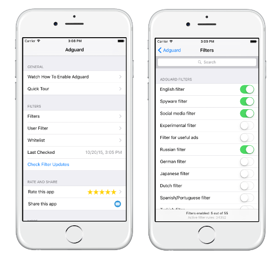

AdGuard for iOS blocks ads on smartphones and tablets by Apple. AdGuard supports more than 50 filters optimized for Safari mobile browser, including a special filter for Russian websites.

AdGuard allows the user to fine-tune the settings: you can add any website to exceptions and stop blocking ads on it. You can also manually adjust every AdGuard filter, turn them on or off, or even create your own ones.

App Store catalogue has two versions of AdGuard for iOS, [free version](https://itunes.apple.com/us/app/id1047223162) and [AdGuard Pro](https://itunes.apple.com/ru/app/id1126386264). The main difference is that AdGuard Pro does not limit its functionality by Safari, but works with all apps and browsers.

Thanks to AdGuard DNS integration, AdGuard Pro can filter traffic in two modes. Default Mode is a basic mode that blocks ads, trackers, phishing websites, etc. Family Mode includes all functions of Default Mode and also blocks all sites with adult content. This mode is perfect if you wish to install AdGuard Pro for iOS on your child’s device. DNS request log will help you track all queries and easily whitelist any website you would like to disable filtering for.

Of course, AdGuard Pro has the same functions as the basic version – it can block ads, counters, and malicious websites in Safari, and has a broad selection of filters, both AdGuard proper and the popular third-party filters, such as EasyList. Thanks to AdGuard for iOS, web pages will load much faster, as there will be no banners, excess pictures, and advertising videos.

**FUNCTIONS**

*	Ad blocking. AdGuard blocks all kinds of ads; more than 50 filters are at your service. With AdGuard, you will forget all about banners, video ads, popup windows, etc.

* Includes popular Adblock filters: EasyList, EasyPrivacy, Fanboys Annoyances, Malware Domains. AdGuard ensures double protection with the help of both its own and third-party filters.

* Regional and other filters. AdGuard is the first blocker that allows usage of different regional filters. Visist websites in different languages, and they will still be filtered with AdGuard.

* Widget and tracking block. Special filters will block all counters to protect your personal data, and remove all unnecessary social network widgets.

* Surfing acceleration. AdGuard removes everything irrelevant from the web, and clear pages load much faster.

**These functions are only available in Pro version:**

* **DNS-filtering in applications.** AdGuard for iOS Pro allows you to control access  to the DNS services in applications - this filters the traffic in different applications and browsers, not just in Safari.

* **Whitelist / blacklist in the application.** Using this feature you can always enable or disable advertising filtering on certain sites.

* **DNS log.** Using DNS log yoy may find the respective request in the log and block the domain in request details.