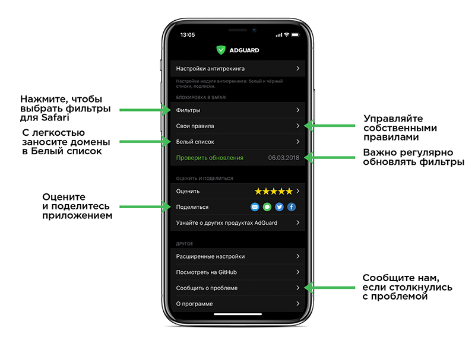
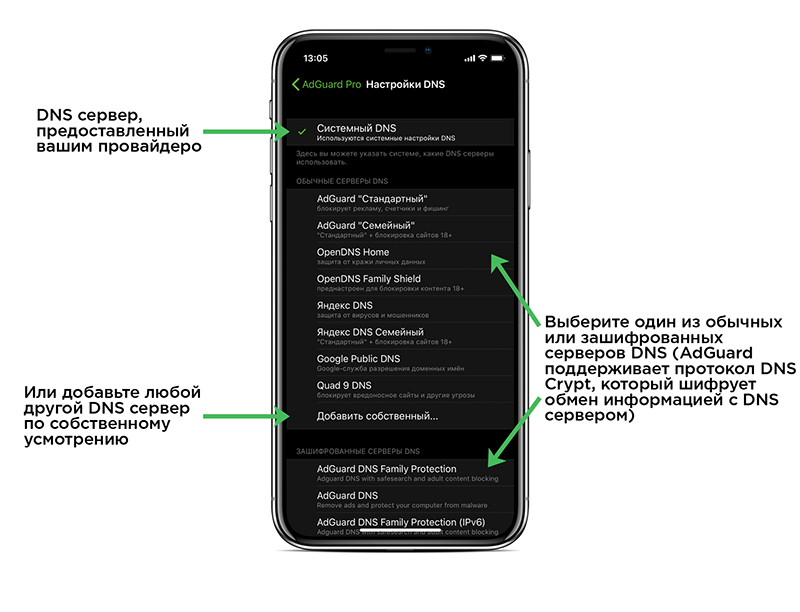
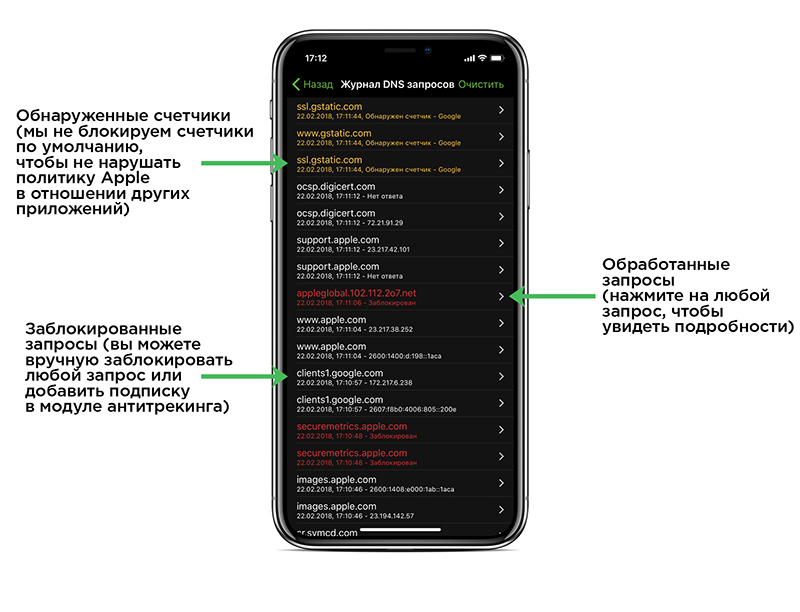

AdGuard для iOS — это эффективный и удобный блокировщик рекламы, разработанный для мобильных устройств производства компании Apple. Он поддерживает более 50 различных фильтров, включая специальный фильтр для русскоязычного сегмента интернета. AdGuard для iOS распространяется в двух версиях. Базовая доступна в каталоге App Store бесплатно, при этом она предназначена для фильтрации рекламы только в мобильном браузере Safari. Версия Pro является платной, блокирует рекламу не только в Safari, но и в других приложениях, а также реализует целый ряд [дополнительных функций](#pro).

### Блокировка рекламы
AdGuard для iOS блокирует все виды рекламы, включая баннеры, видеорекламу и всплывающие окна. В приложении используется более 50 различных фильтров, среди которых представлены как собственные фильтры AdGuard, так и другие популярные фильтры: EasyList, EasyPrivacy, Fanboys Annoyances и т.д.

### Языковые фильтры
AdGuard для iOS позволяет использовать разнообразные языковые фильтры, предназначенные для блокировки рекламы на сайтах на иностранных языках. Кроме того, пользователь может создавать свои собственные фильтры, содержащие индивидуально подобранный набор правил.

### Блокировка виджетов и систем слежения
Многие сайты собирают различную информацию о своих посетителях: их IP-адрес, сведения об установленном на устройстве браузере и операционной системе, экранном разрешении, и даже о том, с какой веб-страницы пришел к ним пользователь. Специальные фильтры AdGuard заблокируют все счетчики автоматических систем сбора статистики, а также удалят с веб-страниц виджеты социальных сетей. Кнопки «Поделиться», «Твитнуть» и «Рассказать друзьям» теперь будут отображаться только там, где они вам по-настоящему нужны.

### Экономия трафика
AdGuard для iOS удаляет с веб-страниц все постороннее содержимое, благодаря чему они открываются в браузере намного быстрее. Это позволяет заметно экономить трафик.

### Белый список
Вы можете гибко настраивать фильтрацию, добавляя те или иные сайты в список исключений. Таким образом, вы можете отключать блокировку рекламы для доменов, которым доверяете.

## Функции версии AdGuard Pro  
Помимо всех базовых функций, доступных в бесплатной версии, AdGuard Pro открывает пользователю множество дополнительных возможностей, таких как фильтрация всех типов рекламы не только в Safari, но и в других приложениях, изменение DNS-настроек и т.д. Чтобы задействовать Pro-функции приложения, просто переместите вправо переключатель Статус в разделе "Антитрекинг" на главном экране AdGuard Pro. Если "главный переключатель" выключен, фильтрация осуществляться не будет.

*СОВЕТ: вы можете добавить виджет AdGuard на экран виджетов вместо того, чобы переключать "Статус" вручную в меню приложения.

### Собственные настройки DNS
Одна из основных функций AdGuard Pro — это возможность изменять настройки DNS по собственному усмотрению. AdGuard Pro позволяет настроить любое количество DNS серверов и быстро переключаться между ними. Некоторые из них доступны по умолчанию, например, собственные DNS серверы AdGuard, публичные DNS серверы Google, [OpenDNS](https://www.opendns.com), и многие другие.

Использование какого-либо DNS сервера вместо систменого DNS может быть полезным сразу по нескольким причинам. Например, это может увеличить скорость интернет-соединения, обезопасить ваши действия онлайн, помочь избавиться от рекламы и служить как инструмент родительского контроля. Одно из возможных применений — DNS фильтрация. Это более грубый способ блокировать рекламу по сравнению с блокировкой контента, но зато он работает на всех устройствах, а не только в Safari. Больше информации о DNS фильтрации можно найти [здесь](https://kb.adguard.com/general/dns-filtering-android). Кстати, AdGuard предоставляет свои собственные DNS серверы, выполняющую DNS фильтрацию, и вы можете найти их среди серверов, доступных по умолчанию.

#### DNSCrypt
AdGuard Pro также поддерживает серверы DNSCrypt. Вы можете почитать о том, почему DNSCrypt так важен, в нашей [Базе знаний](https://kb.adguard.com/general/dns-filtering-android#what-is-dnscrypt-and-why-is-it-important). Вкратце: он значительно усиливает защиту ваших личных данных онлайн. Вы можете выбрать любой из огромного количества серверов DNSCrypt, доступных по умолчанию на экране "Настройки DNS", или же добавить собственный сервер.

### Журнал DNS запросов
Журнал DNS запросов — это ещё один полезный инструмент в распорядении AdGuard Pro. Журнал содержит полный список обработанных DNS запросов, из которого вы можете выбрать любой конкретный и тут же занести его в черный список, или же удалить оттуда ранее заблокированный запрос. Эта функция даёт широкий выбор опций по настройке белого и черного списков, а также позволяет отслеживать все запросы в реальном времени. Чтобы открыть журнал DNS запросов, тапните по блоку со статистикой в главном меню приложения. 

### Обнаружение трекеров — инструментов слежения
Приложения AdGuard в целом заботятся о конфиденциальности пользователя онлайн, и AdGuard Pro не исключение. Он обнаруживает онлайн трекеры, которые пытаются собрать всевозможную информацию о ваших действиях. Все обнаруженные трекеры подсвечиваются желтым цветом в журнале DNS запросов. К сожалению, Apple накладывает жесткие ограничения на инструменты доступные iOS приложениям за пределами Safari, так что зачастую блокирование таких трекинговых запросов дотсупными методами приводит к поломанному функционалу сопряженных сервисов. Поэтому многие такие трекеры не блокируются по умолчанию, но у вас есть полный контроль над тем, какие из них блокировать вручную. AdGuard Pro предоставит подробную информацию о большинстве таких трекеров, так что в каждом случае вы сможете принять взвешенное решение.

### Подписки
Одной из ключевых функций AdGuard Pro является "Настройкам антитрекинга". Внутри одноименной вкладки настроек вы увидите Белый и Черный списки (для управления отдельными запросами), а также доступ к управлению подписками. Подписки — это списки правил (наподобие правил блокировки контента в Safari), которые управляют процессом фильтрации. Подписки бывают hosts-типа или "adblock"-типа.

Hosts-файлы содержат список соответствий между доменными именами и IP-адресами, которые система использует для перехода на те или иные домены.  Это может быть использовано для того, чтобы перенаправить рекламные домены "в никуда", фактически тем самым блокируя их. Множество блокировочных hosts-файлов доступны в интернете. Этот способ блокировки похож на DNS фильтрацию в том смысле, что он хорош для блокировки сторонней рекламы, но при этом есть риск навредить функциональности некоторых сайтов.

В отличие от hosts-файлов, подписки на основе adblock-правил — это обычные фильтры, поддерживающие базовый синтаксис. Вы моежте использовать фильтры, разработанные нами в AdGuard, или же любые другие списки правил, к которым вы привыкли.

Внутри AdGuard Pro вы найдете ссылку на некоторые из наиболее популярных подписок, как и возможность добавить любую подписку по URL.

*ВАЖНО: слишком большое количество подписок может привести к падению туннеля, т.е. приложение перестанет отзываться на ваши действия и фильтрация остановится.*

### Ограничения
К сожалению, на сегодняшний день AdGuard Pro не может заблокировать рекламу в ряде приложений, список которых представлен ниже:

* YouTube
* Facebook
* Twitter
* Instagram

Поскольку AdGuard Pro использует локальный VPN, в процессе его работы могут возникнуть проблемы совместимости с другими приложениями, требующими VPN-подключения. Ниже представлен список таких приложений:

* ExpressVPN
* Shadowrocket
* HotSpot Shield

С актуальным списком совместимых и несовместимых VPN-приложений можно ознакомиться по этой ссылке: [https://github.com/AdguardTeam/AdguardForiOS/issues/162](https://github.com/AdguardTeam/AdguardForiOS/issues/162).
Кроме того, AdGuard не имеет возможности полноценно блокировать рекламу при работе в сети wi-fi московского метрополитена.

