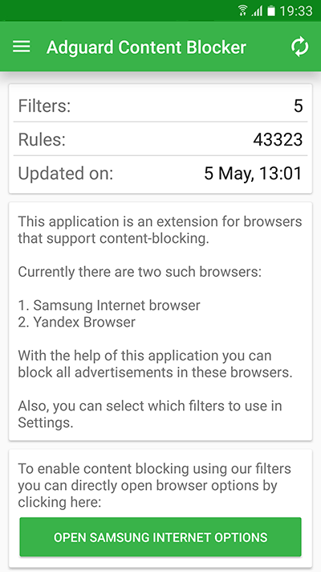

AdGuard Content Blocker is an app that blocks ads on mobile devices operated by Google Android in **browsers that supports content blocking technology**.  For today, there is just two such browsers: Yandex Browser and Samsung Internet browser. The app does not require root access. If you would like to block ads in other mobile browsers, install [AdGuard for Android](kb.adguard.com/en/android/overview) on your device.

AdGuard Content Blocker includes 20 language and common filters that allow for fine-tuning ads demonstration on the sites you view. The user is able to turn preferred filters on and off in the settings as needed.

AdGuard Content Blocker is an app with open source code, which is [published at GitHub](https://github.com/AdguardTeam/ContentBlocker). With AdGuard Content Blocker, your browsing experience will become safe and pleasant.
