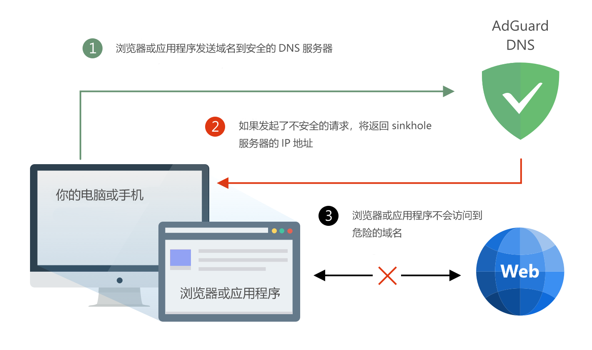

AdGuard DNS 是一种无需安装任何应用程序即可在 Internet 上阻止跟踪器和广告的简单方法。它易于使用、对隐私友好、完全免费，它可以在任何设备上轻松安装，并为您提供最低限度的必要功能来阻止广告、跟踪器、恶意网站以及成人内容（可选）。

要开始使用 AdGuard DNS，请修改 DNS 地址来代替您的服务提供商提供的地址。AdGuard DNS 对个人使用免费。

### 它如何工作？

使用 AdGuard DNS 时，我们会对每次浏览器或应用发起的广告请求返回空响应。AdGuard 拥有自己的域名基础，提供广告、跟踪器和欺诈，并定期更新。我们提供两种方式供 AdGuard DNS 使用。默认模式包括阻止广告、计数器、恶意网站和网络钓鱼网站。家庭模式拥有同样的功能，并附加阻止成人内容和浏览器安全搜索。

AdGuard DNS 可以在任何设备上无限制使用，包括智能手机和平板电脑等。

### AdGuard DNS 的优势

* 您只需要参考这份[简单的设置指南](https://kb.adguard.com/zh/dns/setup-guide)。无需安装任何应用程序。

* AdGuard DNS **开放源代码** 并对个人使用 **完全免费**

* 支持所有现代 DNS 隐私标准：DNSCrypt、DNS-over-HTTPS、DNS-over-TLS。

* 它有两种模式：“默认”用于阻止广告和跟踪器，“家庭”具有相同的功能以及家长控制。
 
* 我们有严格的[无日志](https://adguard.com/en/privacy/dns.html)策略。我们不会保留任何个人数据或记录您的活动。我们将保持你的匿名。

* 您可以在任何 Windows、macOS、Android 或者 iOS 系统的设备上使用它。

### 如何设置 AdGuard DNS？

前往知识库阅读详细的[设置指南](https://kb.adguard.com/zh/dns/setup-guide)。