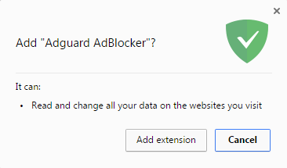
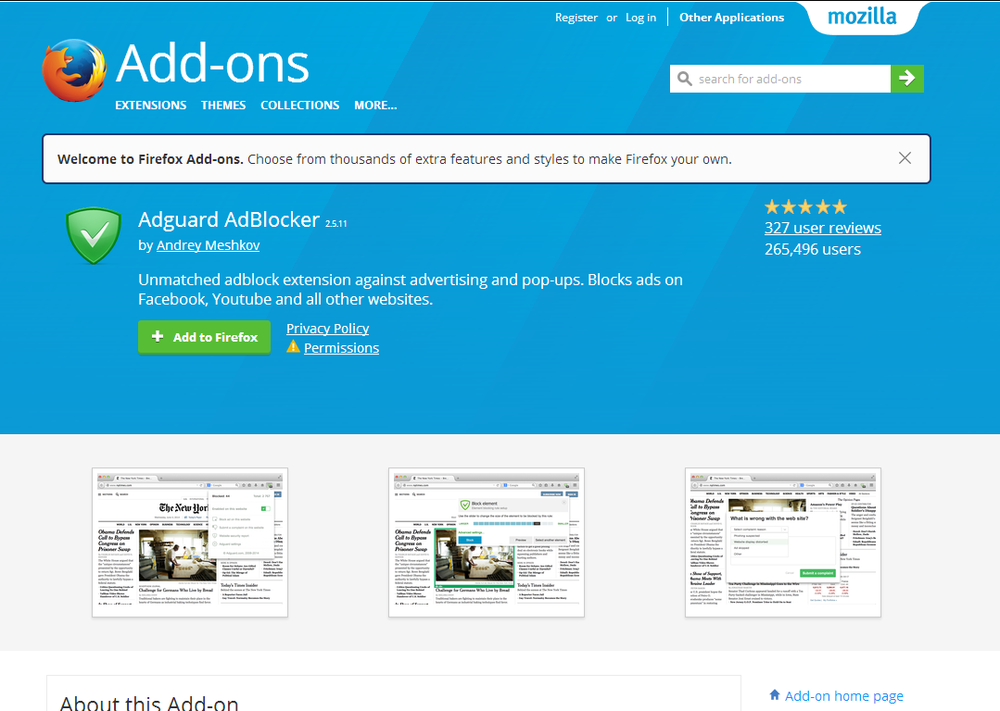
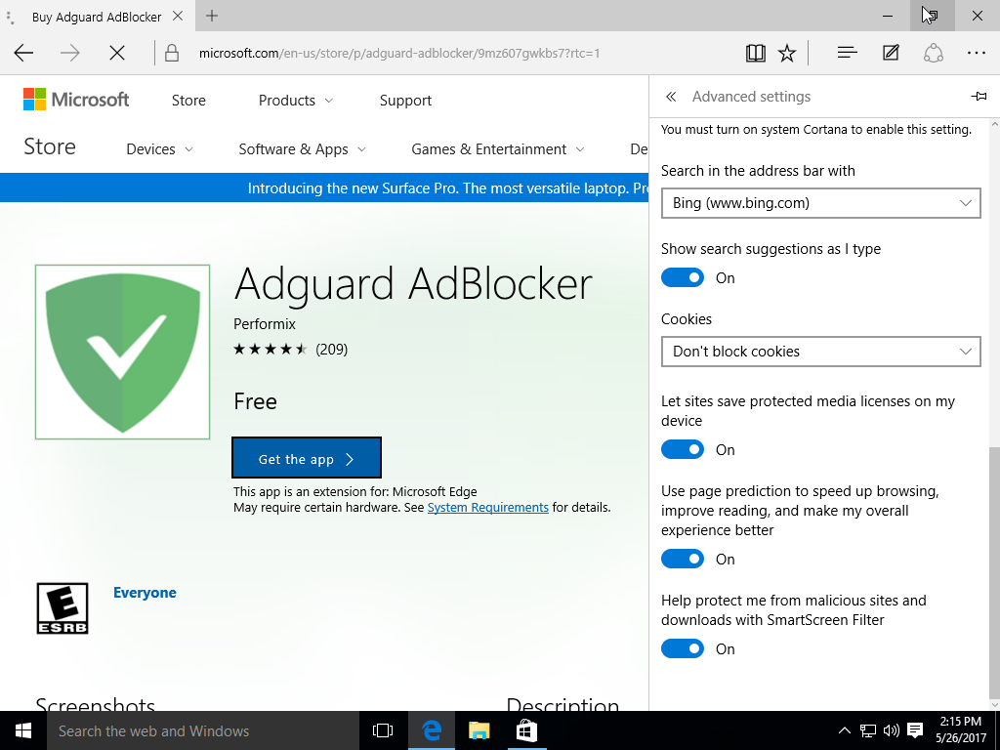

* <a href="#t1">AdGuard AdBlocker Installation in Google Chrome or Chromium</a>
* <a href="#t2">AdGuard AdBlocker Installation in Opera</a>
* <a href="#t3">AdGuard AdBlocker Installation in Firefox</a>
* <a href="#t4">AdGuard AdBlocker Installation in Yandex Browser</a>
* <a href="#t5">AdGuard AdBlocker Installation in Microsoft Edge</a>
* <a href="#t6">AdGuard AdBlocker Installation in Safari</a>

##  AdGuard AdBlocker Installation in Google Chrome or Chromium

Open in your browser the page of [Chrome Web Store](https://agrd.io/extension_chrome). In the top of window that opened click _Add to Chrome_ button. 

In the opened dialogue window click _Add extension_ button.

## AdGuard AdBlocker Installation in Opera

Open the page [addons.opera.com](https://agrd.io/extension_opera) in your browser.

Click the button _Add to Opera_ in the right side of window.

## AdGuard AdBlocker Installation in Firefox

Open the page [addons.mozilla.org](https://agrd.io/extension_firefox) in your browser.

Click the button _Add to Firefox_.

## AdGuard AdBlocker Installation in Yandex Browser

Click the button _Yandex Browser settings_ in the right-top part of the browser's window and then choose _Extensions_ item in drop-down menu.

Scroll the page down and move _AdGuard_ switch in _Content blocking_ area to the right. 

## AdGuard AdBlocker Installation in Microsoft Edge

Open in your browser [AdGuard AdBlocker page](https://agrd.io/extension_edge), and then click _Get_ button. 

Press _Free_ button in the window that opened.

Wait for the installation to complete. Microsoft Edge will be opened automatically and offers you to turn AdBlocker on. 

## AdGuard for Safari installer

After Apple started to force developers to use the new SDK, there are no more browser extensions in the familiar sense. Install the free AdGuard for Safari extension to block ads and trackers in Safari browser. To do so, follow [this link](https://agrd.io/safari_release).