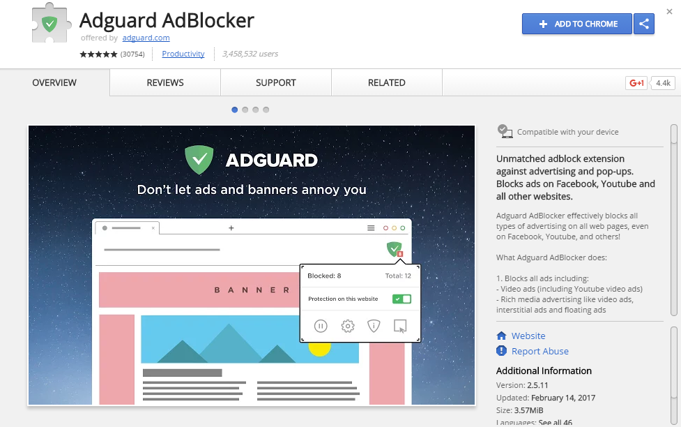
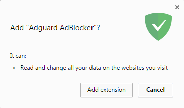
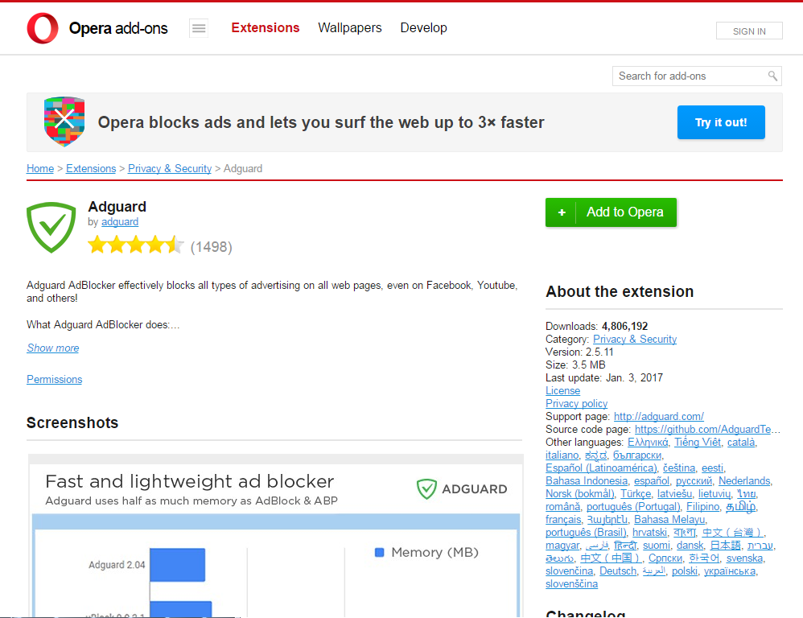
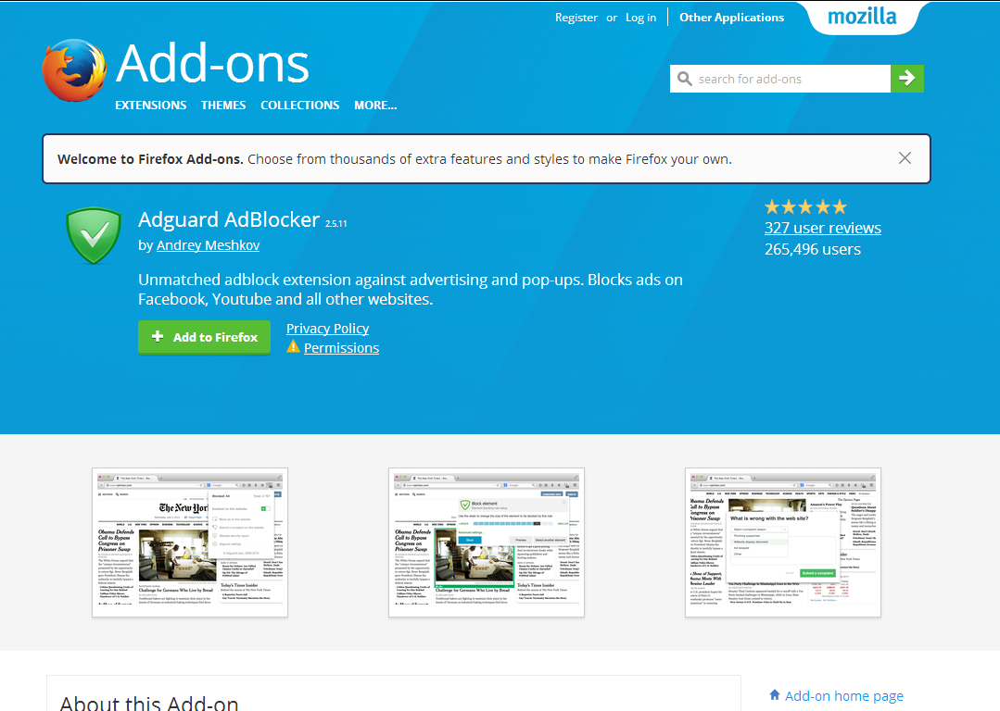
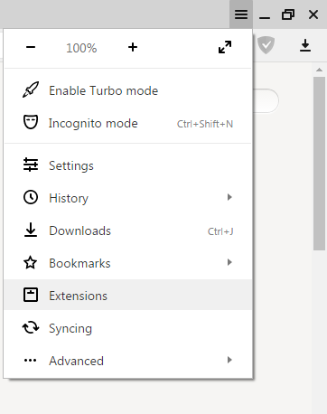
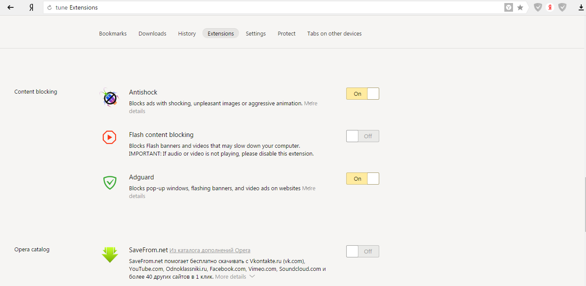
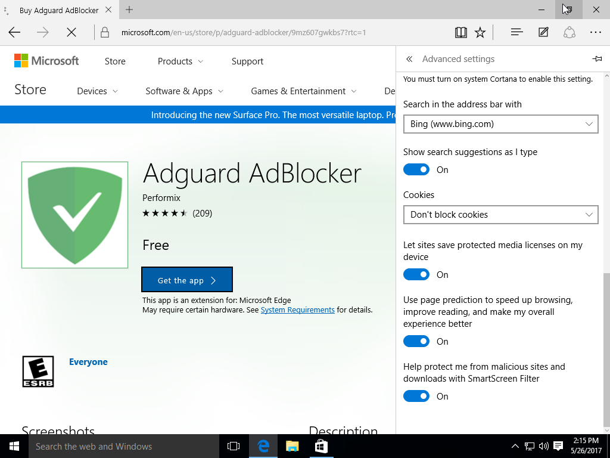
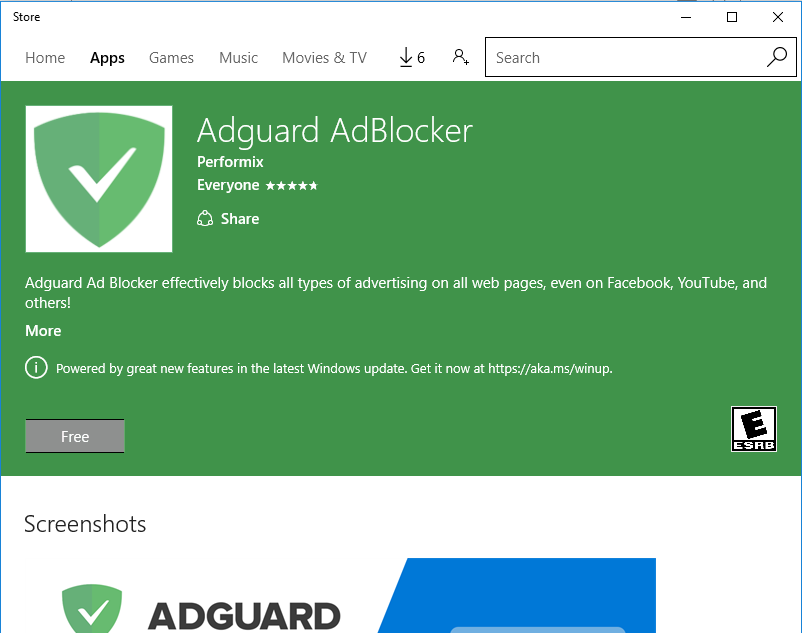

* <a href="#t1">AdGuard AdBlocker Installation in Google Chrome or Chromium</a>
* <a href="#t2">AdGuard AdBlocker Installation in Opera</a>
* <a href="#t3">AdGuard AdBlocker Installation in Firefox</a>
* <a href="#t4">AdGuard AdBlocker Installation in Yandex Browser</a>
* <a href="#t5">AdGuard AdBlocker Installation in Microsoft Edge</a>
* <a href="#t6">AdGuard AdBlocker Installation in Safari</a>

##  为  Google Chrome 或 Chromium 安装 AdGuard

用您的浏览器打开网页 [Chrome 网络商店](https://agrd.io/extension_chrome)。点击网页顶部的按钮 _Add to Chrome_。

在随之打开的窗口内，点击按钮 _Add extension_。

## 为 Opera 安装 AdGuard

用您的浏览器打开网页 [addons.opera.com](https://agrd.io/extension_opera)。

点击位于窗口右侧的按钮 _Add to Opera_。

## 为 Firefox 安装 AdGuard

用您的浏览器打开网页 [addons.mozilla.org](https://agrd.io/extension_firefox).

点击按钮 _Add to Firefox_.

## 为 Yandex Browser 安装 AdGuard

点击位于浏览器窗口右上部的按钮 _Yandex Browser settings_，然后从下拉菜单选择 _Extensions_。

向下滚动网页并移动位于 _Content blocking_ 内的开关 _AdGuard_ 到右侧。 

## 为 Microsoft Edge 安装 AdGuard

用您浏览器打开网页 [AdGuard AdBlocker page](https://agrd.io/extension_edge)，然后点击按钮 _Get_。

点击随之打开的窗口内的按钮 _Free_。

等候安装完成。Microsoft Edge 会自动打开并自动开启扩展。 

## AdGuard for Safari installer

开始强制开发者使用新 SDK 后，不再有熟悉意义上的浏览器扩展。安装免费的 AdGuard for Safari 扩展以拦截 Safari 浏览器内的广告和跟踪器。请跟随 [此链接](https://agrd.io/safari_release)。
