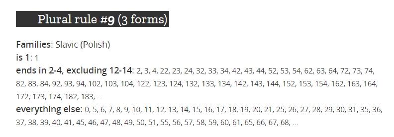
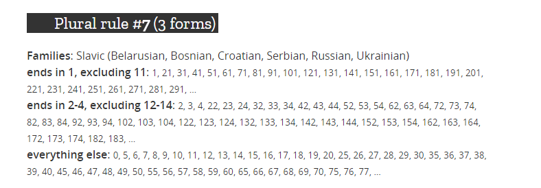

* [Introduction](#intro)
* [What do plural forms mean?](#plurals)
* [Where can you learn about the number of plural forms?](#where-to-learn)
* [Plurals in AdGuard translations](#translations)
* [Short summary](#summary)

## Introduction

It is no secret, that there are a lot of differences between the world’s languages. One of these differences is the use of plural forms that can cause huge difficulties when it comes to localization issue. 

While grammar rule of a language can state the existence of only singular and plural numbers, there can be a great variety of plural forms of words. That is why we strongly recommend you to properly read this article and to learn more about plural forms in different languages and about how they are being used in AdGuard translations. 

## What do plural forms mean?

In different languages, there can be multiple forms of words depending on certain numbers that qualify them. As you might have already guessed, we will talk about the nouns.

In English, for example, you can notice the change of a word ending when speaking about the same subject in different numbers, like *'one star'* or *'two stars'*. It doesn’t matter if you say five, twenty-six or even five hundred thirty-two stars – the ending 's' will remain. And it happens because the English words have only two plural forms – for the singular number and for the plural one. 

But some languages can have only one or, conversely, many more forms of a particular word. 

The Polish language in contrast to English has three plural forms of words. One of them is used when speaking about something in the Singular, another form is used in the Plural but with numbers ending in 2-4,excluding 12-14, and the third form – for words in the Plural determined by other numbers.

Let’s have a look at this picture. Here you can see the groups of numerals which determine a word form when standing before it.  

You can find such examples with numerals which define plural forms of words in your language [here](https://developer.mozilla.org/en-US/docs/Mozilla/Localization/Localization_and_Plurals).

Let’s draw a small parallel between English and Polish for better understanding: 

      The English version:                                                 The Polish equivalents:

      1. form - It takes one hour.                                     1. form - Zajmuje to godzinę. 
      2. form - It takes two hours.                                    2. form - Zajmuje to dwie godziny. 
      2. form - It takes five hours.                                   3. form - Zajmuje to pięć godzin.
      
Now it is clear that the Polish *'godzinę'* (hour) has three different forms, whereas the English word changes its form with given numbers only twice.

There are a lot of other languages that have three plural forms too, such as Russian, Serbian, Slovak, Czech etc. But not all of them can obey the same rule. As an example is the Romanian language that in contrast to Polish has various plural forms of words defined by the following numbers: 

Among the world’s languages there are ones with four, five and even six plural forms (like Arabic).

## Where can you learn about the number of plural forms?

When you are faced with a translation that requires the use of plurals, you may not be able to realize right away how many word forms one or another language includes. Fortunately, there are enough sources of information nowadays and some of them are listed below.

First of all, we would like to advise you to refer to the information of Mozilla’s [Localizations and Plurals](https://developer.mozilla.org/en-US/docs/Mozilla/Localization/Localization_and_Plurals) article. There you will find different plural form rules that contain different numbers of forms and show what languages are involved. One of this article’s advantages is the opportunity to see what specific numbers define plural forms in different languages.

But despite this article is (or at least supposed to be) quite informative and comprehensible, it doesn’t contain the whole list of world’s languages. That’s why we also advise you to turn to the [Localization Guide](http://docs.translatehouse.org/projects/localization-guide/en/latest/l10n/pluralforms.html), where the wider list of languages is represented, but in another manner. The number of plural forms for different languages is identified here with 'nplurals=2', 'nplurals=4' and so on. The numeral after the Equals sign '='  means the number of plural forms of the respective language. Besides, here you can see different formulas which can help you identify what form to use in each particular case.

Also, you can get information about plural forms in the [Unicode Common Locale Data Repository](http://www.unicode.org/cldr/charts/latest/supplemental/language_plural_rules.html#rules)(CLDR). The CLDR Plural Rules indicate an additional word form for decimal numbers (1, 5; 2,3; 100,1…) and as a result of which some languages are supposed to have more plural forms. However, we don’t use decimal numbers in AdGuard translations yet.

## Plurals in AdGuard translations

First of all, you need to understand, that not every AdGuard translation involves the use of different plural forms. 

To identify phrases which translations require the use of plural forms you should pay your attention to the presence of a vertical bar sign between the sentences and **%count%** placeholders in original phrases.

Besides, almost all such strings have a yellow note above them which аttracts your attention to the proper use of plural forms.

Now, let’s imagine — you are faced with such phrase: **"Standard license for %count% computer|Standard license for %count% computers"**. 

What should you know in order to translate it correctly?

The first thing you should understand is that the sentences which are divided by a vertical bar sign are called **'templates'** because they serve as templates for phrases with different numbers. The templates’ count usually starts with '0'.

Coming back to the example, as the English language includes only two plural forms, there should be two templates respectively:

**Template 0** – Standard license for *%count%* computer  
**Template 1** – Standard license for *%count%* computers 

Another important thing you should pay your attention to is **%count%** placeholders that, as usual, take place before the words they define. Instead of **%count%** here will appear different numbers depending on which templates are being chosen.

How does it work during localization process?

For the English language, in this case, the following rule will function:
 
If **%count%** of computers is 1 – use **'Template 0'**;  
If **%count%** of computers is more than 1 (5, 13 or 1149) – use **'Template 1'**  

In a situation with another language that has, let’s say, three plural forms, there should be three templates with two vertical bar signs between them. 

For example, we would like to translate this phrase ("Standard license for *%count%* computer|Standard license for *%count%* computers") into Slovak, that according to the rule of [Localizations and Plurals](https://developer.mozilla.org/en-US/docs/Mozilla/Localization/Localization_and_Plurals) article has three different forms of words to use with following numbers:

Then the translation from English into Slovak should be: 

- Štandartná licencia pre *%count%* počítač|Štandartná licencia pre *%count%* počítače|Štandartná licencia pre *%count%* počítačov 

In this case, we see three templates which contain three plural forms of the word *'počítač'* (computer) in Slovak.

And again, this rule will function during localization proces:

If **%count%** of computers is 1 – use **'Template 0'** –  Štandartná licencia pre *%count%* počítač;  
If **%count%** of computers is more than 1 but less than 5 (2, 3 or 4) – use **'Template 1'** – Štandartná licencia pre *%count%* počítače;  
If **%count%** of computers is 5 or more than 5 – use **'Template 2'** – Štandartná licencia pre *%count%* počítačov.

If we ignore one of the forms and use only two templates for Slovak instead of three, the system won’t be able to take an appropriate template for certain numbers and, as a result, we will have grammatical mistakes in sentences, like in English "I have five star".

But in some languages there can be words (let’s call them exclusions) that have fewer plural forms than the common rule of language states words should have. And that can cause some confusion. 

The Serbian word *'računar'* (computer), for example, has only two forms: *'računar'* - for 1, 21, 31 (and other numbers ending in 1, excluding 11) computers and *'računara'* - for other numbers of computers. But in spite of this fact, there should be three templates in AdGuard translations according to the general rule (which states that there are three plural forms of words in Serbian): 

Thus, the translation from English ("Standard license for *%count%* computer|Standard license for *%count%* computers")  into Serbian in this case should be:

- Standardna licenca za *%count%* računar|Standardna licenca za *%count%* računara|Standardna licenca za *%count%* računara

Although it is obvious that the last two templates have no differences, it is very important to keep the rule: ***The number of templates should reflect the number of plural forms of the respective language!***

## Short summary

When translating AdGuard projects pay your close attention to the original phrases with two important elements: the vertical bar sign(s) and **%count%** placeholders. Also, do not ignore the yellow textboxes (notes) above the original phrases.

Before translating such strings, please refer to the plural rule of a language into which you translate and remember: 

+ The number of your templates should be consistent with the number of plural forms of words in a certain language, even in cases when some words have fewer forms themselves – 2 plural forms of words in a language – 2 templates in translations; 5 plural forms – 5 templates etc.;

+ Do not forget to use a vertical bar sign between templates without any space before and after it;

+ Do not translate, fill in or delete **%count%** placeholders.

By using these simple rules you will help AdGuard developers avoid a lot of unnecessary complications during the localization process. Thank you!
