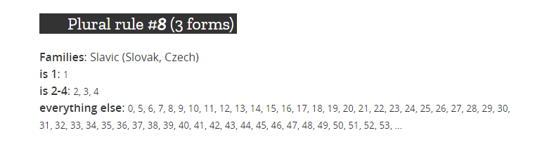

* [简介](#intro)
* [复数形式是什么意思？](#plurals)
* [在哪里可以了解复数形式的数量？](#where-to-learn)
* [AdGuard翻译中的复数](#translations)
    * [具有 `singular`, `dual`, `plural` ](#1type)
    * [用逗号分隔的多个单词形式](#2type)
    * [Crowdin支持的模式](#3type)
    * [带模板的字符串](#4type)
* [简短摘要](#summary)

## 介绍

众所周知，世界上的语言之间存在很多差异。其中一个是使用复数形式，翻译成不同语言可能会造成很大困难。

因此，我们强烈建议您好好阅读本文，以详细了解复数形式以及翻译 AdGuard 时如何使用它们。

## 复数形式是什么意思？

不同语言的名词可以有几种复数形式。它们的用法取决于单词前面的特定数字，以指示该单词表示的数目。

例如，当谈论不同数量时，英语单词有两种单词形式。例如 'one star' 或 'two stars'。无论您说的是五颗星，二十六颗星还是五百三十二颗星，结尾 's' 都将保持不变。之所以会发生这种情况，是因为英语名词只有两种复数形式，即单数形式和复数形式。

但是有些语言只有一种形式，反之，有些语言也可以有更多种复数形式。

与英语相比，波兰语里的名词具有三种复数形式。在说单数形式时使用一种形式，复数形式时以 2-4 数字为结尾的名词（不包括 12-14）使用另一种形式。但还有第三种形式，前面带有其他数字的单词。

我们来看看这张图片。在这里，可以看到一组数字。按这些数字要选择数字后面的单词形式。

>在[此处](https://developer.mozilla.org/zh-CN/docs/Mozilla/Localization/Localization_and_Plurals)查找其他示例。

我们来在英语和波兰语之间做个小比较，以便更好理解:

      英文版：                                                          波兰语等效：

      1. form - It takes one hour.                                     1. form - Zajmuje to godzinę. 
      2. form - It takes two hours.                                    2. form - Zajmuje to dwie godziny. 
      2. form - It takes five hours.                                   3. form - Zajmuje to pięć godzin.
      
现在很明显的是，波兰语 'godzinę' (小时)具有三种不同的形式，而英语单词仅更改两次单词形式。

除波兰语之外，世界上还有许多其他具有三种复数形式的语言，包括俄语，塞尔维亚语，斯洛伐克语，捷克语等语言。但并非所有语言都遵循相同语法规则。这就是了解您的语言包含多少种复数形式以及如何应用它们如此重要的原因。

## 在哪里可以了解复数形式的变体数量？

当您需要使用复数形式的翻译时，您很可能无法立即意识到某些语言的单词形式的数量。不过好在，现在我们有不少信息源，下面列出了其中一些。

首先，我们建议您参考 Mozilla 的[本土化和复数](https://developer.mozilla.org/en-US/docs/Mozilla/Localization/Localization_and_Plurals)文章内的信息。在这里，您可以发现符合不同语言的复数形式规范，以及语法规则。

尽管这篇文章内容丰富且易于理解（至少希望是这样），但内容并未包含世界语言的完整列表。因此，我们建议您转到[本土化指南](http://docs.translatehouse.org/projects/localization-guide/zh-CN/latest/l10n/pluralforms.html)。该手册内容以另一种方式列出了更多的语言。不同语言复数形式的数量以这种方式显示： 'nplurals=2', 'nplurals=4' ，依此类推。 '=' 等号后的数字表示相应语言的形式数量。除此之外，在这里您可以看到不同公式。这些公式可以帮您确定，在某种情况下所需要使用的格式。

此外，您还可以在 [Unicode 通用语言环境数据存储库](http://www.unicode.org/cldr/charts/latest/supplemental/language_plural_rules.html#rules)(CLDR)（CLDR）中获取有关复数形式的相关信息。 CLDR 复数规则，即指十进制数字（1.5; 2.3; 100.1…）的其他词形式。但在 AdGuard 翻译中我们不使用它们。

## AdGuard 翻译中的复数形式

首先，您得明白并非每个 AdGuard 译文都需要使用复数形式。

当前，我们在 Crowdin 上有四种使用复数形式字符串的类型。

我们来仔细看看它们。

#### 1. **带有 .singular, .dual, .plural 作为结尾的字符串键的短语**

其中大多数属于 AdGuard for Windows 项目中，仅包含一两个单词：

- `days;`
- `extensions;`
- `hours`

在 Crowdin 上遇到此类短语时，请注意字符串键。在 "context" 字段中您会看到一些关于复数形式的重要注解。

#### 2. **单数和复数名词字符串以逗号分隔**

这种字符串主要在 AdGuard for Android 项目中。

请看示例：

如果您的语言名词具有三种复数形式（正如波兰语)，请用逗号分隔每一个复数形式。

`hour, hours --> godzinę, godziny, godzin`

如果一个名词只有两种形式，则无需重复写同一形式（*通常仅适用于这种带有复数形式的字符串！*）。但是，如果您把同一个形式重写两次也不会出错。

#### 3. **使用 Crowdin 发展模式的字符串**

这是进行复数字符串翻译的最佳用户友好的方案。

Crowdin 为用户提供翻译一定数量具有不同复数形式的短语的功能。

如果您的语言仅有一种复数形式，则您只会看到一个要翻译的短语。如果语言具有三种形式，Crowdin 将为您提供被分出另外两到三部分的字符串进行翻译。

例如：

在翻译和批准这些字符串时，请注意， 如果您不知道“其他”字段的含义，则只需粘贴与“许多”字段中相同的表单即可。 “许多”和“其他”字段的内容可以相同。

#### 4. **带有用竖线分隔模板的字符串**

这是最复杂的 AdGuard 字符串类型，通常在 AdGuard Websites 项目（即在 adguard.com 文件夹中）中使用。

请密切注意句子与原始短语中的 %count% 占位符之间的竖线符号。这将帮助您识别需要使用复数形式短语的翻译。

现在，我们来想象一下。您将面临这样的短语：*"Standard license for %count% computer|Standard license for %count% computers"*.

您应该知道哪些信息才能正确翻译它？

这些用竖线符号的句子称为 ***“模板”***，因为它们被用作具有不同数字的短语的模板。

回到示例，由于英语仅包含两种复数形式，因此应分别有两个模板：

`**Standard license for *%count%* computer|Standard license for *%count%* computers**`

其中 模板 1 – *％count％*计算机（computer）的标准许可，

和 模板 2 – *％count％*计算机（computers）的标准许可

您应注意的另一重要事项是 **％count％** 占位符，通常在其定义的单词前出现。根据选择的模板，此处将显示不同的数字，而不是 **％count％** 。

在另一种语言具有三种复数形式的情况下，应该有三个模板，即两个竖线符号。

例如，根据[本土化和复数](https://developer.mozilla.org/en-US/docs/Mozilla/Localization/Localization_and_Plurals)文章的规则，我们将上述短语用三种复数形式的单词来翻译成斯洛伐克文，可与以下数字配合使用：

那么从英语翻译成斯洛伐克语是：

`**Štandartná licencia pre *%count%* počítač|Štandartná licencia pre *%count%* počítače|Štandartná licencia pre *%count%* počítačov**` 

在这种情况下，我们看到三个模板，其中包含斯洛伐克语中 *"počítač"* （计算机）的三个复数形式。

**如果我们忽略其中一种形式，而只为斯洛伐克语使用两个，而不是三个模板，则系统将无法为某些数字采用适当的模板**。结果是，句子中将出现语法错误，例如英语：*Standard license for 5 computer*（正确应是：Standard license for 5 computers）。

但是在一些语言中，可能有一些单词（我们来将其称为例外词）比本语言法则规范规定的有更少复数形式。这可能会引起一些混乱。

例如，塞尔维亚单词 *'računar'*（计算机（computer））只有两种形式：第一个是 *'računar'* （计算机）表示 1、21、31（以及其他以1为结尾的数字，不包括11），第二个是 *'računara'* （计算机）用于其他数量的复数形式。 尽管如此，根据一般规则（说明塞尔维亚语中的单词有三种复数形式），AdGuard 翻译中还是要有三个翻译模板：

因此，英语翻译成塞尔维亚语是：

`** Standardna licenca za *％count％*računar| Standardna licenca za *％count％*računara| Standardna licenca za *％count％*računara**`

尽管很明显，最后两个模板没有区别，但保持规则非常重要：***模板的数量应反映相应语言的复数形式*** (通常针对这种带复数的字符串)！

## 简短的摘要

在翻译 AdGuard 项目时，请密切注意需要使用复数形式的短语。

尽管前三种类型的字符串或多或少容易执行，但第四类要求更高的警惕性。

重申一次：如果您遇到包含两个重要元素的原始词组：**竖线符号**和 **％count％** 占位符，请执行以下操作：

+ 指翻译成一种语言的复数规则；

+ 保留确切数量的模板；

>即使在某些单词本身具有较少形式的情况下，模板的数量也应与语言所包含的复数形式的数量相一致。两种复数形式对应翻译中的两个模板；五个复数形式对应五个模板等。

+ 不要忘记在模板之间使用竖线符号，在模板前后没有任何空格（例外：在原始短语中带有空格的字符串）；

+ 请勿翻译，填写或删除 **％count％** 占位符。

通过遵循这些简单的规则，您将会帮助 AdGuard 开发人员避免翻译过程中发生的许多不必要的复杂问题。谢谢！
