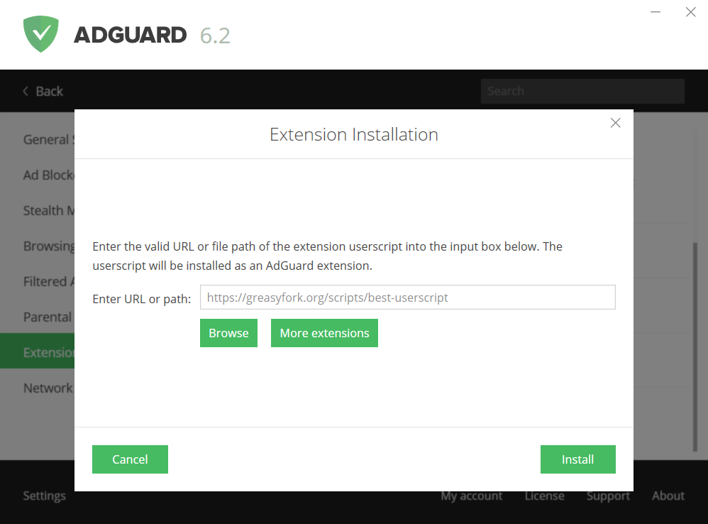

* [Introduction](#intro)
* [How to install userscripts in AdGuard](#install-scripts)
* [Where can you get userscripts?](#repo)
* [Userstyles.org](#userstyles)
* [Greasy Fork](#greasyFork)
* [OpenUserJS.org](#openUserJs)

## Introduction

Starting from version 5.9 it became possible to install userscripts in AdGuard for Windows.

First of all, we need to understand what it is. Userscript is a script, written in Javascript that extends the functionality of one or more sites. AdGuard users already know such extensions. Among them are the [PopupBlocker](https://github.com/AdGuardTeam/PopupBlocker), that blocks all unwanted pop-up windows, and the [AdGuard Assistant](https://github.com/AdGuardTeam/adguardassistant), which helps to manage filtering right from the browser. You can see its icon in the corner of any web page. 

There is also the Web of Trust extension, that is disabled in AdGuard by default. Once it is activated, you can see the reputation of each website based on users’ opinions.  

## How to install userscripts in AdGuard

As it was already mentioned above, AdGuard for Windows can work as a user script manager. While using this AdGuard function you will understand how easy the process of userscripts downloading is and how convenient their managing can be.

Firstly, AdGuard can automatically define browser queries to userscripts and suggest their installation if the following option is enabled: 

Secondly, you can choose any scripts you like and add them in AdGuard manually. To do it, you should just click on the 'Add extension' button. 

 

Then you should enter the respective URL or path into the appeared input box and click on the ‘Install’. 

## Where can you get userscripts?

Userscripts are mostly the people's art, that is why you need to be careful when installing a userscript. But, nevertheless, there is a great variety of interesting scripts that can really make the use of some websites more convenient.

There are several popular userscript catalogues. We will describe them in this article.

## Userstyles.org

[Userstyles.org](https://userstyles.org/) is a catalogue of user styles, but it allows you to unload them as userscripts. Thus, any user style can be installed in AdGuard.

Do you want to paint Facebook in pink? Or make YouTube look like this: 

No problem, find the suitable style at Userstyles.org and install it in AdGuard.

## Greasy Fork

[Greasy Fork](https://greasyfork.org/) is a userscript catalogue by [userstyles.org](#userstyles). In contrast to the late userscripts.org, scripts in this catalogue undergo moderation, so that their credibility is much higher.

## OpenUserJS.org

[OpenUserJS.org](https://openuserjs.org/) is an open source userscript catalogue written in nodeJS.
