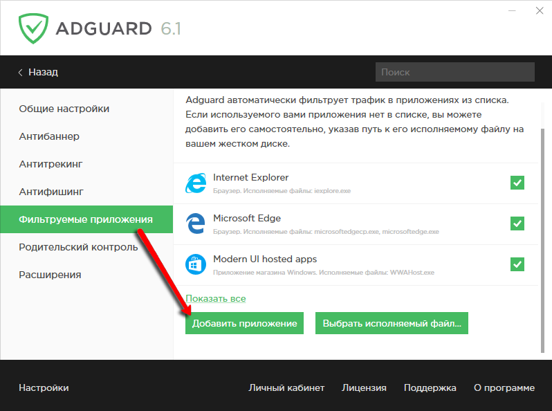

Adguard часто сравнивают с известными браузерными расширениями - Adblock и Adblock Plus. В этой статье мы хотим описать основные преимущества, которые имеет Adguard перед своими конкурентами.

Преимущества Adguard во многом обусловлены ограничениями, которые накладываются на браузерные расширения. Adblock и Adblock Plus чисто технологически не способны удалить всю рекламу на странице сайта. Дело в том, что Adguard обрабатывает страницу до того, как она загружена в браузер, удаляя все рекламные элементы. Расширения же работают по другому принципу, полагаясь на технические возможности самого браузера для блокировки. Из-за этого им необходим дополнительный этап [пост-обработки страницы](http://adguard.com/ru/how-ads-blocked.html#cosmetic) и сокрытия заблокированных элементов. Если вы когда-нибудь использовали Adblock, то наверняка замечали, как мигают скрываемые баннеры.

Второе преимущество Adguard также обусловлено тем, что это отдельная программа, а не браузерное расширение. Adguard может блокировать рекламу абсолютно в любом браузере. Каким бы браузером вы не пользовались, будь то Google Chrome, Mozilla Firefox, Opera, Internet Explorer или Яндекс.Браузер - с Adguard вы забудете о навязчивой интернет-рекламе.

Если вы используете редкий браузер - это может быть проблемой для Adblock и Adblock Plus, ведь эти расширения существуют только для самых популярных браузеров. С Adguard же проблем не будет, вы легко сможете добавить свой браузер в список защищаемых.

Но это не все. Adguard может заблокировать рекламу в Skype, uTorrent и многих других обычных программах. Достаточно добавить их в список браузеров и перезапустить.

Помимо блокировки рекламы Adguard предлагает вам множество дополнительных инструментов. Пожалуй, самым важным из них является **Антифишинг**. Работа этого модуля построена на использовании постоянно пополняемых черных списков вредоносных и фишинговых сайтов. Adguard использует в работе два основных источника. Первый - это список Safe Browsing от корпорации Google. Второй - это собственные черные списки Adguard. Мы постоянно отслеживаем данные о безопасности интернет-сайтов, оперативно пополняя наши фильтры.

Некоторые пользователи устанавливают Adguard вместо антивируса, некоторые - используют вместе с ним. В любом случае, Adguard серьезно повышает безопасность вашего компьютера в сети.

Популярно заблуждение о том, что Adblock и Adblock Plus практически не потребляют ресурсов. Но так ли это на самом деле?

Для проверки мы воспользуемся диспетчером задач браузера Google Chrome.

Обратите внимание: даже при самых простых настройках и одном-единственном включенном фильтре расширения потребляют по 100 мегабайт оперативной памяти. Adguard потребляет сравнимое количество ресурсов, при этом обладая намного большими возможностями.

Подведем итог

**1. Adguard блокирует рекламные элементы еще до того, как они загружаются в браузер.**

**2. Adguard действительно экономит используемый Вами трафик.**

**3. Adguard работает в любом браузере.**

**4. Adguard может убрать рекламу из Skype, uTorrent и других приложений.**

**5. Adguard поможет вам защититься от вирусов и сетевых мошенников.**