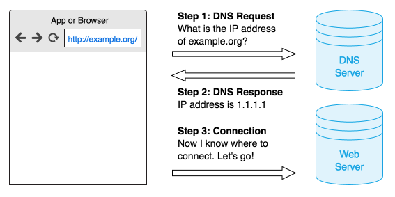

### What is DNS?

DNS stands for 'Domain name system', and its purpose is to translate websites 'names' into something browser can understand, i.e. IP addresses. Thus, each time you go to a website, your browser sends a request to a special server. That server either redirects the request to another server or replies with an IP address. Very schematically it can be represented like this:

The same applies, of course, to all apps and programs that send any web requests.

### How does DNS Filtering work?

Usually, your ISP provides a DNS server that does all the job. But in reality you are free to use any DNS server, and there are plenty of them to choose from. In fact, Adguard has its own DNS servers - you can read about Adguard DNS in [another article](https://kb.adguard.com/en/dns/overview).

Adguard for Android app has a special 'Simplified domain names filter' containing a large amount of 'bad' addresses, which it uses in conjunction with User filter to block ad and tracking servers. Mind you, all this happens locally on your device with no extermal servers involved.

The main advantage of this approach is it is extremely economical and saving. Once a domain is blocked, it won't be requested again within an hour. The disadvantage being the roughness of this method: specific URLs can't be blocked, only whole domains. It can sometimes lead to 'breaking' of a websites functionality.

### What is DNSCrypt and why is it important?

If you use a regular client-server protocol, you are at risk of your DNS requests being intercepted and, subsequently, eavesdropped and/or altered. The experiments [show that](https://blog.adguard.com/dns-track-you/) the DNS tracking can be used to collect a 'profile of interests' for any user. Luckily, Adguard offers DNSCrypt - a special protocol that encrypts communication with the DNS server, thus preventing tampering and tracking by any third party including your ISP.