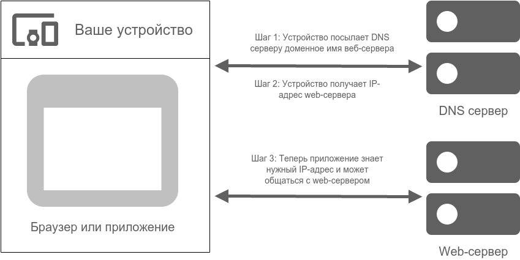
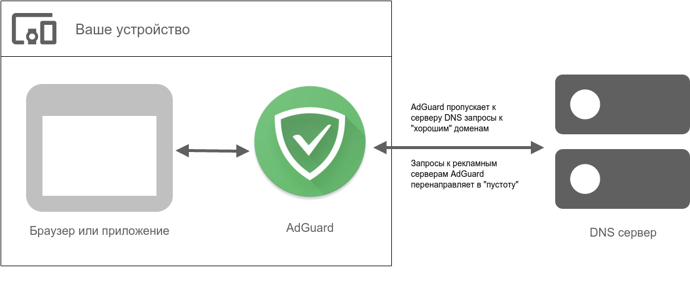
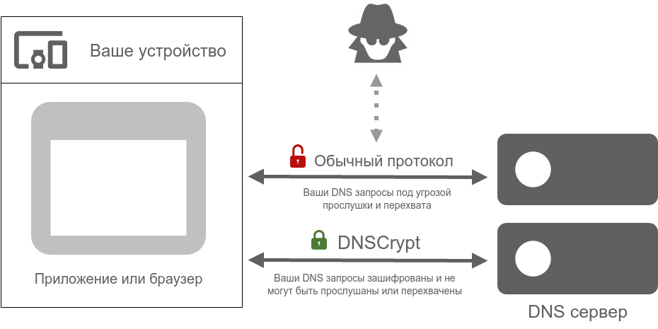

### Что такое DNS?

DNS означает "Domain name system" (система доменных имён) - это система, которая переводит названия сайтов на язык, понятный браузеру, т.е. IP-адреса. Таким образом, каждый раз, когда вы переходите на веб-сайт, ваш браузер посылает запрос к специальному серверу. Этот сервер либо перенаправляет запрос к вышестоящему серверу, либо посылает обратно ответ, содержащий IP-адрес. Схематично это можно изобразить так: 

То же самое относится, разумеется, и ко всем приложениям и программам, которые посылает веб-запросы.

### Как работает DNS фильтрация?

Обычно, ваш интернет-провайдер предоставляет DNS сервер, который и выполняет всю работу по возврату IP-адресов в ответ на запросы ваших приложений и браузеров. На самом деле, вы можете использовать любой DNS сервер для этой цели, их существует огромное множество (кстати, у AdGuard тоже есть собственные DNS серверы - вы можете прочитать об AdGuard DNS в [другой статье](https://kb.adguard.com/ru/dns/overview)). Некоторые из этих серверов могут выполнять дополнительную работу, например, блокировать рекламу.

И более того, вам даже не нужен специальный DNS сервер, чтобы блокировать рекламу, если вы используете DNS фильтрацию. Как это возможно? Давайте посомтрим на эту диаграмму:

Давайте представим, например, что у вас установлен AdGuard для Android. Если вы включите в нём DNS фильтрацию, все DNS запросы будут пропускаться через AdGuard перед тем, как попасть на DNS сервер. Adguard имеет специальный "Фильтр доменных имён", содержащий большое количество рекламных доменов и доменов счетчиков. Совместно с Пользовательским фильтром, он используется для блокировки "плохих" запросов. Каждый запрос проверяется на присутствие в этом списке, и в случае совпадения запрос, вместо отправки по назначению, направляется в "пустоту". При этом весь процесс происходит локально на вашем устройстве!

Главное преимущество этого подхода в том, что он крайне экономичен в плане расхода батареи. Если домен был заблокирован, он больше не будет запрашиваться повторно в течение часа. Минус данного метода в его "грубости". С его помощью невозможно заблокировать конкретные страницы, только домены целиком. Иногда это может привести к "поломке" функционала того или иного сайта.

### Что такое DNSCrypt и почему это важно?

Если вы используете обычный протокол обмена взаимодействия клиент-сервер, ваши DNS запросы могут быть перехвачены, прочитаны и даже подменены. Эксперименты [показали](https://blog.adguard.com/dns-track-you/), что с помощью DNS-слежки можно получить "профиль интересов" любого пользователя. К счастью, Adguard позволяет использовать [DNSCrypt](https://dnscrypt.org/) - специальный протокол, который шифрует общение с DNS сервером, тем самым предотвращая возможную слежку со стороны третьей стороны, в том числе вашего интернет-провайдера.

Мы настоятельно рекомендуем использовать DNSCrypt для защиты ваших персональных данных от прослушивания и перехвата третьими лицами.
