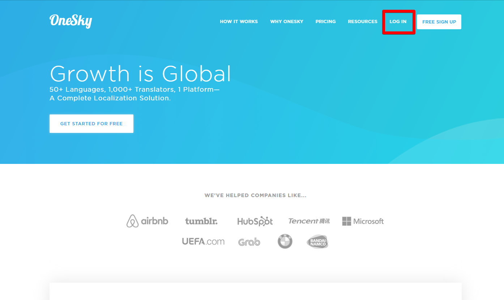
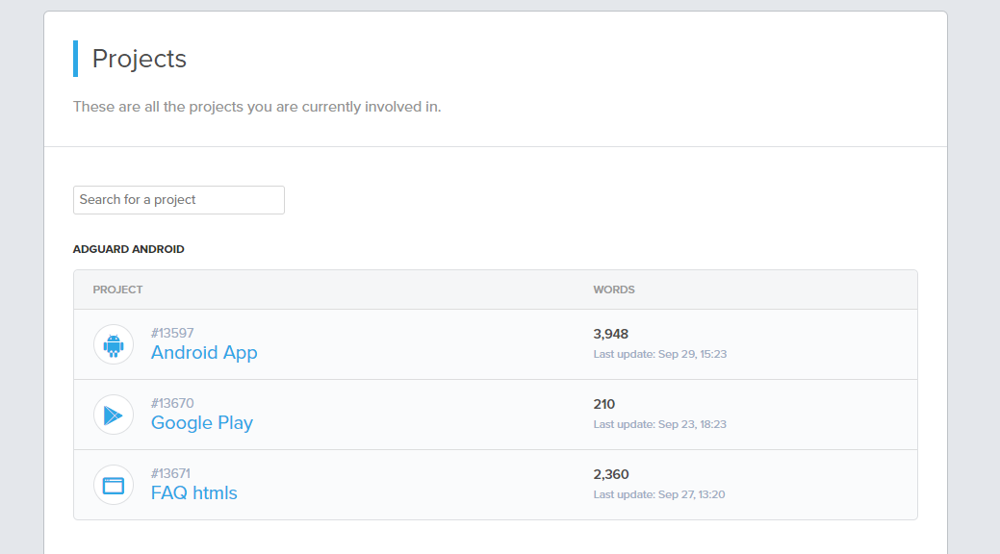
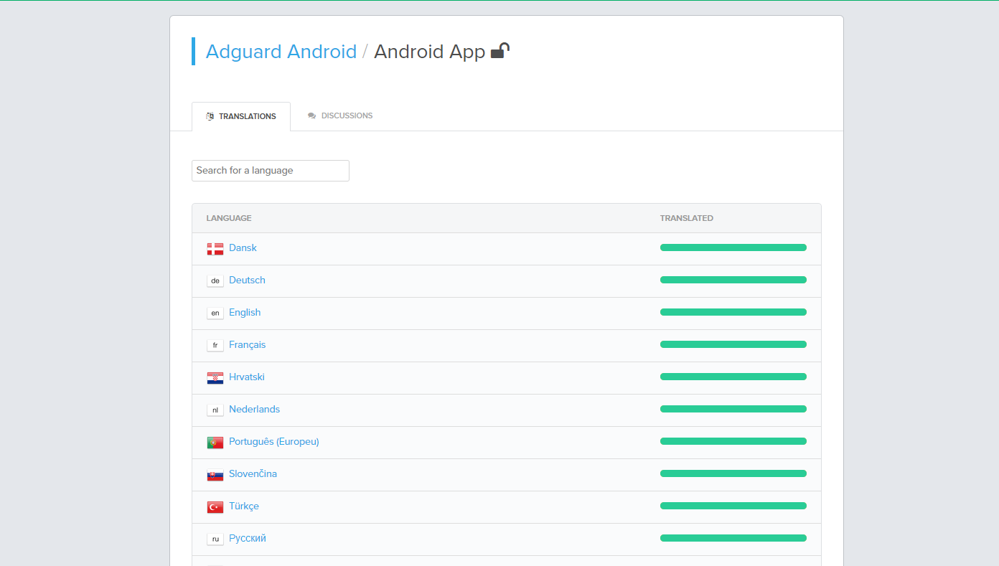
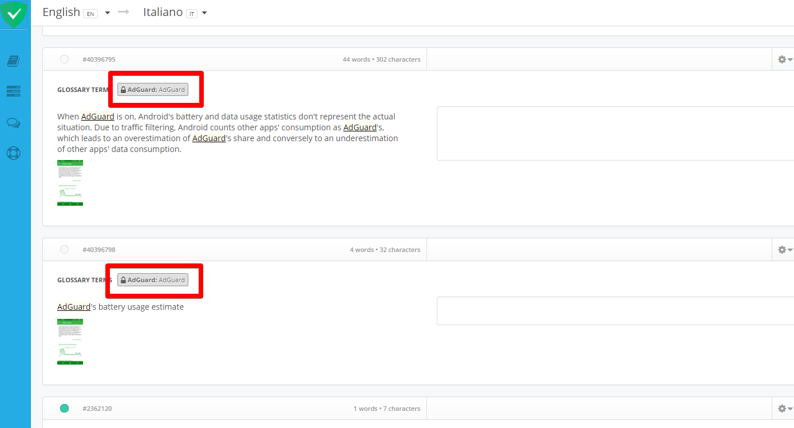
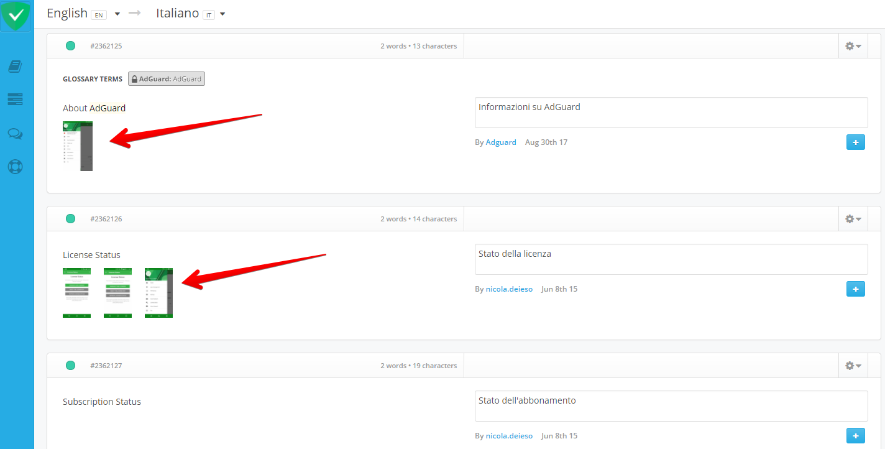
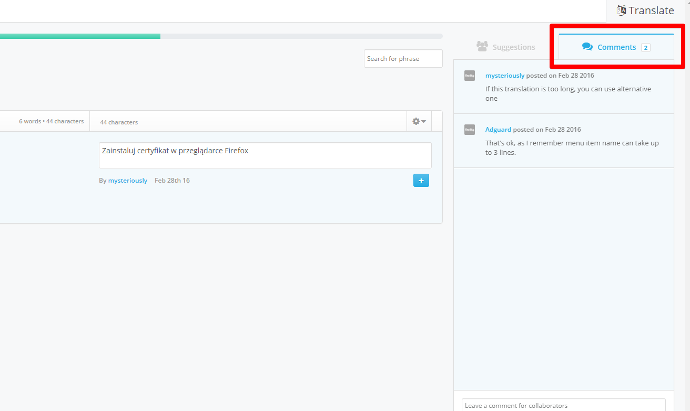
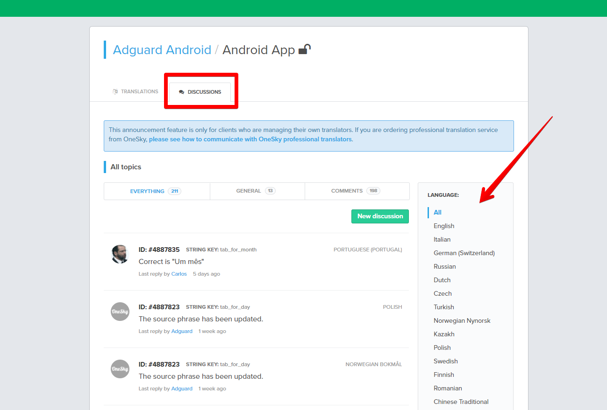
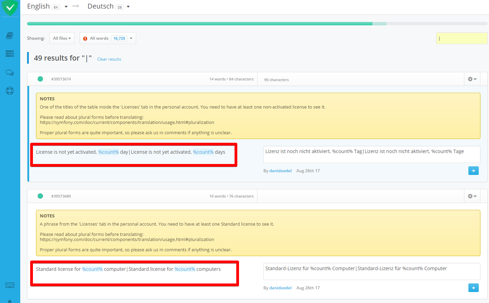

* [About AdGuard translation program](#program)
* [How to become a translator?](#become-translator)
* [Guidelines and recommendations](#guidelines)
* [Who are moderators?](#moderators)
* [Reward system](#rewards)

>**Disclaimer:** you can ask us any questions about translating AdGuard by sending an email to [translate@adguard.com](mailto:translate@adguard.com) or by joining our [Telegram chat](https://t.me/joinchat/CBcY6Au3K0AX-FRXAqBxnA).

### About AdGuard translation program

When it comes to the translations, we at AdGuard always heavily rely on volunteers.

We use OneSky app to manage the translations of our products — https://www.oneskyapp.com/.  It is the place to go for all the people who want to take part in translating any AdGuard product they are interested in. 

If you want to be among volunteers who help us translate AdGuard, please read the following information to learn more about how to become our translator, as well as about the way we collaborate with them.
 
 
### How to become a translator

If you want to join AdGuard translators, first of all, go to OneSky and sign up/sign in.

Once you are logged in, head to our page - https://adguard.oneskyapp.com/. You will see various AdGuard projects there. You can start translating literally any project you like. Just click on it and you will see a list of available languages. 

----

Select the language you want to contribute to and choose phrases that are not yet translated.

Now you can start translating phrases by suggesting your variant in the text box. 

If you see an existing translation, but don't agree with it, you still can suggest your own version by clicking this button:

Besides you can vote for any existing translations (please do!):

You can find some useful tips reading the following information. Please, have a look at it.

### Guidelines and recommendations

There are several things we'd like you to know before you start translating. It will not only save your time and effort, but also ensure that we are on the same page in terms of the meaning of the phrases being translated.

1. Pay attention to glossary terms that sometimes appear above the original phrase. These are usually special words, like brand names, that should not be translated.

2. Often, there are also useful notes that accompany certain phrases to make them easier to understand and translate:

These are always worth paying attention to, keep an eye on them.

3. Keep notice of screenshots that often go alongside key phrases. They will help to understand the context and convey the exact meaning.

4. Apart from suggesting new translations, you can also leave comments to phrases. Use comments to inform about any mistakes in existing translations, to make notes or to ask questions. Sometimes you will find a comment left to your translation — try to react to it.

There's also a **Discussions** tab that conveniently allows you to see all comments for the specific language in this project.

5. Sometimes there can be phrases with plural forms. Please be especially attentive when translating such phrases. You can read how to translate plural forms [here](https://symfony.com/doc/current/components/translation/usage.html#pluralization).

Proper plural forms are extremely important, so please ask us in comments if anything is unclear.

 

6. If you have any questions, you can always ask admins and moderators for help using the comments system. 

 

### Moderators 

As it has already been mentioned before, we have moderators for each language. Moderators:

- Approve the high-quality translations and disapprove the bad ones;
- Look after the relevance of the translations; 
- Participate in discussions in comment section etc.

So, ask moderators any questions regarding the translations on Oneskyapp.

In case you have any problems, send us an e-mail to [translate@adguard.com](mailto:translate@adguard.com) or ask a question in the [Telegram chat](https://t.me/joinchat/CBcY6Au3K0AX-FRXAqBxnA). The Admins will answer you as soon as possible.

However, we do hope that everything for you will go smoothly and without any difficulties! Hope to see you on our team! 

### Reward system

As every honest and well-done work should be rewarded, volunteers who actively translate on OneSky are eligible to request free AdGuard  license key.

Just send us a request to this e-mail: [translate@adguard.com](mailto:translate@adguard.com) and you’ll get the license key as a token of our gratitude.

Besides, the most active translators may receive a moderator’s status in future, should they express such intention, and that promises even more good stuff :)
