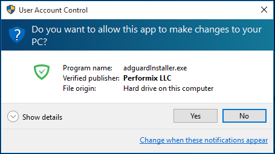
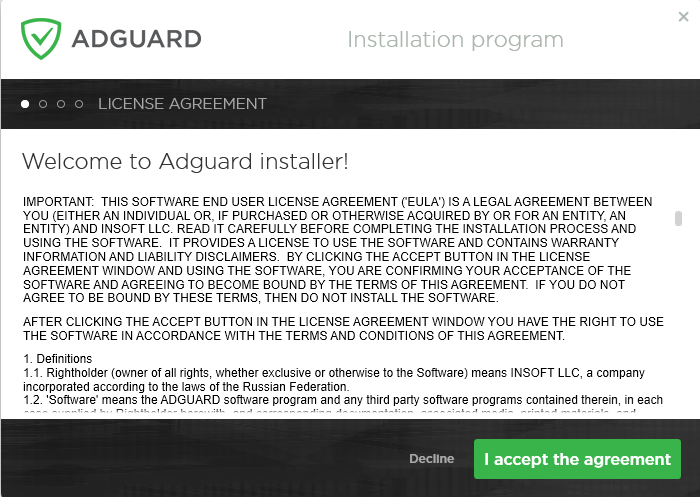
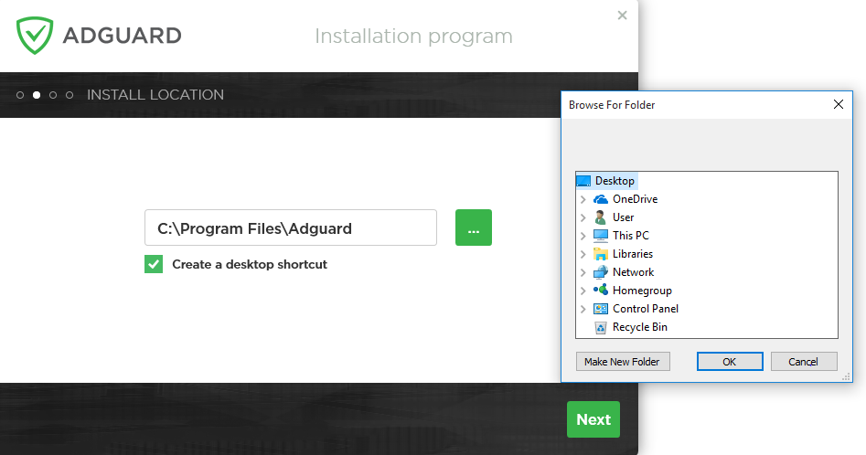
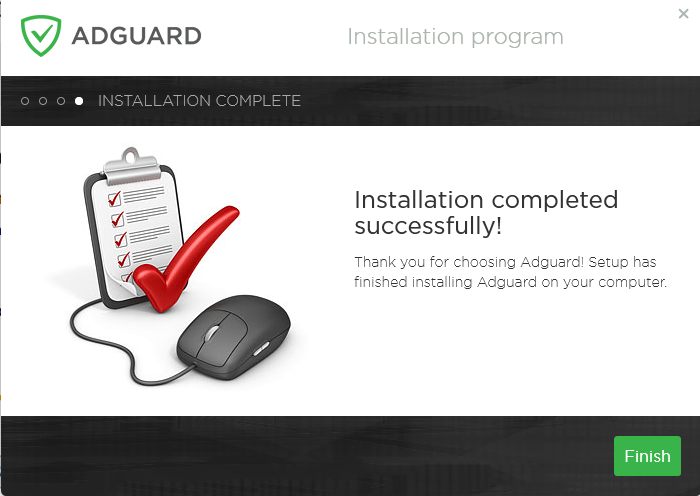
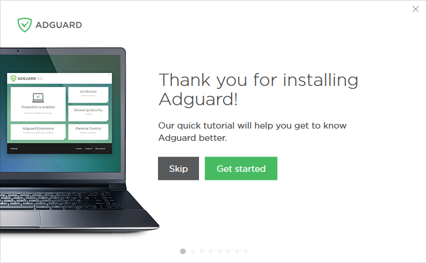

## System  requirements
**Operating system:** Microsoft Windows 10, 8.1, 8, 7, Vista, XP SP3.

**RAM:** at least 512 MB.

**Free disk space:** 60 Mbytes.

**Browsers:** Microsoft Edge, Microsoft Internet Explorer (all versions), Opera, Google Chrome, Yandex.Browser, Mozilla Firefox, and other browsers.

## Adguard Installation

To use Adguard on a PC or tablet under Microsoft Windows, you should download the installation package and launch the installation program. Perform the following actions:

* Open your browser and proceed to the[ Adguard website](http://adguard.com) by typing adguard.com in the address bar, and then click **Download Adguard** (1).
* If the download hasn’t started automatically, use the direct link (2) on the web page that opens in the browser window.
* When the download is finished, press the **Run** (3) button shown in the Downloads bar or click the file name _AdguardInstaller.exe_.

* You’ll see the User Account Control dialogue box requesting to allow the app to make changes to your PC. Click **Yes**.

* The installation program will prompt you to read the License Agreement. Accept the terms and conditions by clicking **I accept the agreement** at the bottom of the window.

* Next, choose the folder on your PC for the app to be installed to. If you do not agree with the default installation path, press the **[…]** button on the right, select the folder for Adguard installation in the **Browse For Folder** window, and confirm your choice by clicking** OK**. You can also install Adguard to a new folder by clicking **Make New Folder** and entering its name. To create a desktop shortcut for Adguard, check the **Create a desktop shortcut** box. Press **Next** to proceed with installation.

* Wait for the installation to complete and click **Finish**.

* When the installation is complete, you can learn about the main functions of Adguard. To begin your tour of the app and step-by-step adjustment of its principal parameters, click **Get started**. If you want to skip this step, press **Skip**.

* Congratulations! You have successfully installed Adguard on your computer. On the screen you will see the main window where you can change the app’s settings.

## Uninstalling and Reinstalling Adguard

If you need to uninstall or reinstall Adguard, do the following:

* For Microsoft Windows 10: Open **Start Menu** by clicking **Start**, and select **Settings**. Click the **System** icon in the window that opens. Select **Apps and Features** from the list on the left in the **Settings** window. Select **Adguard** from the list of your installed apps and click **Uninstall**. Click **Uninstall** in the dialogue box that opens to confirm.

* For Microsoft Windows 8.1, 8 and 7: Open **Control Panel**. Click** Uninstall a program** in the **Programs** section, then select **Adguard** from the list of installed apps and press the **Uninstall** button located right above the list. Confirm the action by clicking** Uninstall Adguard** in the window that opens.

To reinstall Adguard on your PC, launch the installation program again and repeat the steps in the Adguard Installation section.