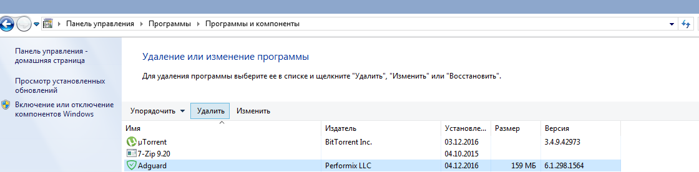

## Системные требования ##

**Поддерживаемые операционные системы:**	Microsoft Windows 10, 8.1, 8, 7, Vista, XP SP3.

**Объем оперативной памяти:**	от 512 Мбайт.

**Необходимый объем доступного дискового пространства:**	60 Мбайт.

**Поддерживаемые браузеры:**	Microsoft Edge, Microsoft Internet Explorer (все версии), Opera, Google Chrome, Yandex.Browser, Mozilla Firefox, другие браузеры.

## Установка Adguard ##
Чтобы использовать программу Adguard на компьютере или планшетном устройстве под управлением операционной системы Microsoft Windows, необходимо загрузить дистрибутив этого приложения и запустить программу установки. Для этого выполните перечисленные ниже действия.

- Откройте окно используемого вами браузера и перейдите на [сайт Adguard](https://adguard.com/ru/welcome.html), набрав в адресной строке `adguard.ru`, а затем щелкните мышью на кнопке ***Скачать Adguard*** (1).

- Если загрузка не началась автоматически, воспользуйтесь прямой ссылкой (2), расположенной на открывшейся в окне браузера веб-странице.

- После завершения загрузки нажмите на кнопу ***Выполнить*** (3), которая отобразится в панели загрузки браузера, либо щелкните мышью на имени файла *adguardinstaller.exe*.

- На экране появится диалоговое окно службы Контроля учетных записей пользователей, содержащее запрос на внесение изменений в настройки вашего компьютера. Нажмите на кнопку ***Да***.

- Программа установки предложит вам ознакомиться с текстом Пользовательского Соглашения. Следует принять условия этого Соглашения нажатием на кнопку ***Я принимаю условия***, расположенную в нижней части окна. 

 

- На следующем этапе необходимо выбрать папку на вашем компьютере, в которую будет установлена программа. Если вас по каким-либо причинам не устраивает предложенная по умолчанию папка установки, нажмите на расположенную правее кнопку **[…]**. В открывшемся окне ***Обзор папок*** укажите папку, в которую вы желаете установить программу Adguard, и подтвердите свой выбор нажатием на кнопку ***ОК***. Вы также можете установить Adguard в новую папку: для этого щелкните мышью на кнопке ***Создать папку*** и введите ее имя. Чтобы разместить ярлык Adguard на Рабочем столе Windows, установите флажок ***Создать ярлык на рабочем столе***. Для продолжения установки нажмите на кнопку ***Далее***.
 
 

- В следующем окне вам будет предложено установить дополнительные продукты. Вы можете отказаться от использования этих приложений, переместив влево соответствующие переключатели в списке предлагаемых программ. Чтобы получить более подробные сведения об этих продуктах, воспользуйтесь ссылкой ***Узнать подробности*** в нижней части окна. Для продолжения установки нажмите на кнопку ***Далее***.

 
 
- Дождитесь окончания процедуры установки и щелкните мышью на кнопке ***Готово***.

 
 
- После завершения установки вы сможете изучить основные возможности программы Adguard. Чтобы приступить к знакомству с приложением, а также настроить в пошаговом режиме основные параметры его работы, нажмите кнопку ***Начать***. Если вы хотите пропустить этот шаг, воспользуйтесь кнопкой ***Пропустить***.

 

- Поздравляем, вы успешно установили программу Adguard на свой компьютер. На экране отобразится основное окно приложения, в котором вы сможете изменить его настройки.

## Удаление и переустановка Adguard ##

Если у вас возникла необходимость удалить Adguard или переустановить эту программу, выполните следующие действия:

- В Microsoft Windows 10 откройте ***Главное меню*** нажатием кнопки ***Пуск*** и выберите в нем пункт ***Параметры***. В отобразившемся окне нажмите на значок ***Система***. В списке, расположенном в левой части окна ***Параметры***, выберите пункт ***Приложения и возможности***. В перечне установленных на вашем компьютере приложений выберите пункт ***Adguard*** и нажмите кнопку ***Удалить***. В открывшемся диалоговом окне подтвердите выбранное действие нажатием кнопки ***Удалить Adguard***.

  

- В Microsoft Windows 8.1, 8 или 7 откройте окно ***Панели управления***. Нажмите на надпись ***Удаление программы*** в разделе ***Программы***, затем выберите в списке установленных приложений Adguard и нажмите кнопку ***Удалить***, расположенную непосредственно над этим списком. В открывшемся окне подтвердите выбранное действие нажатием кнопки ***Удалить Adguard***.

   

В случае, если обычное удаление по какой-либо причине не помогает, попробуйте воспользоваться [специальной утилитой](https://adguard.com/ru/kak-udalit-adguard.html) по удалению Adguard.

- Для того чтобы переустановить Adguard на вашем компьютере, запустите заново программу установки и последовательно повторите шаги, изложенные в разделе «*Установка Adguard*».
