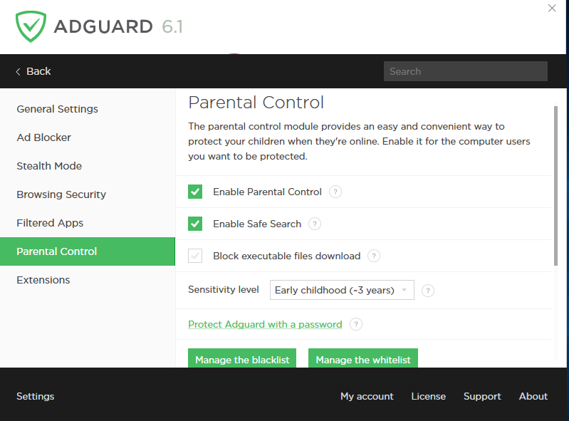

The Parental Control module ensures children’s web safety. Enable it for users you would like to protect from unacceptable information. [How Parental Control works and what it’s for](https://adguard.com/en/adguard-parental-control.html).

**Enable Parental Control**

Turn Parental Control on or off.

**Enable Safe Search**

Safe Search excludes adult and other content that is inappropriate for children from search results in popular search engines (Yandex, Rambler, Google, Yahoo).

**Block executable files download**

Enabling this function will make Parental Control block downloading any executable files. This option will forbid your child from downloading and installing software on the protected device.

**Sensitivity level
**
Sets the level of sensitivity for Parental Control depending on the age of your child.

**Protect Adguard with a password
**
A password protects Adguard from change of settings or disabling. You can also use the password to access websites Parental Control has blocked.

**Manage the blacklist**

Here you can manually add websites you thinks are inappropriate for your children.

**Manage the whitelist**

You can manually disable Parental Control for certain sites.

**Protected users**

Choose which users are protected by Parental Control. Just check the boxes near your children’s names.
