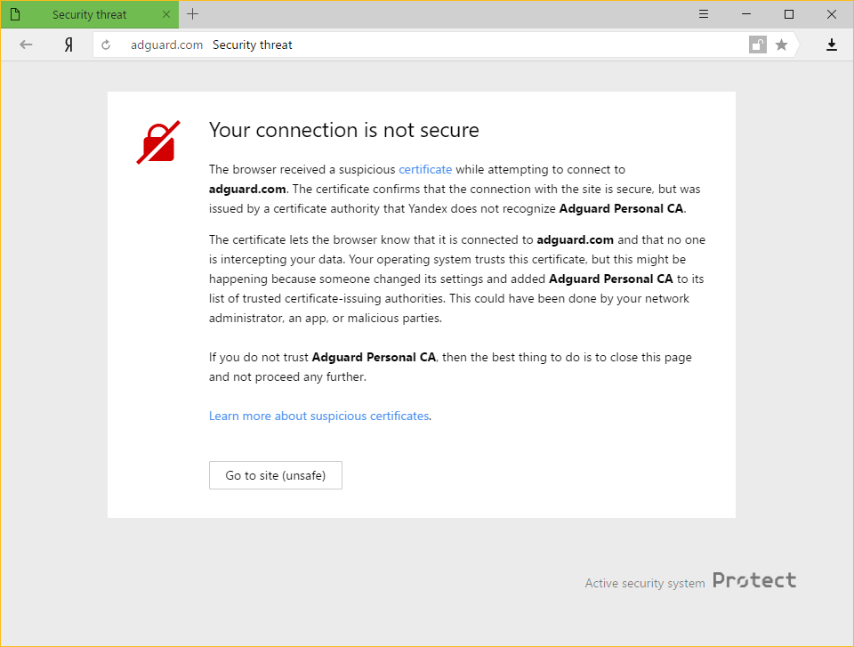

If you are a user of both Adguard for Windows and Yandex.Browser you may have come across this warning:

### Why is this happening

It may look scary, but in reality there is no reason to rush and uninstall either of the programs. Let us explain why.

Both Adguard and Yandex take users' security on the Internet very seriously. Current Yandex policy is to warn their users about any certificate that is not recognized by the browser. This is not unsubstantiated, because sometimes malicious apps can inject their own certificates and use this to harm the system and steal private data. 

However, Adguard also adds its certificate to the trusted ones to be able to filter all traffic and efficiently block ads. This leads to the warning message you have encountered.

### What to do?

The easiest way is to click on the **'Go to site'** button. This will tell Yandex.Browser to remember Adguard certificate as a trusted one, at least for a while. Normally, you won't have to see this message anymore, but it is not beyond the realm of possibility for it to appear occasionally, for whatever reasons. In such cases, simply press the same button again *(make sure it is Adguard's certificate!)*.

Disabling the HTTPS filtering in Adguard will also prevent Yandex.Browser from showing this message again, but it comes with a big price: all ads that are loaded by HTTPS, including **Yandex own ads**, will show up. We strongly advise against it if you want to keep the quality of ad blocking high.
