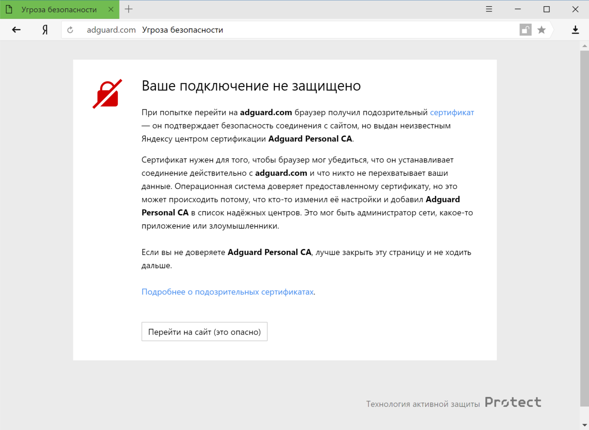

Если вы являетесь одновременно пользователем AdGuard для Windows и Яндекс.Браузера, то вы могли столкнуться с таким предупреждением:

### Почему это происходит

Оно может выглядеть устрашающе, но на деле нет причин бросаться удалять AdGuard или Яндекс. Объясним, почему.

И AdGuard, и Яндекс очень серьезно подходят к вопросу безопасности пользователя в сети. Текущая политика Яндекса предписывает предупреждать пользователей о любом сертификате безопасности, не распознаваемом браузером. Это не всегда необосновано, так как иногда вредоносные программы действительно могут вставлять свои сертификаты, наносить вред системе и красть личные данные.

Однако, AdGuard также добавляет свой сертификат в список доверенных, чтобы иметь возможность фильтровать весь трафик и эффективно блокировать рекламу. Это и приводит к появлению предупреждения.

### Что делать?

Самый простой способ - кликнуть по кнопке **"Перейти на сайт"**. Этим вы говорите Яндекс.Браузеру, что вы доверяете сертификату AdGuard, и он запомнит его как доверенный. Обычно, после этого вы больше не столкнётесь с подобным предупреждением, однако изредка это может происходить по некоторым причинам. В таком случае просто нажмите эту же кнопку ещё раз *(сначала убедитесь, что это именно сертификат AdGuard!)*.

Отключение фильтрации HTTPS в настройках AdGuard также предотвратит появление данного предупреждения, но такой метод обойдётся дорогой ценой: вся реклама, загружаемая по HTTPS (включая **собственную рекламу Яндекса**), будет отображаться - а это такие сайты как YouTube, VK, Facebook, и многие другие. Мы не советуем выбирать этот путь, если вы хотите сохранить высокое качество блокировки рекламы.
