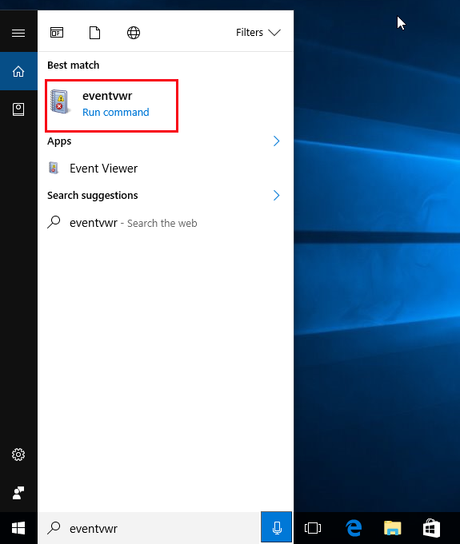
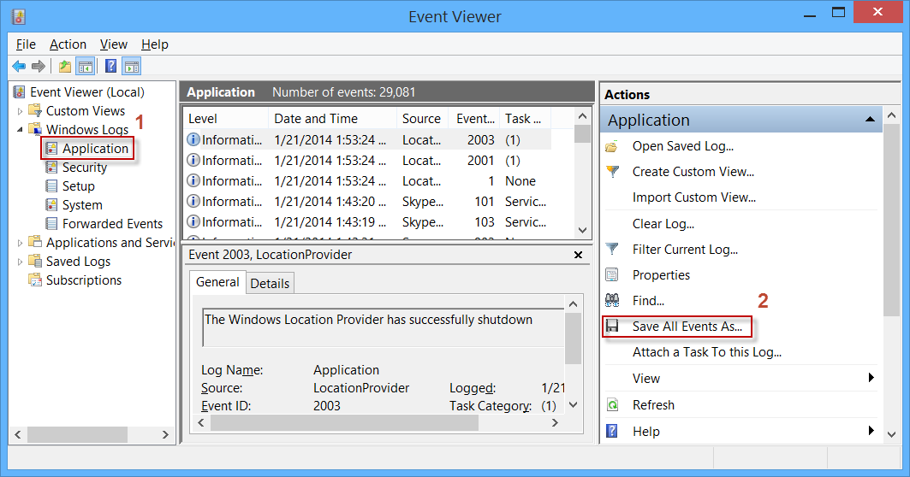

For analysis and diagnostic of different problems connected with the work of Adguard, support service might need Windows log files. Windows event logs contain records about all errors occurred with the software recently. Below is the brief instruction describing the way to get the log files and send them to support service. 

1. Open the **“Event Viewer”**.

If you use Windows 10, click the "**Search**" icon on the Taskbar and type in the search form field **eventvwr**.Then run the first program that will be found by clicking on **Event Viewer** icon, or just press Enter.

If you use Windows 8 or 8.1 do the following.

Go to **Start**:

Type in **eventvwr** in the search bar and launch the first program found (by clicking it or by pressing **Enter**)

If you use Windows 7 or Vista press **Star**t then type in **eventvwr** in the search bar and press **Enter**. 

2. Save application and system logs in separate files.

**Event Viewer** window appears as shown in the picture.

To save files that we need, do the following:

 2.1 Open "Application" ("Event Viewer (Local)" -> "Windows Logs" -> " Application")

 2.2 Right-click on the "Application" and in drop-down menu select "Save All Events As..."

 2.3 Select a name and where to save, click "Save." Select "Display information for the following languages". You need to tick the box next to "English”. Click "OK".

 2.4 Open "System" ("Event Viewer (Local)" -> "Windows Logs" ->  “System" ) .

 2.5 Right-click on "System" and in the drop-down menu, select "Save All Events As ..."

 2.6 Choose a location, enter the name, click "Save." Select "Display information for the following languages". You need to tick the box next to "English”. Click "OK". 

Please send two files that you've got as a result, to the Adguard support service.

