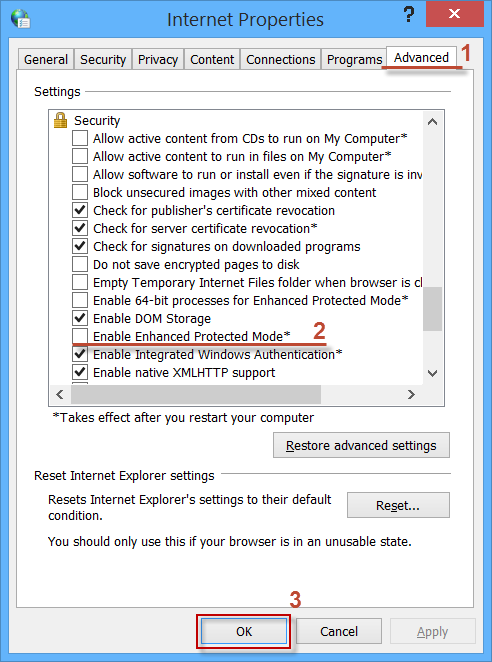

What shall I do if the filtering in Internet Explorer doesn’t work?

Most probably it’s because you are using Windows 8 or 8.1 and enhanced protected mode is enabled in Internet Explorer. There are two solutions to this problem. 

**Option 1 - enable the WFP-drivers in the Adguard network settings.**

To do so:

1. Go to the Adguard [extended interface](https://kb.adguard.com/index.php?/Knowledgebase/Article/View/19/0/how-to-enter-the-adguard-extended-interface).

2. Enable WFP driver as done in the picture:

**Option 2 – disable enhanced protected mode in Internet Explorer.**

To do so:

1. Launch Internet Explorer

2. In the upper right corner of the browser’s screen click “Service” and choose “Internet options” as shown in this picture.

  3. In the window “Internet options” choose “Advanced”, deselect “Enable Enhanced Protected Mode” and click “Ok”.

