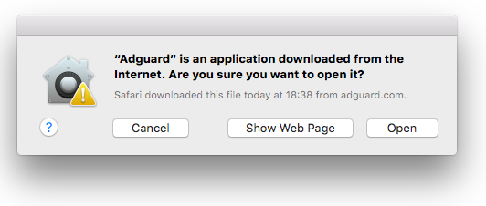
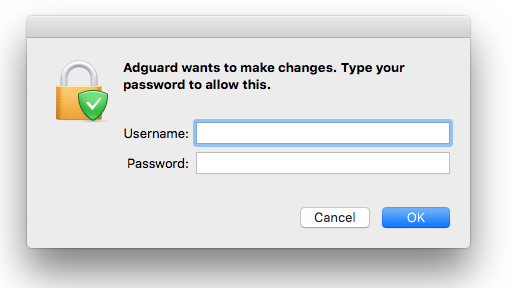

## System  requirements

**Operating system version:** OS X 10.7 (64 bit) or higher

**RAM:** at least 2 GB

**Browsers:** Safari, Google Chrome, Opera, Yandex.Browser, Mozilla Firefox, any other macOS compatible browser

**Free disk space:** 60 Mbytes

## Installation

To install Adguard for macOS on your computer, launch your browser, type _adguard.com_ in the address bar, and press **Download Adguard** on the page that opens.

Wait for _Adguard.release.dmg_ to download and click on its icon in the list of downloaded files in the Dock panel. The Adguard icon will appear on your Desktop. Cick on it to open the installation app.

In the installation window, drag the Adguard icon to the **Applications** folder icon on the right.

Now the application has been installed on your computer. To launch the application, double click on the Adguard icon in the Applications folder that you can open with Finder. Upon the first Adguard launch, your operating system will warn you that this application has been downloaded from the Internet. Click **Open**.

To use the application, you will need the administrator password for your macOS account. Enter the password when propped in the dialogue box and press **OK**.

<a name="uninstall">
## Uninstall

### Regular
First of all, open 'Finder' app by clicking on a respective icon:

Go to 'Applications' section. Find Adguard there, right-click on it and choose 'Move to Trash'.

### Advanced
**Use this instruction only after performing all steps from 'regular uninstall'.** After that, do the following:

* Delete following Adguard files:
    * */Library/Application Support/com.adguard.Adguard* (folder)
    * *~/Library/Application Support/com.adguard.Adguard* (folder)
    * *~/Library/Preferences/com.adguard.Adguard.plist* (file)

* Run ’Activity Monitor’ app.
* Using search tool, find process **cfprefsd**.

* Stop the process which is being&nbsp;run under the user (not the one run under root).

Adguard is removed from your computer.
