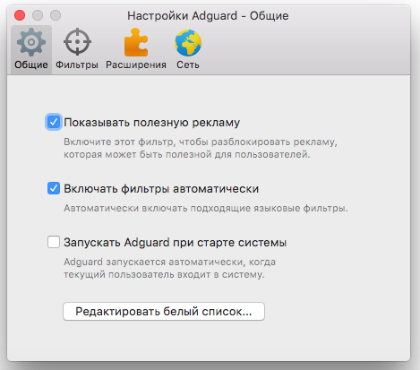
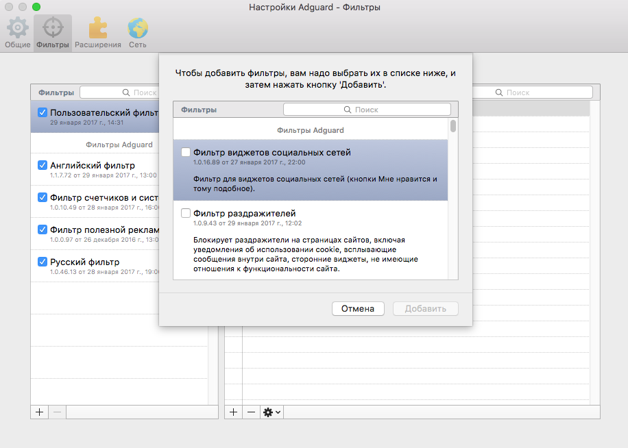

Это основной модуль Adguard для macOS, предназначенный для фильтрации рекламы на просматриваемых пользователем сайтах и в установленных на компьютере приложениях. Модуль Антибаннер удаляет с веб-страниц рекламные изображения и сообщения при помощи специального набора правил. При этом нежелательный контент отфильтровывается еще до того момента, как веб-страница будет загружена в браузер, что позволяет заметно экономить трафик.

Вы можете гибко настроить Антибаннер, добавив в правила блокировки любой объект на просматриваемых вами веб-страницах, либо отключить фильтрацию рекламы на определенных сайтах. Существует возможность полностью приостановить работу модуля, и вновь возобновить ее по мере необходимости. Фильтры Антибаннера обновляются автоматически, но при желании вы можете самостоятельно изменить параметры Пользовательского фильтра, отредактировав в его настройках список адресов интернет-ресурсов.

Adguard работает со всеми браузерами, совместимыми с macOS, поэтому Антибаннер успешно заблокирует рекламу в любой используемой вами программе для просмотра веб-страниц. 

Для того чтобы включить или отключить модуль  Антибаннер, щелкните мышью на значке Adguard в верхней панели macOS, и в открывшемся окне переместите переключатель Антибаннер влево или вправо. 

Для того чтобы изменить настройки модуля, включить или отключить фильтры, щелкните мышью на значке с изображением шестеренки в правом верхнем углу окна программы Adguard, и в открывшемся меню выберите пункт «Настройки».

В открывшемся окне можно изменить основные настройки приложения, например, включить демонстрацию [полезной рекламы](https://adguard.com/ru/whitelist.html), установив соответствующий флажок.

Adguard предоставляет пользователям множество различных фильтров, с помощью которых вы можете точно настроить параметры блокировки. Фильтры автоматически обновляются с серверов Adguard. Все они вручную создаются нашими специалистами на основании получаемых от пользователей данных. Вы всегда можете помочь другим пользователям Adguard, отправив нам адреса сайтов, на которых всё же увидели рекламу.

Чтобы включить или отключить фильтры, щелкните мышью на значке «Фильтры» в верхней части окна «Настройки Adguard». 

По умолчанию установлены и включены следующие фильтры:

**Пользовательский фильтр**

Самостоятельно редактируемый фильтр. Правила можно добавлять с помощью «помощника Adguard», либо вручную, в соответствии с +руководством по составлению правил+. Например, его удобно использовать против мозолящих глаза картинок в форумных подписях.

**Русский фильтр**

Правил этого фильтра достаточно для того, чтобы полностью очистить от рекламы любой сайт рунета.

**Английский фильтр**

Убирает рекламу с сайтов англоязычного сегмента интернета.

**Фильтр полезной рекламы**

Пропускает поисковую рекламу и собственную рекламу веб-сайтов (скидки, промоакции и тому подобное). [Что мы считаем полезной рекламой](https://adguard.com/ru/whitelist.html)?

**Фильтр счетчиков и системы аналитики**

Защищает персональную информацию пользователя от различных счетчиков и систем сбора статистики, блокируя соответствующие запросы сайтов.

Чтобы добавить фильтр в список работающих фильтров, нажмите на кнопку «+» в левой нижней части окна «Настройки Adguard — Фильтры». В открывшемся окне отметьте флажками фильтры, которые вы желаете установить, и щелкните мышью на кнопке «Добавить».

