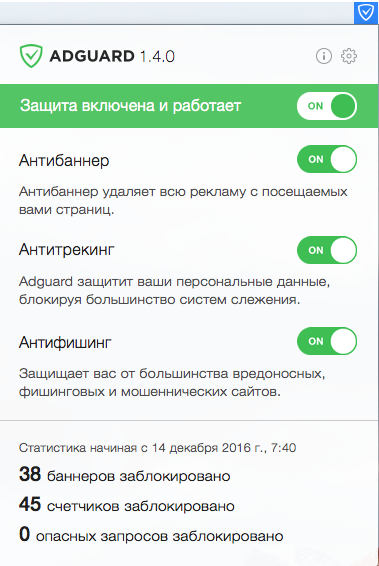

Одним из самых распространенных видов мошенничества в Интернете по праву считается фишинг. Целью злоумышленников является кража личных данных (паролей доступа, реквизитов банковских карт и т. д.). Для этого используются поддельные веб-страницы, имитирующие оформление популярных сайтов или реально существующих сетевых сервисов (например, интернет-магазинов, социальных сетей). Чтобы усыпить бдительность потенциальных жертв, многие фишинговые сайты имеют адреса, отличающиеся от настоящих всего лишь несколькими символами. Если пользователь введет свои учетные данные или реквизиты банковской карты на таком сайте, эта информация неизбежно попадет в руки мошенников.

Модуль Антифишинг надежно защищает пользователей от подобных инцидентов. При этом личная информация пользователя никуда не передается, и сервера AdGuard не знают о том, какие сайты он посещает: для проверки безопасности используются не открытые сетевые адреса (URL), а префиксы их хешей (хеш — определенным образом сформированная структура данных, однозначно идентифицирующая каждый добавленный в базу адрес).

Некоторые веб-страницы сами по себе не представляют угрозы, однако могут содержать элементы, загружаемые в их структуру с других сайтов. В отличие от расширений для браузеров, модуль Антифишинг проверяет каждый встроенный в веб-страницу объект, обеспечивая тем самым максимальную степень защиты.

Для того чтобы включить или отключить модуль  Антифишинг, щелкните мышью на значке AdGuard в верхней панели macOS, и в открывшемся окне переместите переключатель Антифишинг влево или вправо. 

