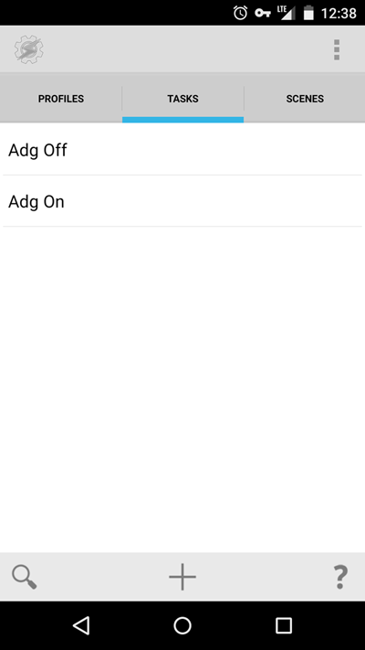

Для настройки автоматического запуска (выключения) Adguard для Android в Tasker необходимо проделать следующие операции:

1. Добавить соответствующие Task'и

_для запуска защиты:_

<table>
<tbody>
<tr>
<td>Send</td>
<td>Intent</td>
</tr>
<tr>
<td>Action:</td>
<td>android.intent.action.SEND</td>
</tr>
<tr>
<td>Cat:</td>
<td>None</td>
</tr>
<tr>
<td>Mime Type:</td>
<td>&nbsp;</td>
</tr>
<tr>
<td>Data:</td>
<td>&nbsp;</td>
</tr>
<tr>
<td>Extra:</td>
<td>ACTION:2</td>
</tr>
<tr>
<td>Extra:</td>
<td>&nbsp;</td>
</tr>
<tr>
<td>package:</td>
<td>com.adguard.android</td>
</tr>
<tr>
<td>Class:</td>
<td>com.adguard.android.ServiceManager</td>
</tr>
<tr>
<td>Target:</td>
<td>Service</td>
</tr>
</tbody>
</table>

_для выключения защиты: _

<table>
<tbody>
<tr>
<td>Send</td>
<td>Intent</td>
</tr>
<tr>
<td>Action:</td>
<td>android.intent.action.SEND</td>
</tr>
<tr>
<td>Cat:</td>
<td>None</td>
</tr>
<tr>
<td>Mime Type:</td>
<td>&nbsp;</td>
</tr>
<tr>
<td>Data:</td>
<td>&nbsp;</td>
</tr>
<tr>
<td>Extra:</td>
<td>ACTION:4</td>
</tr>
<tr>
<td>Extra:</td>
<td>&nbsp;</td>
</tr>
<tr>
<td>package:</td>
<td>com.adguard.android</td>
</tr>
<tr>
<td>Class:</td>
<td>com.adguard.android.ServiceManager</td>
</tr>
<tr>
<td>Target:</td>
<td>Service</td>
</tr>
</tbody>
</table>

В результате будет два готовых к использованию таска:

2. Добавить профили, использующие созданные задачи.

Например, можно настроить автоматическое включение Adguard для Android при переключении на мобильные сети и автоматическое отключение при подключении к wi-fi:

