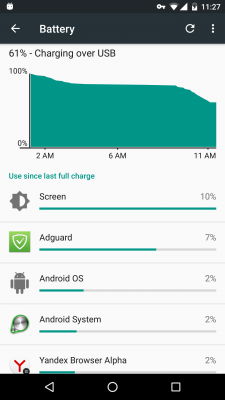

Sometimes you may notice that, according to Android built-in statistics, Adguard consumes a lot of traffic and/or battery resource.

Both these problems are two side of the same coin. Since in the process of filtering all the mobile traffic goes through Adguard, Android decides that it is Adguard that consumes it all. In reality, of course, it is not true.

Battery and traffic consumption shown in devices statistics **does not represent the facts**. The thing is, Android attributes all of the WiFi and Mobile traffic to Adguard, which was in fact consumed by other apps. Due to this, Adguards real share of total traffic and battery resource consumed increases, and other apps, on the contrary, decreases.

**Real example**

On the screenshots below you can see the battery resource consumption statistics for a night and subsequent morning.

From these screenshots you can see that:

1. Adguard, as expected, at the top of the chart. This is generally typical for smartphones (and not at all for tablets without 3G, since WiFi is much less 'costly' from the battery consumption point of view).

2. Pay attention to the number of sent Mobile and WiFi packages, which were attributed to Adguard (Mobile packets sent и Wi-Fi packets sent) on screenshot #2.

3. On screenshot #3 is the stats for one of the real traffic consumers, Yandex.Browser. It was not attributed almost no traffic at all, while in reality 70% of the traffic were spent by it.

**How much battery resourse does Adguard really consume?**

First, let us lay down a little bit of theory and links with necessary data.

1. Android derives traffic consumption judging on so-called Power Profile, whcih is given by every manufacturer: <https://source.android.com/devices/tech/power/values.html>

2. Main part of Power Profile is a set of values in mAh which define battery consumption for every component of the device: <https://source.android.com/devices/tech/power/values.html>

For example, from the table above:

_wifi.active=_ 31mA additional consumption in mAh caused by WiFi data exchange.

_radio.active=_ 100-300mA additional consumption in mAh caused by data exchange over Mobile network.

_cpu.active=_ 100-200mA additional consumption in mAh caused by CPU work.

3. Adguard by itself almost doesn't consume any traffic, so for the sake of evaluating battery resourse consumption let's get rid of 'Mobile/WiFi packets' and stcik to 'CPU'.

Formulа for consumption calculating:

>"CPU TIME (ms)" X "cpu.active" / (60 * 60 * 1000) = "POWER USE mAh"

Let's put real numbers into this formula.

Let's take _CPU total_ from the second screenshot and convert into milliseconds: 506000

A coefficient _cpu.active_ for 2GHz will be roughly equal to 225mA

Final result

>506000 * 225 / (60 * 60 * 1000) = 31,625mAh

**Conclusion**

Real consumption is **several times less** than it is shown in Android statistics. Instead of 220mAh it should be somewhere around 31-40mAh. On the other hand, browser's consumption should be not 66mAh, but ~200mAh.