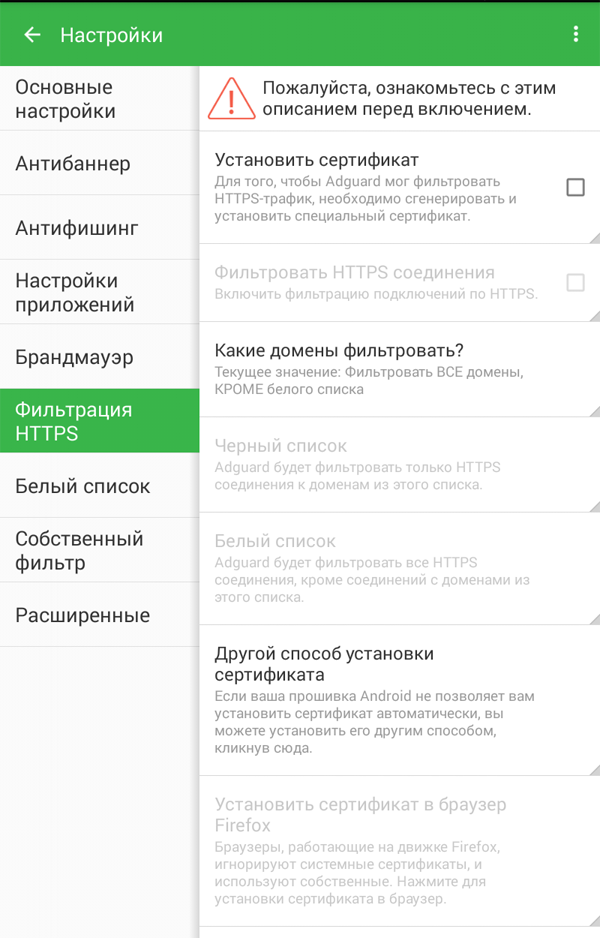
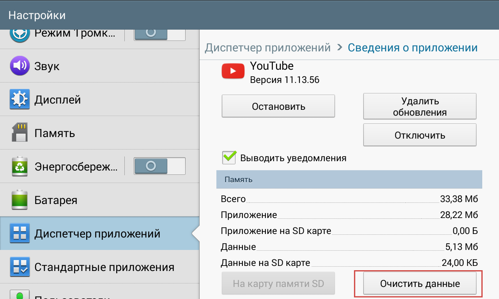
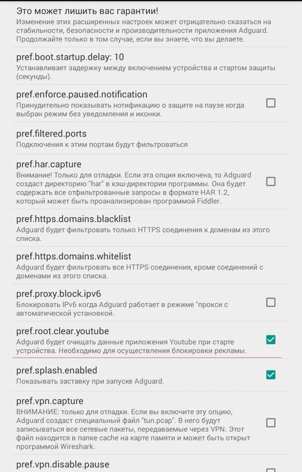

Один из самых популярных вопросов, которые задают нам пользователи, - можно ли заблокировать рекламу в Youtube на Android. К сожалению, простого ответа на него нет. В этом посте мы постараемся рассказать все, что знаем об этой теме.

На данный момент не найден способ полностью убрать рекламу из приложения Youtube для Android. Каждый из описанных ниже вариантов потребует от вас совершения дополнительных действий. Для многих это покажется слишком сложным. Мы это понимаем и продолжаем искать лучшее решение.

## Инструкция
### Шаг 1: Включение фильтрацию HTTPS

В первую очередь следует включить фильтрацию HTTPS в настройках Adguard. Это необходимо для расшифровки данных, передаваемых приложению Youtube от их серверов. Чтобы включить HTTPS-фильтрацию, просто перейдите в настройки Adguard -> Фильтрация HTTPS, и установите сертификат Adguard:

>_Советуем ознакомиться с подробным описанием HTTPS фильтрация. Перейти к нему вы сможете из настроек Adguard._

**Пользователям Android 7.0 (Nougat) или новее **
К сожалению, возможности фильтрации HTTPS в Android Nougat [ограничены](https://blog.adguard.com/ru/adguard-android-v-2-5-official-release/), так что в новых версиях приложения Youtube фильтрация работать не будет. У этой ситуации есть два решения.

1. Вы можете установить старую версию приложения Youtube, скачав ее, например, с сайта [apkmirror.com](http://www.apkmirror.com/apk/google-inc/youtube/) - подойдет  релиз [11.13.56](http://www.apkmirror.com/apk/google-inc/youtube/youtube-11-13-56-release/). В этом случае вам нужно будет также запретить автоматическое обновление приложению Youtube в настройках Google Play.

2. Если у вас есть ROOT доступ, вы можете перенести сертификат Adguard в системные с помощью приложения [Move Certs](https://f-droid.org/repository/browse/?fdfilter=move%20certs&fdid=com.nutomic.zertman).

### Шаг 2: Очистка данных приложения

Следующий шаг - очистка данных приложения Youtube. Для этого откройте настройки Android, перейдите в Диспетчер приложений, далее нажмите на приложение Youtube и на кнопку "Очистить данные":

Это и есть наша основная проблема. Adguard может убрать всю рекламу из приложения, но только если Youtube находится в состоянии с “очищенными” данными. После перезагрузки устройства или перезапуска приложения Youtube (перезапуск осуществляется “смахиванием” и последующим запуском), оно переключается на другой алгоритм работы, в котором часть видео-рекламы всё равно будет “прорываться”.

Таким образом, вам надо будет очищать данные приложения Youtube как минимум при каждой перезагрузке вашего устройства.. Для пользователей с ROOT-доступом этот процесс можно автоматизировать. Специально для этого мы добавили новую функцию в низкоуровневые настройки. Чтобы ее включить, вам нужно зайти в Настройки -> Расширенные -> Низкоуровневые настройки, найти пункт **pref.root.clear.youtube **и поставить рядом с ним флажок:

Если он включен, Adguard будет очищать данные приложения Youtube при старте устройства.

### Обновления

Мы будем поддерживать этот пост в актуальном состоянии, следите за обновлениями.