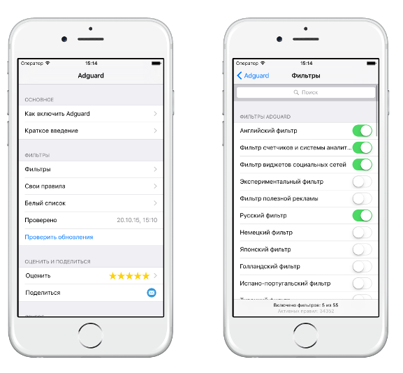

AdGuard для iOS позволяет блокировать рекламу на смартфонах и планшетах производства компании Apple. AdGuard поддерживает больше 50 разных фильтров, оптимизированных для мобильного браузера  Safari, включая специальный фильтр для сайтов на русском языке.

AdGuard позволяет пользователю гибко менять настройки: вы можете добавить любой сайт в исключения, и реклама на таких сайтах не будет блокироваться. Также вы можете управлять всеми фильтрами AdGuard, при необходимость включать, отключать их, или даже создавать собственные.

В каталоге приложений App Store доступно две версии AdGuard для iOS — [бесплатная](https://itunes.apple.com/us/app/id1047223162) и [AdGuard Pro](https://itunes.apple.com/ru/app/id1126386264). Основное отличие этой версии от базовой заключается в том, что AdGuard Pro не ограничивается одним лишь браузером Safari: он будет работать во всех приложениях и браузерах.
 
Благодаря интеграции с AdGuard DNS, AdGuard Pro может фильтровать трафик в двух режимах. Режим По умолчанию — это базовый режим для блокирования рекламы, трекеров, фишинговых сайтов и так далее. Семейный режим включает в себя всё, что может режим "По умолчанию", но вдобавок к этому также блокирует все сайты со "взрослым" контентом. Этот режим идеально подойдет, если вы, например, установили AdGuard Pro на iOS-устройство вашего ребенка. Журнал запросов DNS поможет вам отслеживать все запросы и легко занести в белый список любой сайт, для которого вы хотели бы отключить фильтрацию.
 
Разумеется, AdGuard Pro умеет выполнять те же функции, что и базовая версия —  блокировать рекламу, счетчики и вредоносные сайты в Safari, имеет широкий выбор фильтров - как собственных фильтров AdGuard, так и самых популярных "внешних" фильтров типа EasyList. Благодаря AdGuard для iOS веб-страницы загружаются намного быстрее — ведь в них отсутствуют баннеры, лишние картинки и рекламное видео.

## ФУНКЦИИ

*  Блокировка рекламы. AdGuard блокирует все виды рекламы; к вашим услугам более 50 различных фильтров. С AdGuard вы забудете, что такое баннеры, видеореклама, всплывающие окна и т.д. 

* Включает в себя популярные фильтры Adblock: EasyList, EasyPrivacy, Fanboys Annoyances, Malware Domains. AdGuard  обеспечивает двойную защиту с помощью как сторонних, так и собственных фильтров. 

*  Региональные и другие фильтры. AdGuard - первый блокировщик, который позволяет использовать разнообразные региональные фильтры. Посещайте сайты на разных языках - они также будут фильтроваться AdGuard.

* Блокировка виджетов и систем слежения. Специальные фильтры заблокируют все счетчики, чтобы защитить ваши личные данные, и уберут все лишние кнопки социальных сетей.

*  Ускорение интернета. AdGuard убирает из сети все лишнее, и чистые страницы загружаются гораздо быстрее. 

**Эти функции доступны только в версии Pro:**

* **DNS-фильтрация в приложениях.** Версия AdGuard для iOS Pro позволяет контролировать обращения к службам DNS в приложениях - это дает возможность фильтровать трафик других приложений и браузеров, а не только в Safari. 

* **Возможность заносить сайты в белый/черный список.** Благодаря этой функции вы всегда сможете включать или отключать фильтрацию рекламы на определенных сайтах.

* **Журнал DNS-запросов.** Ведение журнала DNS запросов позволяет найти в журнале нужный запрос и заблокировать домен в деталях запроса.