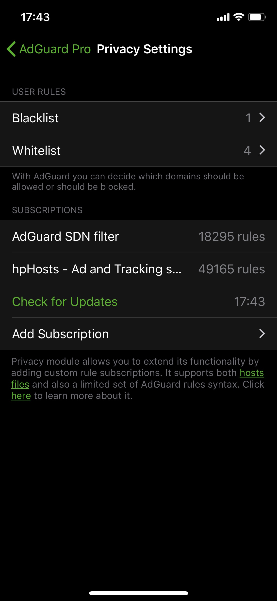
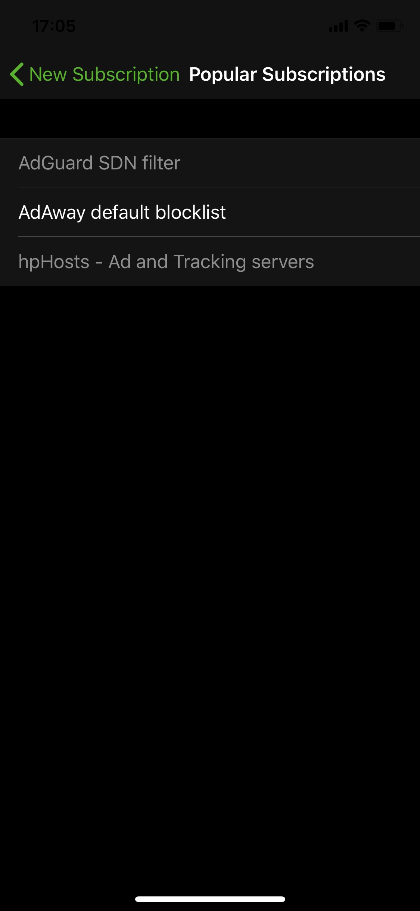

AdGuard for iOS is an efficient and convenient ad blocker developed for Apple mobile devices. It supports more than 50 filters and is available in two versions. The basic version is free on App Store and provides content blocking in Safari mobile browser only. The Pro version is a paid one; it blocks ads in other apps and has a whole number of [additional features](#pro).

### Ad blocking
AdGuard for iOS blocks all kinds of ads, including banners, video ads, and popup windows. The app utilizes more than 50 filters, both its own and popular third-party ones, such as EasyList, EasyPrivacy, Fanboys Annoyances etc.

### Regional filters
AdGuard for iOS allows the use of various language-specific filters to block ads on websites from respective internet segments. In addition, users can create their own filters with a personalized set of rules.

### Blocking of trackers and social widgets
Many websites gather different kinds of information about their visitors: their IP address, the installed browser and OS, screen resolution, and even the page where the user has come from. Special AdGuard filters block all statistics gathering resources and remove social widgets from web pages. The Share and Tweet buttons will only appear when you want them.

### Traffic saving
AdGuard for iOS removes all the unnecessary content from web pages, allowing for much shorter loading time and saving your traffic noticeably.

### Custom blocking
You can fine-tune filtering by manually blocking literally any element on the page by accessing AdGuard Assistant right from Safari. It is also possible to add particular domains to the list of exceptions, which disables ad blocking for domains you trust.

## AdGuard Pro Features 
Apart from its basic functions available with the free AdGuard version, AdGuard Pro opens numerous additional possibilities for its users, like filtering all kinds of ads not only in Safari, but in many other iOS apps. To enable Pro features of the app, simply turn on the Status switch (under the "Privacy" tab of the AdGuard Pro settings). If this switch is off, any Pro features will be unavailable. 

*NOTE: you can add AdGuard widget on the widget screen to use it instead of flipping the Status switch in the app menu.* 

### Custom DNS settings
One of the main AdGuard Pro features is ability to customize DNS settings. AdGuard Pro allows to set up any number of DNS servers and quickly switch between them. Several are available by default, like AdGuard's own DNS servers, Google Public DNS, [OpenDNS](https://www.opendns.com) servers and many others.

Using a custom DNS server instead of a system default one can be helpful in a number of ways. Sometimes it will speed up the internet connection, secure your actions online, help get rid of ads or serve as a parental control tool. One of the possible applications is DNS filtering. It is a more "rough" way of ad blocking compared to content blocking, but it works across the board rather than just in Safari. More information about DNS filtering can be found [here](https://kb.adguard.com/general/dns-filtering-android). By the way, AdGuard has its own DNS servers that provide DNS-based ad blocking, and you can choose them from among the default ones in AdGuard Pro.

#### DNSCrypt
AdGuard Pro also supports DNSCrypt servers. You can read why DNSCrypt is so important in our [Knowledge base article](https://kb.adguard.com/general/dns-filtering-android#what-is-dnscrypt-and-why-is-it-important). Long story short: it greatly enhances your online privacy protection. Loads of DNSCrypt servers to choose from (including AdGuard DNSCrypt servers) are available by default on the “DNS settings screen”, along with option to add a custom server.

#### DNS requests log
DNS requests log is another useful feature of AdGuard Pro. The log contains the full list of processed DNS requests, from which you can choose any single one and blacklist it on the spot, or whitelist a previously blocked one. This feature allows for wide choice of options to adjust the blacklist and whitelist as well as lets you track all requests in real time. To access it, tap on the stats tab in the app's main menu.

#### Trackers detection

AdGuard products in general care about online privacy, and AdGuard Pro is not an exception. It detects online trackers that gather all types of information about you and your actions. Any detected tracker requests are highlighted with yellow in DNS requests log. Unfortunately, Apple puts harsh restrictions on tools available to iOS apps outside of Safari, so often blocking of such requests results in breaking functionality of associated services. This is why many of these trackers are not blocked by default, but you have full control over which ones to block manually. AdGuard Pro will provide detailed info about most of these trackers so you can make a well-considered decision in each separate case.

### Subscriptions
AdGuard Pro provides you access to "Privacy Settings". Inside the self-titled settings tab you will find Blacklist/Whitelist (that can be used to manage single requests), as well as access to subscriptions. Subscriptions are lists of rules (similar to Safari content blocking rules) that are used to operate the filtering process. Subscriptions are either hosts-file or adblock-file based.

Hosts files contain a list of matches between domain names and ip-addresses that the system should use to navigate to these domains. They can be used to guide the ad domains requests into "nothing", effectively blocking them. Multiple ad blocking hosts files can be found over the internet. This way is similar to DNS filtering in the sense that it is good for third-party ads but can accidentally interfere with some websites' functionality.

Unlike hosts files, adblock-based subscriptions are regular filters that support basic syntax. You can use filters developed by AdGuard or any other lists you grew accustomed to.

Inside AdGuard Pro you will find a link to add some of the popular subscriptions as well as a possibility to add any custom ones by URL.

*NOTE: Important to notice that too many subscriptions can lead to tunnel crash, i.e. the app will stop responding and the filtering will cease.*

### Limitations
Unfortunately, AdGuard Pro is currently incapable of blocking ads in a number of applications, the list of which is provided below:

* YouTube
* Facebook
* Twitter
* Instagram

As AdGuard Pro utilizes a local VPN, certain compatibility issues may arise with other VPN-dependent apps. The list of such apps is as follows:

* ExpressVPN
* Shadowrocket
* HotSpot Shield

You can see the up-to-date list of compatible and incompatible VPN-dependent apps here: [https://github.com/AdguardTeam/AdguardForiOS/issues/162](https://github.com/AdguardTeam/AdguardForiOS/issues/162).
Additionally, AdGuard is unable to completely block ads while working in the Moscow subway WiFi network.
