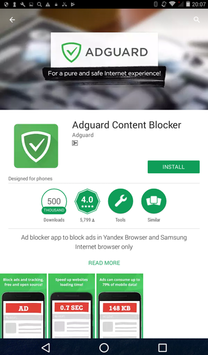
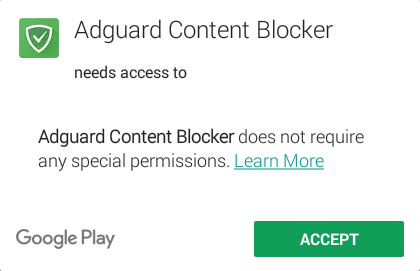
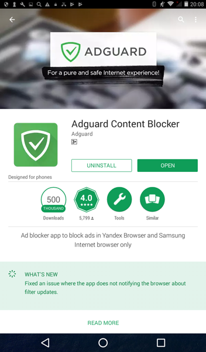

Adguard Content Blocker is an app that will block all ads only in Yandex Browser and Samsung Internet browser. The application is available in [Google Play](https://play.google.com/store/apps/details?id=com.adguard.android.contentblocker) and Galaxy Apps store. To install Adguard Content Blocker from Google Play, run Play Store app on your device and then type ‘_adguard content blocker_’ in the search form.

On the opened page tap ‘_Install_’ button.

On devices running Android 4  the system will show you the screen containing permissions required by the application. Tap ‘_Accept_’ button.

Wait for the installation to complete and tap ‘_Open_' button to run the application.

Adguard Content Blocker is successfully installed on your device.
