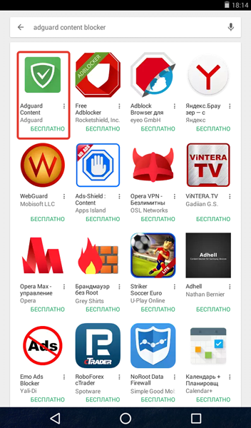
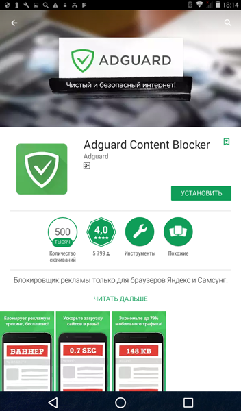

Adguard Content Blocker предназначен для блокировки рекламы в браузерах Samsung Internet и Яндекс Браузер. Приложение доступно в каталоге [Google Play](https://play.google.com/store/apps/details?id=com.adguard.android.contentblocker), а также в магазине приложений Galaxy Apps. Для установки Adguard Content Blocker из Google Play запустите приложение Play Маркет. В форме поиска введите строку _adguard content blocker_.

На открывшейся странице нажмите кнопку _Установить_.

В операционной системе Android версии 4 на экране вашего устройства будет продемонстрировано окно, содержащее список требуемых приложению разрешений. Нажмите кнопку _Принять_.

Дождитесь окончания загрузки и установки приложения. Чтобы запустить Adguard Content Blocker, нажмите кнопку _Открыть_.

Приложение установлено на вашем устройстве. 