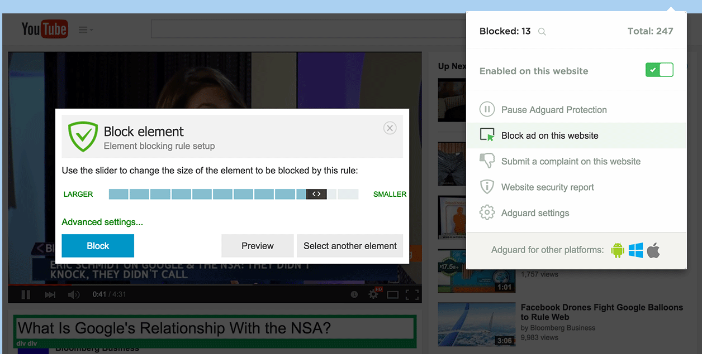

Browser extensions facilitate the use of Adguard and increase its functionality.

## Adguard Assistant

The name of this extension is quite deliberate: it actually assists the user in changing basic Adguard settings right in the browser, without the need to open the app itself. The Adguard Assistant icon will not be displayed on websites listed as exceptions by the user and on certain web pages where there is a risk of incorrect content display.

**Ad Blocker**

This extension blocks ads in social networks, such as VK.com and Facebook, on YouTube, and other sites. Adguard Ad Blocker efficiently blocks all kinds of ads on all web pages. Ad Blocker speeds up loading and saves traffic by not wasting it on ads and popups. This extension also blocks spyware and adware installers, protects your personal data and you from malware and phishing sites.

**Adguard Popup Blocker**

This extension prevents popup windows from opening when you view web pages. Some popups are considered useful – they may contain settings for site administering or additional reference information demonstrated upon clicking a link. That is why you can turn off the Blocker if needed. This extension doesn’t work on websites added to the Adguard exceptions list either.

