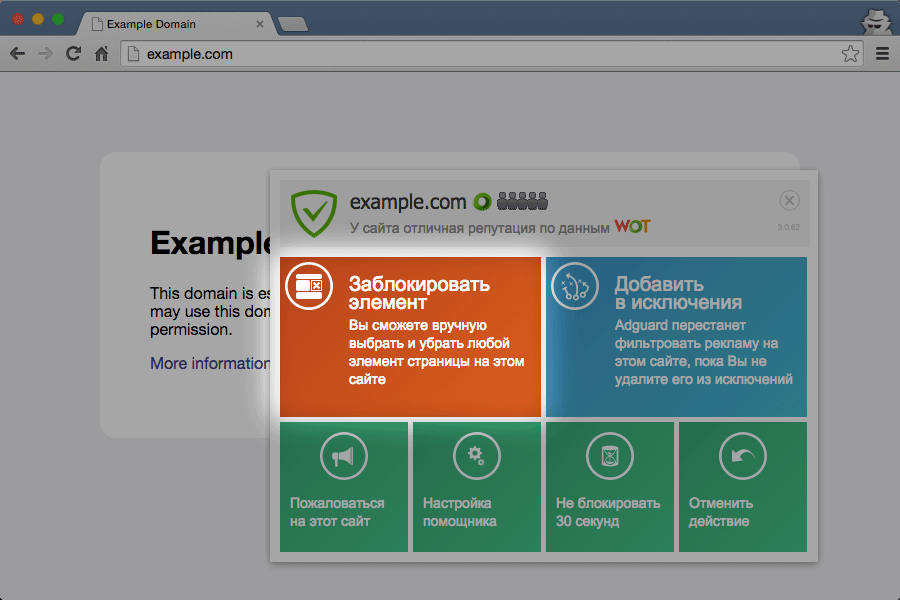

Браузерные расширения позволяют упростить работу с  приложением Adguard, а также увеличивают функциональные возможности программы. 

## Помощник

Название этого расширения выбрано таким не случайно: Помощник действительно помогает пользователю изменить основные настройки Adguard прямо в браузере, без необходимости открывать окно самого приложения. Значок Помощника не отображается на сайтах, добавленных в список исключений, и на некоторых веб-страницах, где существует риск нарушить корректное отображение содержимого. 

## Антибаннер

Это расширение блокирует рекламу в социальных сетях Вконтакте и Одноклассники, на портале Youtube и на других сайтах. Антибаннер Adguard эффективно блокирует все виды рекламы на всех веб-страницах. Антибаннер ускоряет загрузку страниц и экономит трафик, поскольку он не тратится на загрузку рекламы и всплывающих окон. Также это расширение блокирует инсталляторы программ-шпионов и программного обеспечения, содержащего рекламу (adware), защищает ваши личные данные и оберегает вас от вредоносных и фишинговых сайтов.

## Блокировщик всплывающих окон

Это расширение используется для предотвращения открытия всплывающих окон при просмотре веб-страниц. Некоторые всплывающие окна считаются полезными: например, они могут содержать элементы настроек в панели администрирования сайта, или дополнительную справочную информацию, демонстрируемую при нажатии на ссылку. Поэтому в случае необходимости вы можете отключить Блокировщик. Также это расширение не действует на веб-страницах, добавленных в список исключений Adguard. 
