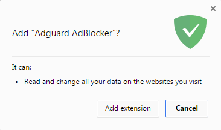
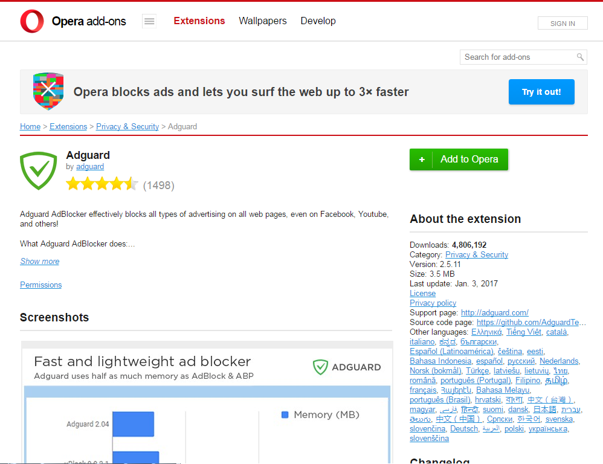
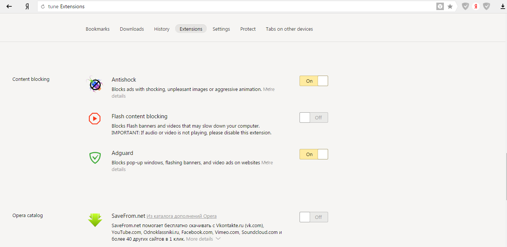
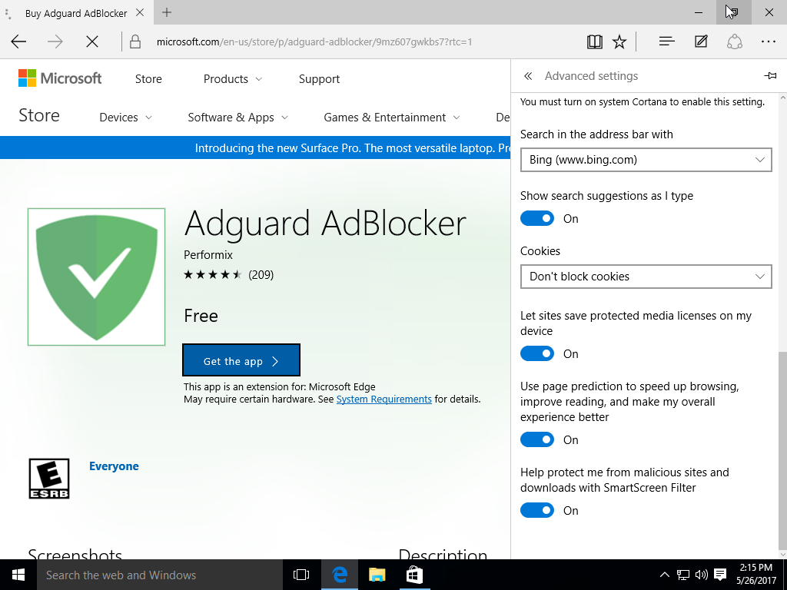
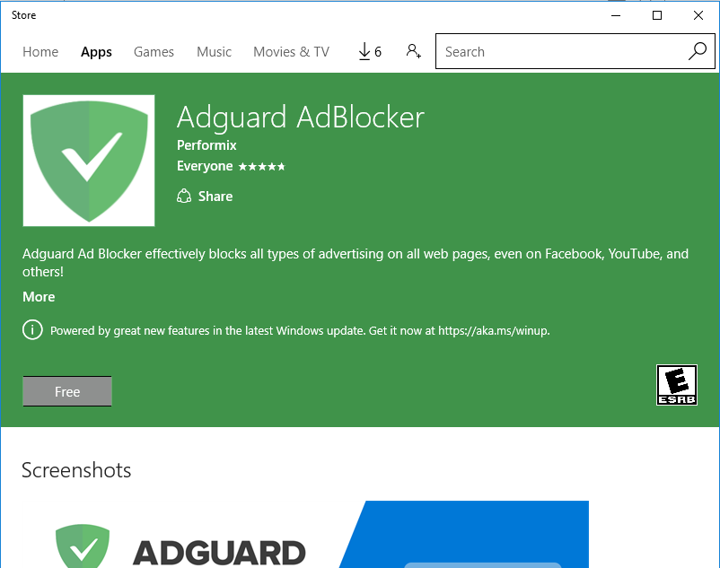

* <a href="#t1">Adguard AdBlocker Installation in Google Chrome or Chromium</a>
* <a href="#t2">Adguard AdBlocker Installation in Opera</a>
* <a href="#t3">Adguard AdBlocker Installation in Firefox</a>
* <a href="#t4">Adguard AdBlocker Installation in Yandex Browser</a>
* <a href="#t5">Adguard AdBlocker Installation in Microsoft Edge</a>
* <a href="#t6">Adguard AdBlocker Installation in Safari</a>
* <a href="#t7">Adguard AdBlocker Installation in Pale moon</a>

##  Adguard AdBlocker Installation in Google Chrome or Chromium

Open in your browser the page of [Chrome Web Store](https://chrome.google.com/webstore/detail/adguard-adblocker/bgnkhhnnamicmpeenaelnjfhikgbkllg) (<https://chrome.google.com/webstore/detail/adguard-adblocker/bgnkhhnnamicmpeenaelnjfhikgbkllg>). In the top of window that opened click _Add to Chrome_ button. 

In the opened dialogue window click _Add extension_ button.

## Adguard AdBlocker Installation in Opera

Open the page [addons.opera.com](https://addons.opera.com/extensions/details/adguard/) (<https://addons.opera.com/extensions/details/adguard/>) in your browser.

Click the button _Add to Opera_ in the right side of window.

## Adguard AdBlocker Installation in Firefox

Open the page [addons.mozilla.org](https://addons.mozilla.org/en-us/firefox/addon/adguard-adblocker/) (<https://addons.mozilla.org/en-us/firefox/addon/adguard-adblocker/>) in your browser.

Click the button _Add to Firefox_.

## Adguard AdBlocker Installation in Yandex Browser

Click the button _Yandex Browser settings_ in the right-top part of the browser's window and then choose _Extensions_ item in drop-down menu.

Scroll the page down and move _Adguard_ switch in _Content blocking_ area to the right. 

## Adguard AdBlocker Installation in Microsoft Edge

Open in your browser [Adguard AdBlocker page](https://www.microsoft.com/ru-ru/store/p/adguard-adblocker/9mz607gwkbs7) (<https://www.microsoft.com/ru-ru/store/p/adguard-adblocker/9mz607gwkbs7>), and then click _Get the app_ button. 

Press _Free_ button in the window that opened.

Wait for the installation to complete. Microsoft Edge will be opened automatically and offers you to turn AdBlocker on. 

## Adguard AdBlocker Installation in Safari

Open the page [extensions.safari.com](https://safari-extensions.apple.com/details/?id=com.adguard.safari-N33TQXN8C7) (<https://safari-extensions.apple.com/details/?id=com.adguard.safari-N33TQXN8C7>) in your Safari browser and click the  _Install now_ link. 

Wait for the installation to complete.

## Adguard AdBlocker Installation in Pale moon

Users of Pale moon and older versions of Firefox  can install the Legacy-version of the extension, which can be downloaded from the following site: <https://github.com/AdguardTeam/AdguardBrowserExtension/releases>.