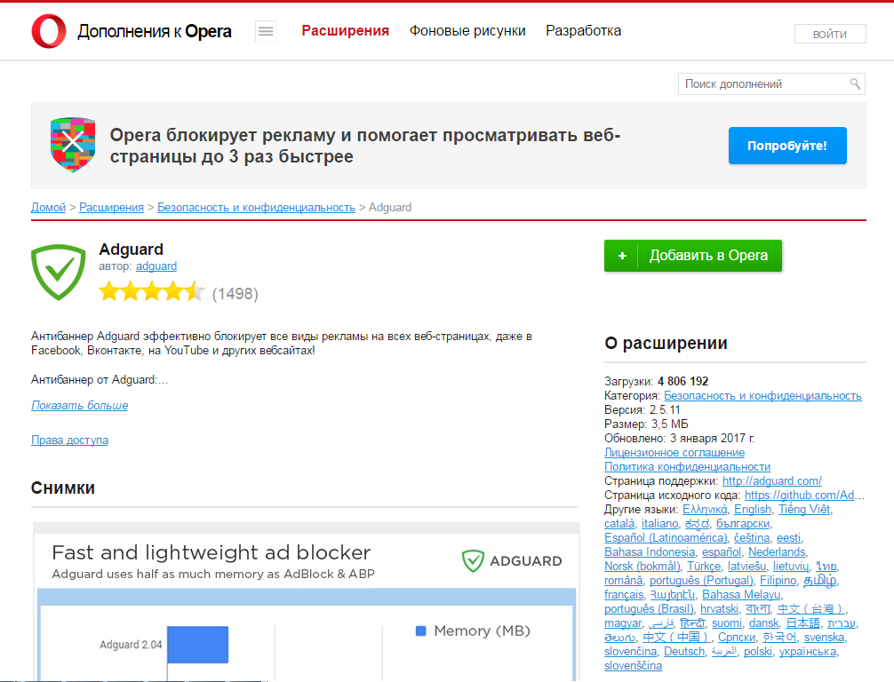
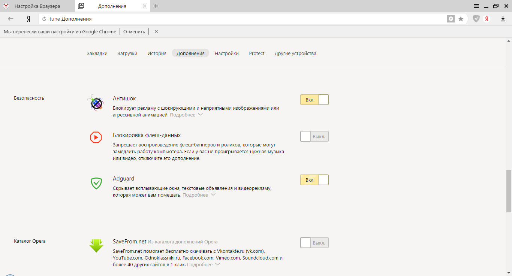
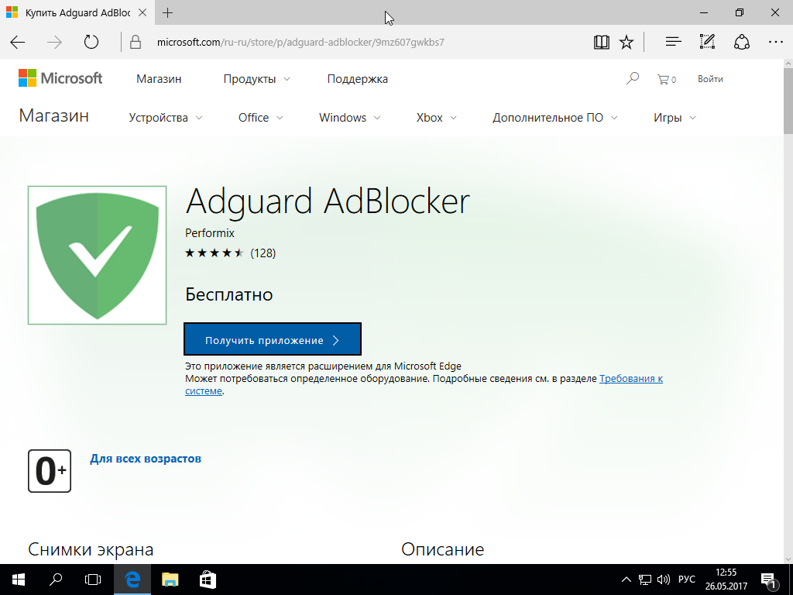

* <a href="#t1">Установка Adguard Антибаннер в браузере Google Chrome или Chromium</a>
* <a href="#t2">Установка Adguard Антибаннер в Opera</a>
* <a href="#t3">Установка Adguard Антибаннер в Firefox</a>
* <a href="#t4">Установка Adguard Антибаннер в Яндекс Браузере</a>
* <a href="#t5">Установка Adguard Антибаннер в Microsoft Edge</a>
* <a href="#t6">Установка Adguard Антибаннер в Safari</a>
* <a href="#t7">Установка Adguard Антибаннер в Pale moon</a>

##  Установка Adguard Антибаннер в браузере Google Chrome или Chromium

Откройте в браузере страницу [Chrome Web Store](https://chrome.google.com/webstore/detail/adguard-adblocker/bgnkhhnnamicmpeenaelnjfhikgbkllg) (<https://chrome.google.com/webstore/detail/adguard-adblocker/bgnkhhnnamicmpeenaelnjfhikgbkllg>). В верхней части открывшегося окна нажмите кнопку _Установить_. 

В открывшемся диалоговом окне нажмите кнопку _Установить расширение_.

## Установка Adguard Антибаннер в Opera

Откройте в браузере страницу  [addons.opera.com](https://addons.opera.com/extensions/details/adguard/) (<https://addons.opera.com/extensions/details/adguard/>).

Нажмите кнопку _Добавить в Opera_ в правой части окна.

## Установка Adguard Антибаннер в Firefox

Откройте в браузере страницу [addons.mozilla.org](https://addons.mozilla.org/en-us/firefox/addon/adguard-adblocker/) (<https://addons.mozilla.org/en-us/firefox/addon/adguard-adblocker/>).

Нажмите кнопку _Добавить в Firefox_.

## Установка Adguard Антибаннер в Яндекс Браузере

Нажмите на кнопку _Настройки Яндекс Браузера_ в правой верхней части окна браузера и выберите в открывшемся меню пункт Дополнения.

Промотайте вниз открывшуюся страницу и в разделе «Безопасность» переместите вправо переключатель _Adguard_.

## Установка Adguard Антибаннер в Microsoft Edge

Откройте в браузере [страницу расширения Adguard](https://www.microsoft.com/ru-ru/store/p/adguard-adblocker/9mz607gwkbs7) (<https://www.microsoft.com/ru-ru/store/p/adguard-adblocker/9mz607gwkbs7>), затем нажмите кнопку _Получить приложение_. 

В открывшемся окне нажмите кнопку _Получить_.

Дождитесь окончания установки. Браузер Edge откроется автоматически и предложит включить Adguard. 

## Установка Adguard Антибаннер в Safari

Откройте в браузере Safari страницу [extensions.safari.com](https://safari-extensions.apple.com/details/?id=com.adguard.safari-N33TQXN8C7) (<https://safari-extensions.apple.com/details/?id=com.adguard.safari-N33TQXN8C7>) и нажмите на ссылку _Install now_. Дождитесь окончания установки расширения.

## Установка Adguard Антибаннер в Pale moon

Пользователи Pale moon и старых версий Firefox могут установить Legacy-версию расширения, которую можно скачать по адресу: <https://github.com/AdguardTeam/AdguardBrowserExtension/releases>. 